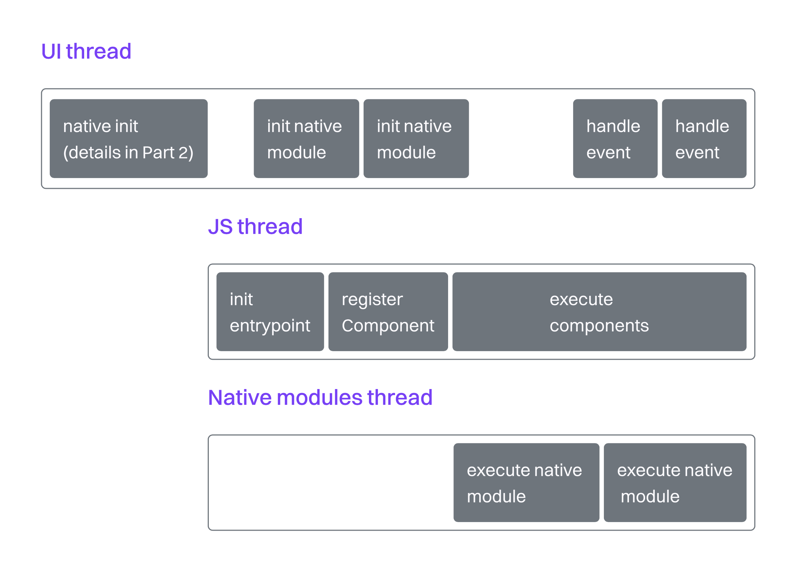
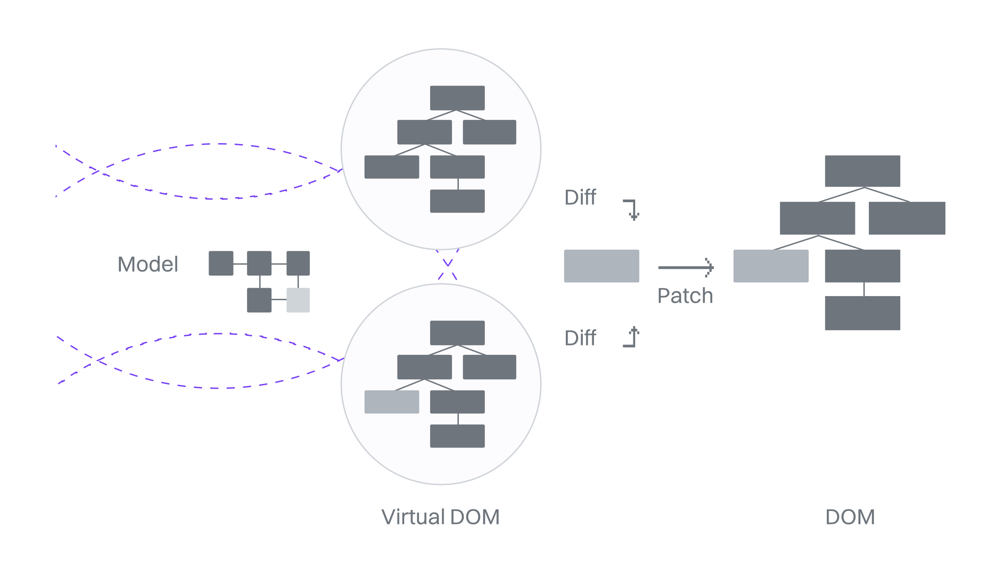

# JAVASCRIPT

通过优化 React Native 中 JavaScript 和 React 层来提升 FPS 的指南和技巧

## 简介

本指南的第一部分，我们将聚焦在 React Native 生态系统中的 JavaScript 部分。你可能已经知道，React Native 本身就是基于原生平台构建的，它结合了多种技术：Android 使用 Kotlin 或 Java，iOS 使用 Swift 或 Objective-C，核心运行时由 C++ 编写，而 JavaScript 则通过 Hermes 引擎执行。这一整套系统看起来信息量很大，我们不妨从一个平台入手，先从 Android 来讲解。

当用户打开一个原生 Android 应用时，通常会经历这样一个初始化过程：应用在主线程启动，加载原生代码（通常是 Kotlin、Java 或 C++ 编写）进内存，然后执行这些代码，最终呈现出 UI 给用户。React Native 创建的 Android 应用也大同小异，毕竟它本质上就是一个原生应用——不过多了一层 React Native 的代码参与。

## JavaScript 的初始化流程

React Native 的初始化流程主要包含几个核心机制：

- **初始化 React Native 内部系统**：包括跨平台的 C++ React 渲染器、JSI（JavaScript Interface）、Hermes 引擎、布局引擎（Yoga）等，这些都在主线程中完成。
- **初始化 JS 线程**：这个线程专门运行 JavaScript，并通过 JSI 与主线程进行双向通信。
- **初始化 Native 模块线程**：用于运行懒加载的 Turbo Modules。

可以看到，渲染逻辑（Kotlin、C++）和业务逻辑（JavaScript）被设计成运行在不同的线程上：主线程和 JS 线程。因为我们现在专注的是 JavaScript 和 React，我们接下来就围绕 JS 线程展开，看看它是如何支撑 React 的运行模型，以及它对应用性能有怎样的影响。

根据 Callstack 内部对 100 位 React Native 开发者的调查显示，他们在移动端、TV 和桌面端开发中遇到的性能问题，有约 80% 来源于 JavaScript 层。虽然这个样本规模不大，不能代表整个社区的真实情况，但结合社区里的实际反馈，这个比例基本也反映出大多数问题确实出现在 JS 端。因此，优先处理 JS 侧的问题，往往能带来显著的性能提升，而更深入的原生优化（见第二部分 Native）可以后续再关注。

## React 的重新渲染模型

React 负责根据状态来渲染并更新 UI，无论平台是 Web、iOS、Android 还是其他。React 本身其实很小，主要包含公共 API 定义、跨平台功能和一个“协调算法”（Reconciliation），这个算法负责高效地将状态变更映射成 UI 的更新，也就是决定“要做什么”。

真正强大的是它将“做什么”和“怎么做”分离开来，并交由不同平台的渲染器去实现：Web 端是`react-dom`，iOS 和 Android 用的是`react-native`，Windows 则有`react-native-windows`等。这样的架构让你可以用统一的方式定义组件，再组合成完整的界面，适配多平台。你无需手动控制组件的渲染生命周期，React 和它的渲染器会替你完成这件事。

换句话说，“什么时候”需要更新屏幕内容是 React 说了算，而“怎么更新”由各个平台的渲染器决定。**React 会对你的组件变更进行比较，然后只执行最少量、最必要的更新。

React 组件会在以下几种情况重新渲染：

- 父组件重新渲染
- `state`或`hooks`发生变化
- `props`变化
- `context`发生变化
- 使用`forceUpdate`强制更新

在我们深入具体优化技巧之前，先从所有项目都必不可少的一步讲起：性能分析与指标测量（Profiling & Measuring）。
