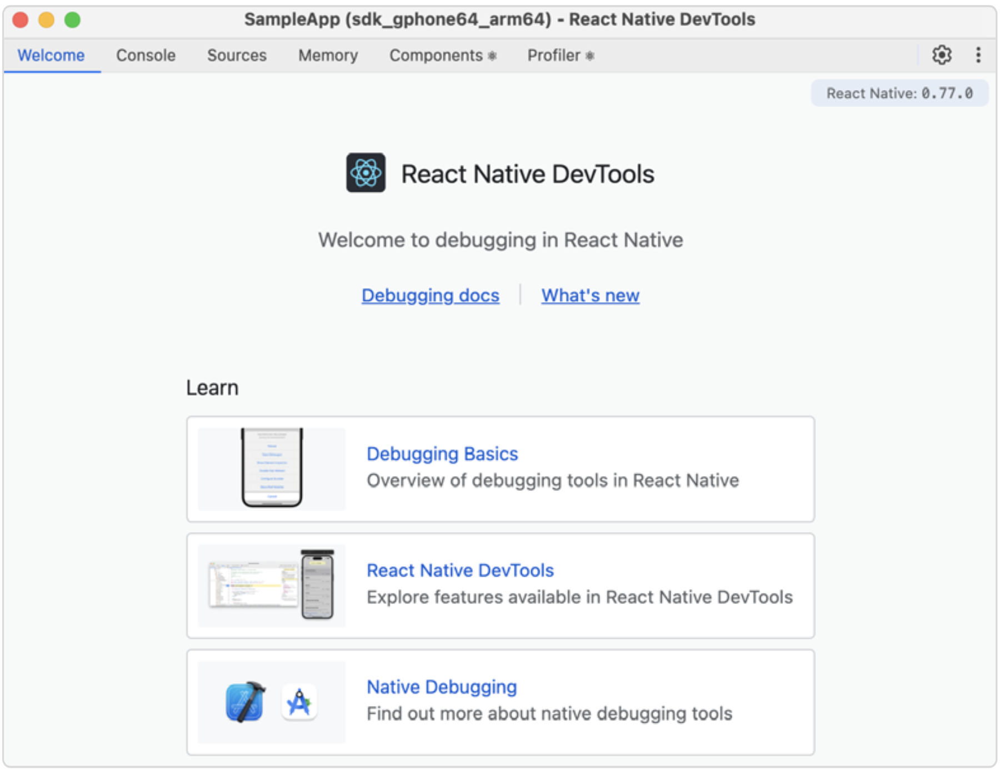
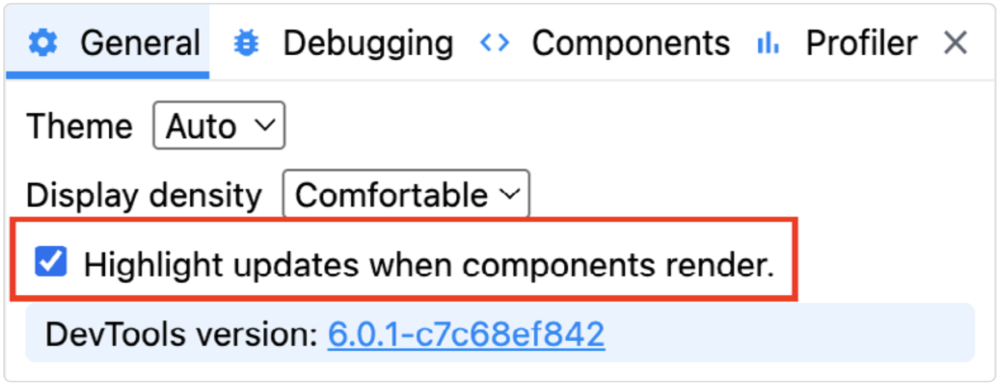
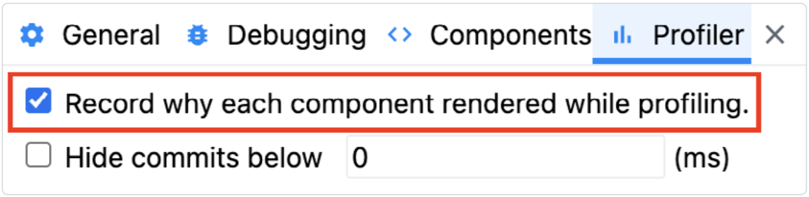
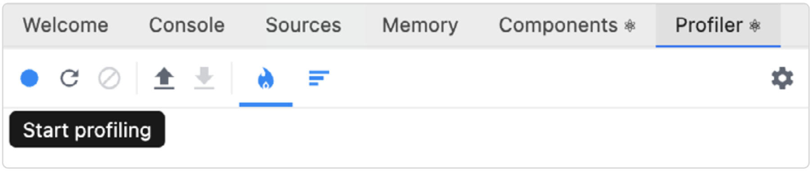
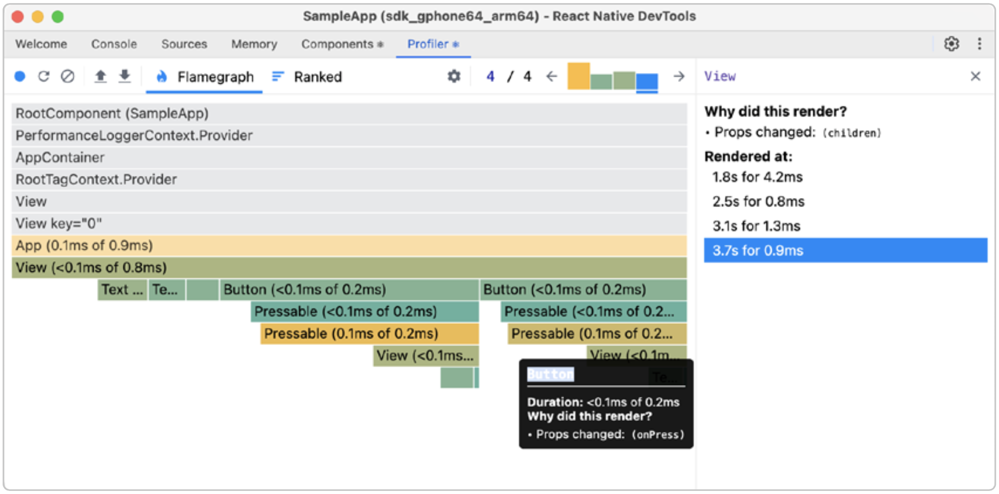
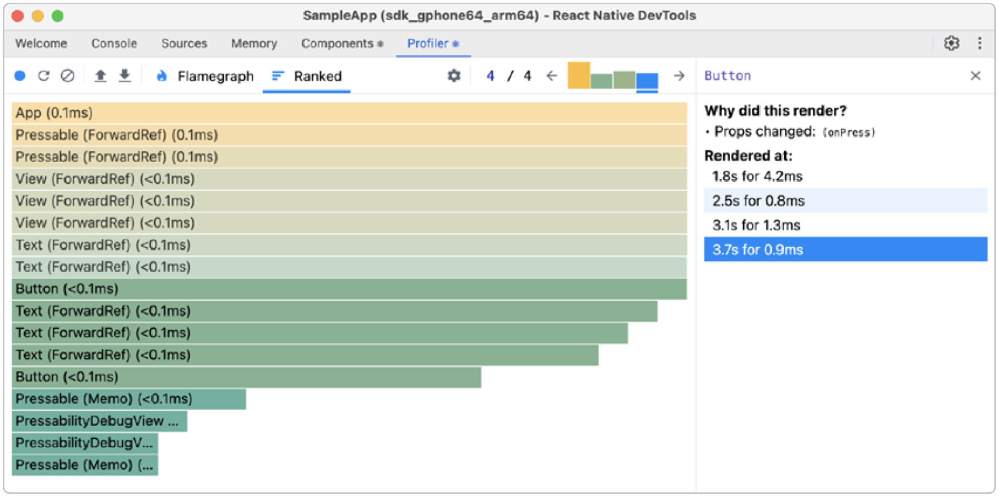
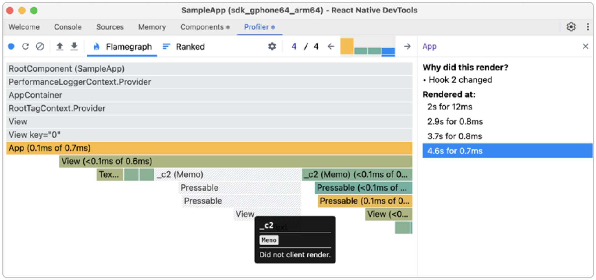
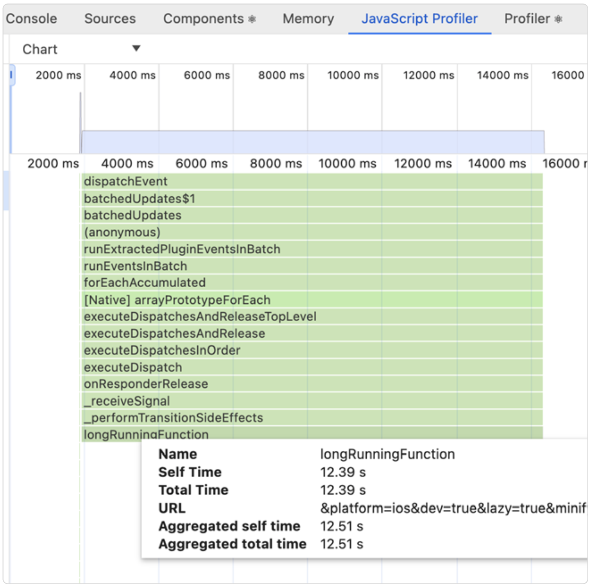

# 如何分析 JavaScript 和 React 的性能

在优化性能时，我们希望准确知道是哪一段代码路径导致了性能下降。凭借一定的经验以及对代码库和常见性能陷阱的了解，开发者通常可以直觉地识别出问题，并期望应用运行得更快。然而，现实中应用程序通常过于复杂，没人能真正掌握整个系统。我们通常所做的盲目优化，对整体性能提升几乎没有影响。要做到精准优化，我们必须依赖数据来指导决策。

这些数据来自于使用专业工具进行的性能测量。这个过程通常被称为“性能分析”（profiling），因为它涉及对程序的运行情况进行分析，从而创建一个“执行画像”。这个画像通常包含程序中哪些部分消耗了最多的资源（如 CPU 时间或内存）的信息，帮助我们识别性能瓶颈。

## 使用 React Native DevTools 进行性能分析

在 React Native 应用的上下文中，能够对 React 本身进行性能分析以检查不必要的重新渲染是非常有用的。用于分析在移动应用中运行的 React 的最佳工具是 React Native DevTools，而本指南将重点介绍它的使用方法。

React Profiler 已作为 React Native DevTools 中的默认插件集成，它可以在分析过程中生成 React 渲染流程的火焰图。我们可以利用这些数据来分析应用中的重新渲染问题。

以下是我们即将分析的代码：

```ts
export const App = () => {
  const [count, setCount] = React.useState(0);
  const [second, setSecond] = React.useState(0);
  return (
    <View style={styles.container}>
      <Text>Welcome!</Text>
      <Text>{count}</Text>
      <Text>{second}</Text>
      <Button onPress={() => setCount(count + 1)} title="Press one" />
      <Button onPress={() => setSecond(second + 1)} title="Press two" />
    </View>
  );
};
const Button = ({ onPress, title }) => {
  return (
    <Pressable style={styles.button} onPress={onPress}>
      <Text>{title}</Text>
    </Pressable>
  );
};
```

当 <App /> 组件被渲染时，它会显示一条欢迎信息，并包含两个计数器和两个按钮，这些按钮分别由两个独立的状态处理器控制。现在我们已经准备好使用 React Native DevTools 来分析这段 React 代码了。

你可以通过在 Metro 开发服务器中按下 j 键，或者通过应用内的 React Native 开发菜单（在设备上通过摇动手势、在 Android 上按下 Cmd+M，在 iOS 上按下 Cmd+D）来打开 DevTools。打开后你会看到一个欢迎界面，指向一些关于调试基础、DevTools 功能和原生调试的学习资源。我们强烈建议你熟悉这些资源，其中有一部分内容也会在本指南中涉及。



现在，打开 React Native DevTools，切换到顶部的 Profiler 选项卡。点击齿轮按钮，勾选`Highlight updates when components render`



以及`Record why each component rendered while profiling`



最后，点击左上角的 `Start profiling` 或 `Reload and start profiling` 按钮开始分析。在我们的使用场景中，这两种方式都可以，因为我们是在观察用户输入后的响应过程。然而，如果是在分析应用的启动过程， `Reload and start profiling` 将会非常有帮助。



在我们的示例应用中，点击两个按钮几次，观察 DevTools 实时反馈，看看哪些组件被重新渲染了。截图中展示的是先点击两次 “Press one”，再点击两次 “Press two” 后产生的分析结果，由 React 渲染器提交的四次 “commit” 过程组成。

> 你可以在[官方文档](https://react.dev/learn/render-and-commit)中了解更多关于 React 的渲染和提交过程。



你可以点击火焰图中绿色的 View 组件，将视图“放大”到其子组件。这是 Profiler 中的一个重要用户体验交互，希望你很快就能喜欢上。在这个例子中，你会注意到两个 Button 每一次提交都会被重新渲染，这看起来似乎多余，因为它们的 props 并没有变化。但真的是这样吗？

为了从另一个角度查看这个问题，我们可以切换到 Ranked 视图，这个视图会将组件按照渲染耗时从慢（黄色）到快（绿色）排列。这个视图类似于你可能已经熟悉的其他分析工具中的 “Bottom-up” 视图，比如 Chrome DevTools 或原生性能分析器。



在每个视图中，我们都可以看到 Button 组件被渲染了两次，这表明两个按钮在每次状态更新时都会重新渲染。

看看我们的代码，这种行为是预期中的 —— 除非我们使用了 React Compiler，它会自动对这段代码进行记忆优化，从而减少重新渲染的次数。所以，我们可以手动进行记忆优化。

```tsx
// wrap inline functions with `useCallback`
const onPressHandler = useCallback(() => setCount(count + 1), [count]);
const secondHandler = useCallback(() => setSecond(second + 1), [second]);
// ...
<Button onPress={onPressHandler} title="Press one" />
<Button onPress={secondHandler} title="Press two" />

// wrap Button component with `memo`
const Button = memo(({onPress, title}) => {
// ...
});
```

将 Button 用 `React.memo` 包裹，并使用 `React.useCallback` 包裹其 `onPress` 事件处理函数之后，我们从 Profiler 中看到的结果就有所不同了：虽然仍然是 4 次 React commit，但这一次，只有实际被点击的按钮被重新渲染，另一个由于被记忆化（名字被自动命名为 \_c2）而没有发生变化，从而显示为绿色。



现在，你已经掌握了使用分析工具来优化任何 React 应用的基本技巧 —— 不管是 Web 应用还是移动端应用。我们强烈建议你现在就暂停阅读，去你日常开发的应用中尝试使用这些工具。你会发现火焰图的输出会更加复杂，因为你真实的 React 应用比示例应用要复杂得多。

> 记住要关注那些被标记为黄色的组件，因为这些是 React 花费最多时间的地方。并且善用 “Why did this render?” 的提示信息。

## 分析 JavaScript 代码性能

React Native DevTools 不仅可以用来分析 React，还可以分析 JavaScript 代码的性能。毕竟它基于 Chrome DevTools，并复用了其底层架构。本节我们将重点介绍如何对 CPU 进行分析、查看调用栈，并检测运行时间较长的操作。如果你想排查内存相关问题，可以查阅[《如何追踪 JavaScript 的内存泄漏》](./3.How_to_Hunt_JS_Memory_Leaks.md)章节。

启动 React Native DevTools 后，进入 “JavaScript Profiler” 选项卡，即可开始录制 JavaScript 的 CPU 性能分析。

> 如果你没有看到 “JavaScript Profiler” 选项卡，可以点击右上角的齿轮图标进入设置，在实验性功能中启用 JavaScript Profiler。

在左上角，你可以选择你喜欢的视图：_Chart_、_Heavy_（自底向上）或 _Tree_。可以根据你的需求尝试不同的视图效果。

我们来尝试分析一个运行时间很长的函数：

```js
const longRunningFunction = () => {
  let i = 0;
  while (i < 1000000000) {}
};
```

开始录制性能分析，函数执行完成后停止。生成的分析报告中，我们可以看到 `longRunningFunction` 总共执行了超过 12 秒，同时也能看到导致该函数被调用的整个调用栈。这 12 秒里，JavaScript 部分变得无响应，但由于 React Native 的线程模型，原生 UI 仍然是能响应的。

> 在移动应用中，我们的目标是让任何函数都不要阻塞 JS 线程超过 16 毫秒，以实现 60 帧每秒（FPS）；而为了达到如今越来越流行的 120 FPS，我们理想中的最大时间应为 8 毫秒。关于帧率（FPS）的更多信息，可以参考[《如何测量 JavaScript 的帧率（FPS）》](./2.How_to_Measure_JS_FPS.md)章节。



如果 Chart（即火焰图）信息难以阅读，你可以尝试其他视图，比如 Heavy（自底向上），它可以让你按函数运行时间从长到短排序。

' 视图，longRunningFunction 位于顶部")

Profiler 工具可以帮助我们更容易地发现运行时间异常的函数，精确定位它们的调用位置。这种“精准追踪”的能力是每个软件工程师日常开发中都值得使用的强大技能。
