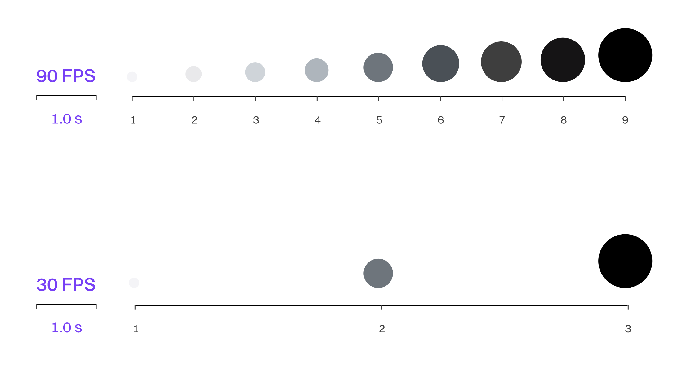
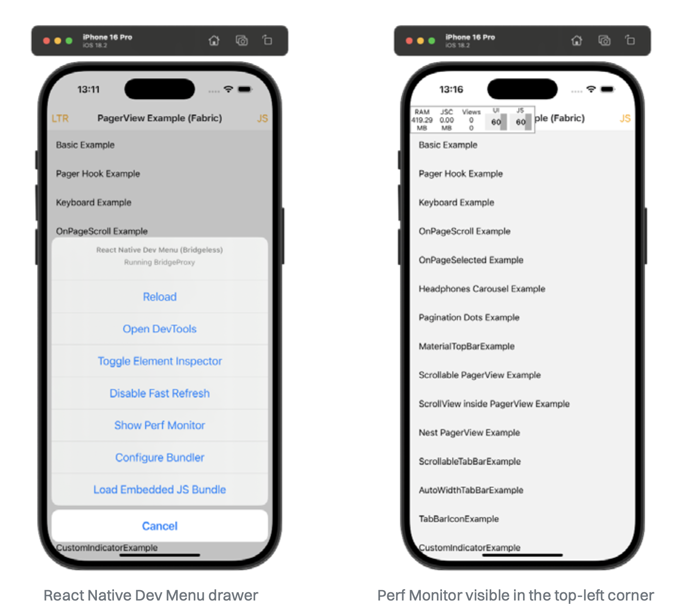

# 如何测量 JavaScript 的帧率

移动用户期望界面流畅、美观、反应迅速并能提供清晰的视觉反馈。因此，应用程序通常包含大量动画，同时还要处理数据请求和状态管理等其他流程。如果你的应用未能提供响应迅速的界面，存在输入延迟或偶尔“卡顿”的情况，这说明 UI 正在“掉帧”。用户非常讨厌这种体验。

## 什么是 FPS

让代码在屏幕上显示内容，涉及将代码编译为可执行格式，并通过各种技术在屏幕上绘制像素。一次绘制被称为一个“帧（frame）”。如果你希望 UI 不只是静态画面（你当然希望如此），那么应用每秒就需要绘制很多帧。大多数移动设备的刷新率为 60Hz，意味着它们每秒最多能显示 60 帧，也就是 60 FPS。这就是我们的衡量指标。



大多数人将 60 FPS 视为流畅的动画表现。然而，随着技术的进步，用户可以使用刷新率高达 120 甚至 240 的屏幕。一旦用户习惯了 120Hz 的屏幕，他们可能会觉得 60Hz 的画面“卡”、“慢”或者“不流畅”。这意味着我们原本的 16.6ms 每帧（1 秒 ÷ 60）渲染目标正在变得更高，我们应该瞄准每帧 8.3ms。

> 如果你不关注应用性能并选择合适的工具来应对这一挑战，那么你的应用迟早会掉帧。

## React Perf Monitor

幸运的是，React Native 提供了一个名为 React Perf Monitor 的实用工具，可以在应用顶部显示实时 FPS 信息。你可以通过 React Native 的开发菜单打开它。

> 你可以通过摇晃设备或使用专用快捷键打开 DevMenu：
>
> - **iOS 模拟器**：`Ctrl + Cmd + Z`（或菜单中选择 Device > Shake）
> - **Android 模拟器**：`Cmd` 或 `Ctrl + M`
>
> 

打开后，它会在应用左上角弹出一个窗口。你可以再次打开 DevMenu，然后选择“Hide Perf Monitor”来隐藏它。

该监控器能让你看到内存使用情况以及 FPS 下降的时间点。它实际上包含两个 FPS 监控器：一个用于 UI（主线程），另一个用于 JS 线程。你可以迅速判断某个交互变慢是因为 JavaScript 的问题，还是来自原生端的瓶颈。

> 在测量性能时一定要关闭开发模式！
>
> 在 Android 上，可以通过 DevMenu 中的 Settings > JS Dev Mode 关闭。
>
> 在 iOS 上，需要以开发模式运行 Metro。

如前文[《如何分析 JavaScript 和 React 的性能》](./1.How_to_Profile_JS_and_React_Code.md)一章所讲，当 FPS 在动画或某些操作过程中下降时，你可以使用 Profiler 进一步定位原因。

## Flashlight

DevMenu 中的 FPS 监控器适合查看，但不适合长期跟踪或测量某次交互的平均 FPS。如果你想查看特定交互或页面加载的平均 FPS 等指标，[Flashlight](https://flashlight.dev/) 工具就派上用场了。不过，它仅支持 Android。

要开始使用，确保你已在终端中安装好 Flashlight 工具。打开你想测试的 Android 应用，并在终端中运行：

```bash
flashlight measure
```

这时，你将看到一个实时更新的图表，显示各种性能指标，并能在你与应用交互时实时变化。

> 获得平均 FPS 只是该工具功能的一部分。它还能生成类似“[lighthouse-like](https://developer.chrome.com/docs/lighthouse/overview)”的总体性能评分，内容包括： 平均 FPS、平均 CPU 使用率、内存（RAM）使用情况等

所有采集的数据都会保存为 JSON 文件，方便你在不同代码版本之间进行对比。这是本地自动化性能监测的好方法，也能可靠地证明 FPS 表现确实有所提升。

### 下一篇：[如何追踪 JavaScript 的内存泄漏](./3.How_to_Hunt_JS_Memory_Leaks.md)
