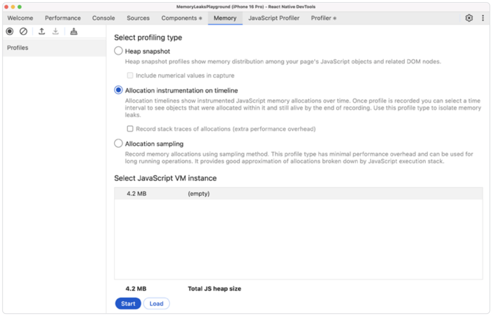
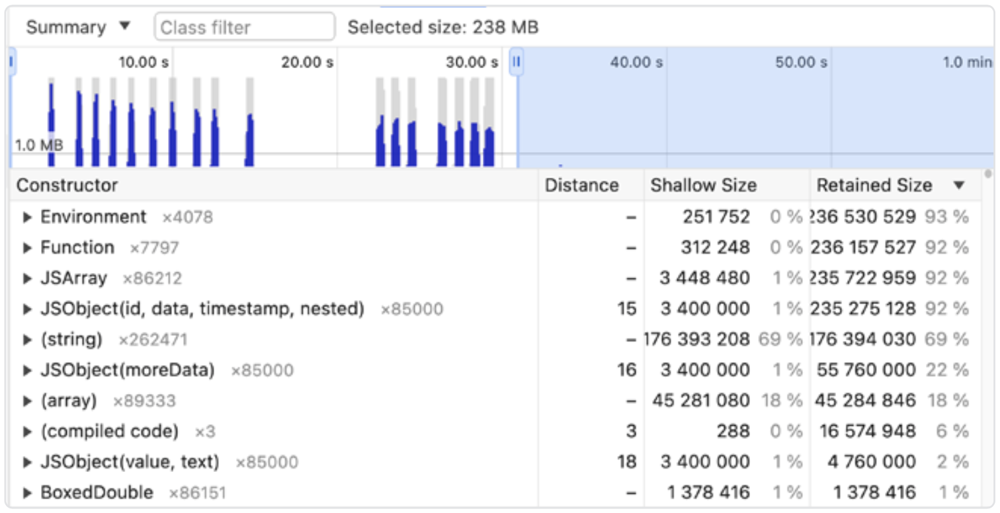
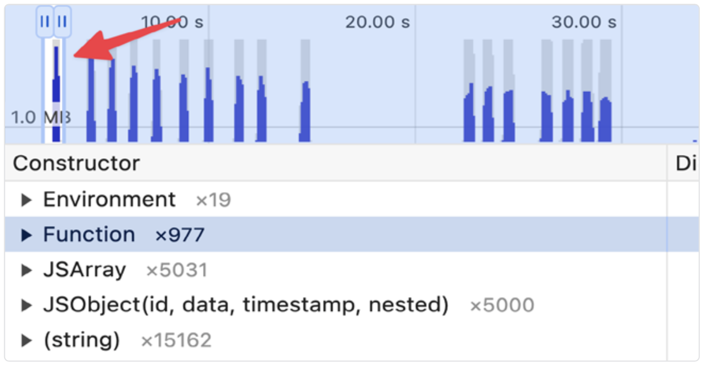
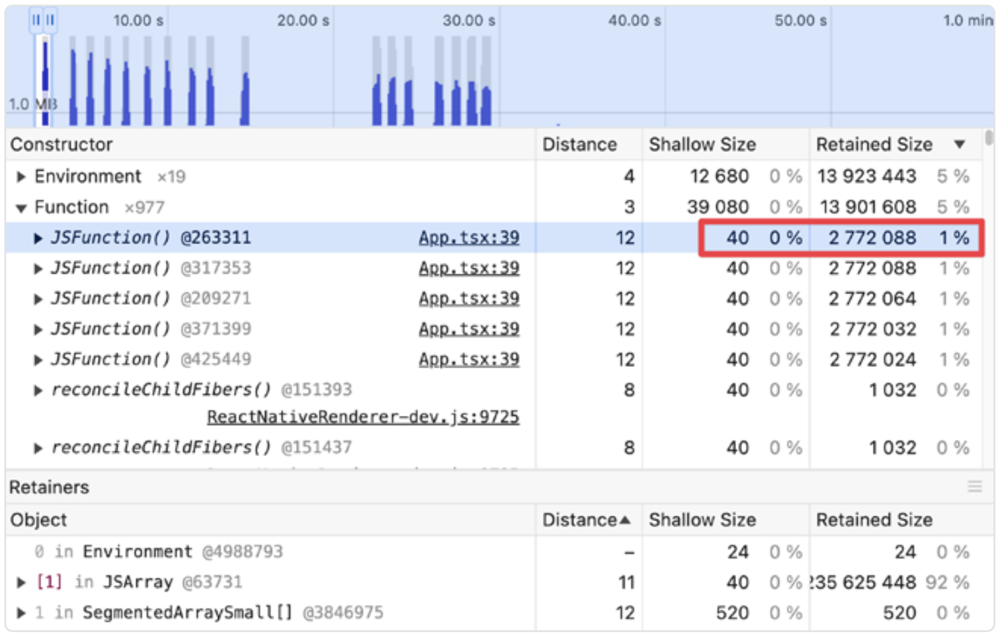
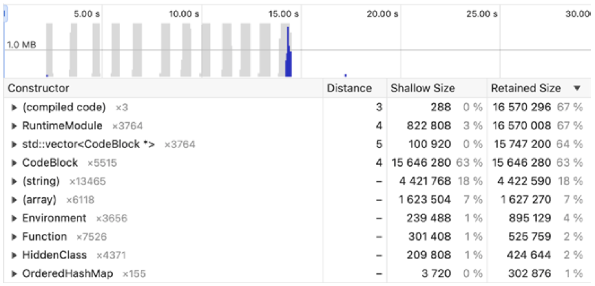

# 如何追踪 JavaScript 的内存泄漏

当一个程序在目标设备或虚拟机上执行时，它总是会在设备的随机存取内存（RAM）中占用一定的空间，这部分空间是专门为该程序正确运行而分配的。如果这部分内存被意外地保留了下来，我们就说它“泄漏”了；因此，我们需要处理内存泄漏的问题。

如果没有合适的工具，内存泄漏可能很难追踪。在大多数情况下，内存泄漏是由程序员的错误引起的。如果你的应用持续使用越来越多的内存却没有释放，很可能某处存在内存泄漏。你也许可以靠猜测来找出是什么导致了泄漏，但使用正确的工具对应用进行性能分析要容易得多，这些工具能帮助你找出泄漏。让我们从定义“什么是内存泄漏”开始。

## JavaScript 应用中的内存泄漏剖析

JavaScript 引擎（如 Hermes）以及其他依赖虚拟机来执行的解释型语言，都实现了一个叫作垃圾回收器（Garbage Collector，简称 GC）的特殊程序。顾名思义，它“回收垃圾”，这里的“垃圾”指的是那些应用运行时不再需要、可以释放出来供其他程序使用的内存地址。GC 会定期扫描已分配的对象，并判断哪些对象不再需要。一个有趣的小知识是：Hermes 的垃圾回收器被称为 Hades。

尽管垃圾回收器使用了先进的技术来可靠并安全地判断哪些内存可以释放，但有些情况下，你的代码可能会“欺骗”GC，让它保留原本应该被释放的对象。这就是我们常说的内存泄漏，它们通常很难在没有专用工具的情况下被追踪到。

> 简而言之，当一个程序未能释放不再需要的内存时，就发生了内存泄漏。

为了更好地理解，下面是一些会造成内存泄漏的代码示例。

1. 没有停止监听的监听器：

```tsx
const BadEventComponent = () => {
  useEffect(() => {
    const subscription = EventEmitter.addListener("myEvent", handleEvent);
    return () => {
      // 没有调用 subscription.remove();
    };
  }, []);
  return <Text>Listening for events...</Text>;
};
```

2. 没有停止计时的定时器：

```tsx
const DidNotStopCountingComponent = () => {
  useEffect(() => {
    const intervalId = setInterval(() => {
      console.log("Still running...");
    }, 1000);
    return () => {
      // 没有调用 clearInterval(intervalId)
    };
  }, []);
  return <Text>Listening for events...</Text>;
};
```

3. 保留对大型对象引用的闭包：

```ts
class BadClosureExample {
  private largeData: string[] = new Array(1000000).fill("some data");
  createLeakyFunction(): () => number {
    // Entire largeData array is captured in closure
    return () => this.largeData.length;
  }
}
// Fixed
class GoodClosureExample {
  private largeData: string[] = new Array(1000000).fill("some data");
  createEfficientFunction(): () => number {
    // Only capture the length, not the entire array
    const length = this.largeData.length;
    return () => length;
  }
}
```

现在你已经知道了典型的内存泄漏可能长什么样子，让我们看看有哪些工具可以轻松帮你发现它们。

## 使用 React Native DevTools 追踪内存泄漏

新版的 React Native DevTools 构建在 Chrome DevTools 的基础之上，因此如果你熟悉网页调试工具，那么你应该会感到很熟悉。不过，如果你想深入了解 Chrome DevTools，建议查看它们的官方文档。

React Native DevTools 提供了三种分析应用内存的方式：

- **堆快照（Heap snapshot）**—— 显示你页面中 JavaScript 对象和相关 DOM 对象的内存分布情况。

- **时间轴上的分配检测（Allocation instrumentation on the timeline）**—— 这种分析类型展示了随着时间推移，JavaScript 内存分配的记录。一旦记录完成，你可以选择一个时间区间，查看在该时间段内分配的、且在记录结束时仍然存在的对象。使用这种类型的分析可以帮助你定位内存泄漏。

- **分配采样（Allocation sampling）**—— 使用采样方法记录内存分配。这种分析类型对性能影响最小，适合用于长时间运行的操作。它可以根据 JavaScript 执行堆栈大致地反映出分配情况。

我们将重点关注 **时间轴上的分配检测** ，它可以帮助我们找到没有被释放的内存分配。让我们在下面这段代码上运行它：

```ts
// Global variable to store closures
let leakyClosures: Funciton[] = [];

// Generate some dummy data
const generateLargeData = () => {
  return new Array(1000).fill(null).map(() => ({
    id: Math.random().toString(),
    data: new Array(500).fill("??").join(""),
    timestamp: new Date().toISOString(),
    nested: {
      moreData: new Array(100).fill({
        value: Math.random(),
        text: "nested data that consumes memory",
      }),
    },
  }));
};

const createClosure = () => {
  const newDataLeak = generateLargeData(); // Creates large data array
  return () => {
    newDataLeak.forEach((data) => data.id); // Closure captures newDataLeak
  };
};

// Create many closures that each capture their own large data
const createManyLeaks = () => {
  for (let i = 0; i < 10; i++) {
    const leakyClosure = createClosure();
    leakyClosures.push(leakyClosure); // Store reference to prevent GC

    // Trigger all closures to keep data "active"
    leakyClosures.forEach((closure) => closure());
  }
};
```

一旦你启动了 DevTools，找到 `Memory` 标签页，选择 `Allocation instrumentation on timeline` 。然后点击底部的 `Start` 按钮。



当你完成分析后，如果某个对象仍然被分配在内存中，就说明发生了泄漏！但如前所述，GC 是周期性运行的，因此你的对象可能不会立刻被释放。你可能需要再分配一些其他对象，以触发已有对象的释放。

以下是捕获快照后分析器的界面：



关于 `Allocation instrumentation` 工具，有几点要注意：

- 时间轴上的蓝条表示内存分配；

- 如果蓝条变成灰色，表示该对象已被释放；

- 在下面的部分，是被调用的构造函数列表。在其右侧，有两个指标：

  - **Shallow size（浅层大小）**—— 对象本身所占用的内存大小；

  - **Retained size（保留大小）**—— 删除该对象后将被释放的总内存大小。

正如你所看到的，在 30 秒内多次调用 `createManyLeaks` 函数后，GC 只清理了一部分对象（在图中显示为灰色），但仍有许多蓝色区域表示对象仍然活着。这个图明显显示出了多处内存泄漏。

我们聚焦于第一个内存峰值，来看看到底是什么引起的。



当我们把图表聚焦在第一个峰值上，我们可以看到有哪些构造函数被调用了。让我们展开 Function 构造函数，看看里面有什么。



如你所见，这里有一个对 `JSFunction()` 构造函数的调用，其浅层大小是 40 字节，但保留大小竟然是 2,772,088 字节（！）。这就是我们要找的内存泄漏！这个闭包欺骗了 GC，让它以为这些对象仍然是相关的。DevTools 甚至还显示了调用该构造函数的确切代码行。

找出内存泄漏后，你应该修复它并重新测试。我们来修改 `createManyLeaks` 函数，把将闭包压入数组的那一行注释掉，避免保留它们的引用。

```ts
const createManyLeaks = () => {
  for (let i = 0; i < 5; i++) {
    const leakyClosure = createLeak();
    leakyClosure(); // just call it
    // leakyClosures.push(leakyClosure);
    // leakyClosures.forEach(closure => closure());
  }
};
```

你可以看到，现在所有的条形图都变成了灰色（除了最后一个，它还没被释放），这说明——没有泄漏了！



现在你已经知道如何追踪和修复内存泄漏了！下一章我们将聚焦于 `受控组件`。
