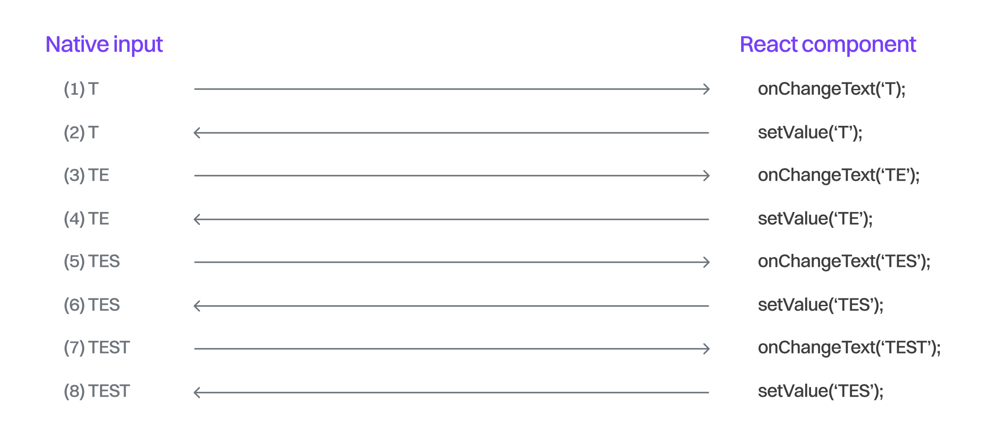
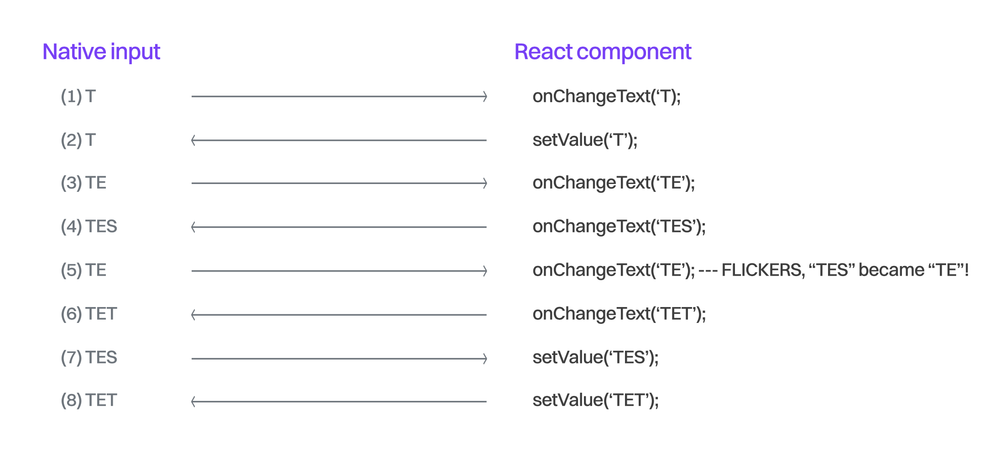

# 非受控组件

React 的编程模型围绕着这样一个理念：每当状态发生变化时，就重新渲染整个应用——这个应用是由组件构成的一棵树。不过，尽管这个模型在大多数 UI 编程场景中都适用，它终究只是一个抽象。而和所有抽象一样，它是对现实的一种简化，使我们更容易理解程序的运行逻辑，但这种简化是以牺牲一定的准确性为代价的。一个好的抽象会提供“逃生通道”（escape hatch）——也就是它的设计者允许你在需要的时候跳出抽象的限制，以完成你作为程序员的目标。

React 也不例外，它提供了多种逃生通道，比如 `ref`，可以绕过 React 的重新渲染逻辑，让组件不再完全依赖状态更新来驱动。我们称这些组件为“非受控组件”（uncontrolled components），这是一个很强大的模式，我们会在本章深入探讨它，尤其是结合 React Native 的旧版异步架构来讲解。

## 旧架构下的受控 TextInput

几乎所有你编写的 React Native 应用中都会包含某种形式的输入，比如文本或语音。我们这里聚焦于文本输入，这是最常见的类型，在 React Native 中，它由 `TextInput` 组件表示。这个组件可以是“受控的”（通过 React 的 `props` 控制），也可以是“非受控的”，通过 `ref` 和回调函数来与 React 模型通信。

我们先来看一个受控文本输入的例子：

```tsx
const DummyTextInput = () => {
  const [value, setValue] = useState("Text");

  const onChangeText = (text) => {
    setValue(text);
  };

  return <TextInput onChangeText={onChangeText} value={value} />;
};
```

上述代码会让原生的文本输入组件在用户输入时，通过 React 的模型来更新其值。用户输入的速度通常非常快，甚至可能受到自动补全功能的引导。如果此时运行在一台配置较低的 Android 设备上，或者 App 本身正在执行一些复杂计算，那么用户很可能会遇到卡顿或丢帧的情况。更糟糕的是，在旧版异步架构中，React 的状态可能会和原生输入状态不同步，导致一些意料之外的行为。

> 在新的架构中，这种受控 TextInput 的同步问题不应该存在。

为了更好地理解这里发生了什么，我们先来看一下用户在 `<TextInput />` 中输入新字符时，会依次发生哪些标准操作。



一旦用户在原生输入框中输入一个新字符，就会通过 `onChangeText` 这个 `prop` 向 React Native 发送一次更新（图示中的操作 1）。React 接收到这个信息后，会调用 `setState` 来更新状态。接着，作为一个受控组件，TextInput 会将 JavaScript 中的值同步到原生组件中（图示中的操作 2）。

这种做法有它的好处。React 是唯一的数据源，它决定了你的输入值。这种模式让你能够在用户输入过程中实时处理文本，比如校验、掩码处理，甚至完全修改输入。

但这种方式也有一个明显的缺点，尤其在设备性能有限，或者用户输入速度非常快的情况下会更加明显。



当 `onChangeText` 触发的更新到达时，如果 React Native 还没来得及将它同步回去，界面就会开始出现闪烁。比如，用户开始输入 `T`，`操作1` 和 `操作2` 正常完成。

接着，`操作3` 和 `操作4` 到来了。用户在 React Native 还在“忙其他事情”的时候输入了 `E` 和 `S`，导致字母 `E` 的同步（ `操作5` ）被延迟。结果就是，原生输入框会短暂地把内容从 `TES` 变回 `TE`。

此时，用户输入速度非常快，在输入框还显示为 `TE` 的那一瞬间又输入了一个字符，于是新的更新（ `操作6` ）带来了 `TET` 这个值。这并不是用户本意——他没想到输入框的值会从 `TES` 变回 `TE`。

最后，`操作7` 将输入再次同步为之前从用户那边收到的正确输入（ `TES`，来自 `操作4` ）。但很快，这个值就被另一个更新（ `操作8` ）覆盖了，最终变成 `TET`。

问题的根本原因在于操作顺序。如果 `操作5` 能早于 `操作4` 执行，或者在输入框值是 `TE` 而非 `TES` 的那一瞬间用户没有输入 `T`，那虽然界面还是会闪一下，但最终输入的值是对的。

## 非受控 TextInput

一个解决这个同步问题的办法是：完全移除 TextInput 的 value 属性，让它变成一个非受控组件。

```tsx
const DummyTextInput = () => {
  const [value, setValue] = useState("Text");

  const onChangeText = (text) => {
    setValue(text);
  };

  return <TextInput onChangeText={onChangeText} />;
};
```

这样，数据只会单向流动：从原生的 `RCTSinglelineTextInputView`（iOS）或 `AndroidTextInputNativeComponent`（Android）发送到 JavaScript 端。原生组件会自己处理内部状态并发出 `onChangeText`，从而避免了前面描述的同步问题
