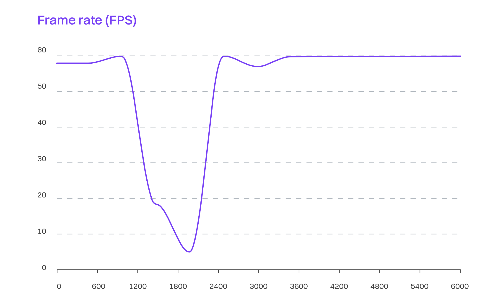
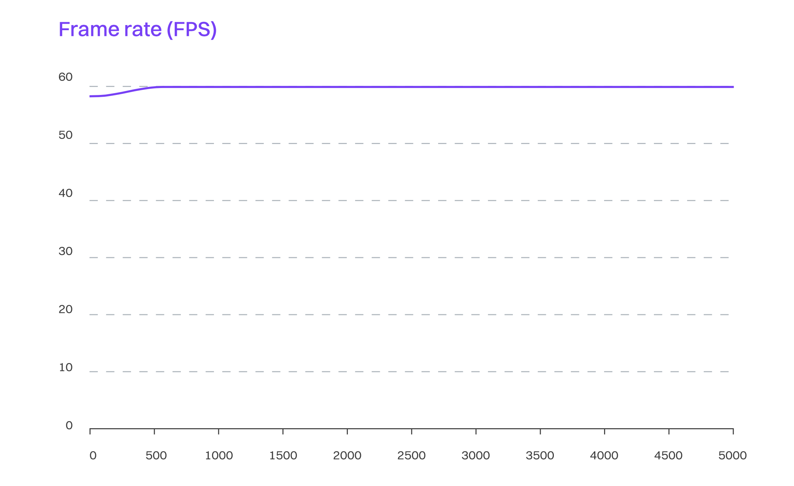
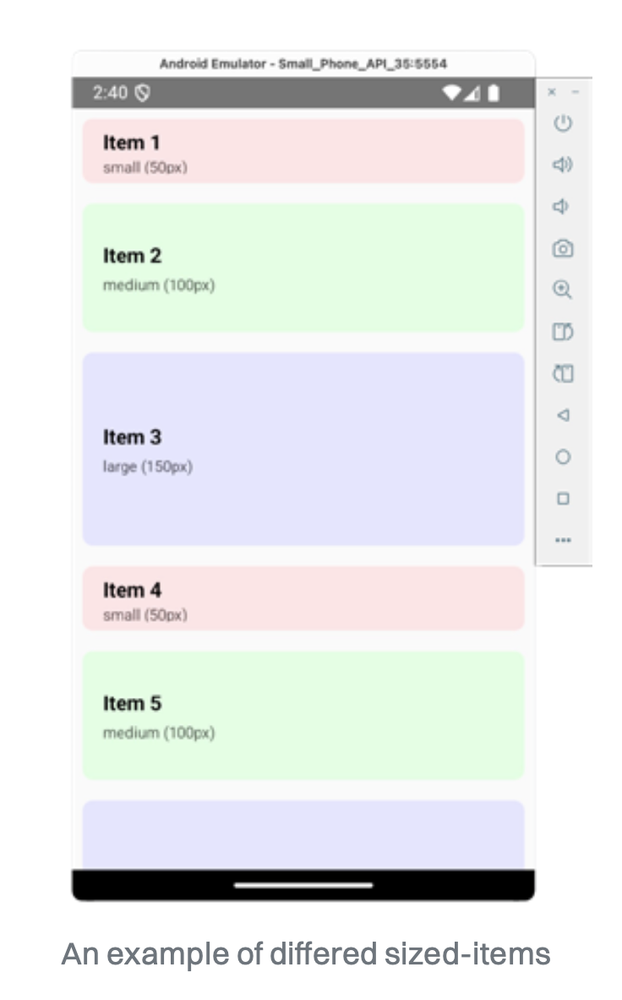
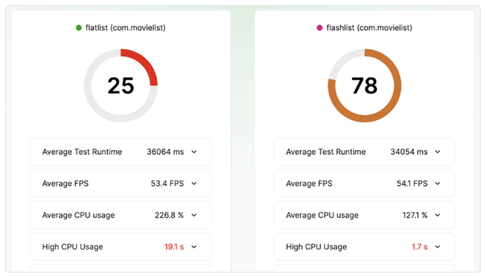
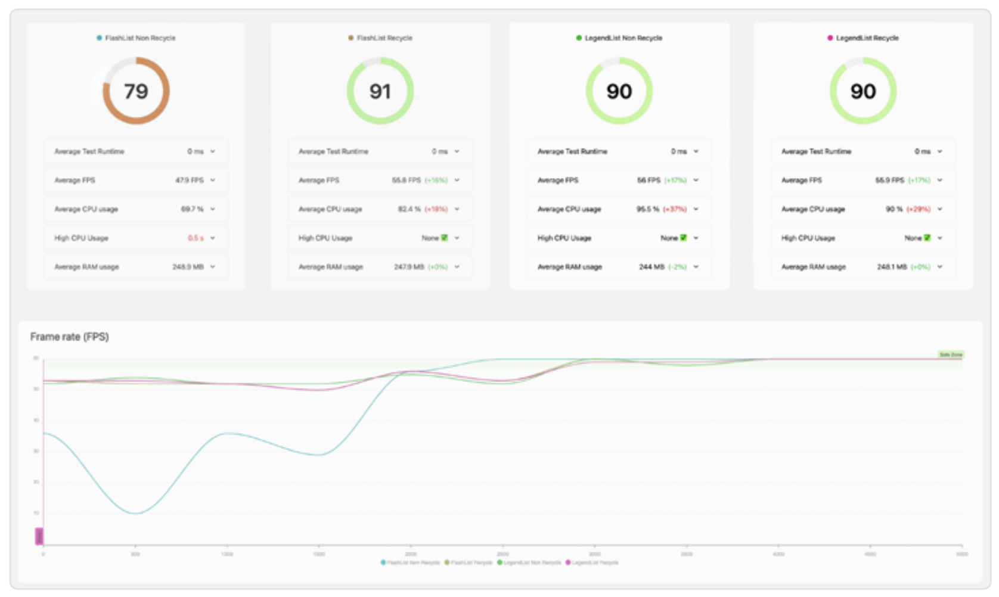

# 高阶定制组件

在 React Native 应用中，几乎一切都是组件。在组件层级的最底层，是一些被称为“原始组件（primitive components）”的组件，比如 `Text`、`View` 或 `TextInput`。这些组件由 React Native 实现，并由你目标平台提供支持，用于实现最基础的用户交互。

在构建应用时，我们会将它组合为更小的构建块。为了实现这一点，我们会使用这些原始组件。例如，要创建一个登录界面，我们可能会用一系列 `TextInput` 组件来获取用户信息，同时用一个 `Pressable` 组件来处理用户的交互。

从我们创建应用中的第一个组件开始，这种方法就是有效的，并且贯穿于开发过程的整个生命周期。

除了原始组件以外，`react-native` 包和一些第三方库还提供了各种更高阶的组件，这些组件是为特定目的设计和优化的。如果不使用它们，可能会影响你的应用性能，尤其是当你用实际的生产数据填充状态时。

## 显示列表

我们以列表为例。几乎每个应用在某个时刻都会涉及到列表。在 Web 开发中我们熟悉的默认方法是，把多个 `<View />` 组件嵌套在一个 `<ScrollView />` 中来构建一个列表

```tsx
import { View, Text, ScrollView } from "react-native";
const NUMBER_OF_ITEMS = 10;
const App = () => {
  const items = Array.from(
    { length: NUMBER_OF_ITEMS },
    (_, index) => `Item ${index + 1}`
  );
  return (
    <ScrollView>
      {items.map((item, index) => (
        <View key={index}>
          <Text>{item}</Text>
        </View>
      ))}
    </ScrollView>
  );
};
export default App;
```

这个例子在应用开发的初期阶段可能运行良好，但很快就会出现问题。我们来看看当查询结果返回 5000 个列表项时会发生什么

```diff
- const NUMBER_OF_ITEMS = 10;
+ const NUMBER_OF_ITEMS = 5000;
```

如下图所示，性能（用 FPS 测量）明显下降，甚至在大约一秒钟内应用变得无响应。



### 切换到 FlatList

上述问题可以通过从原始方案切换到更专业的 `FlatList` 组件来快速解决。`FlatList` 是 React Native 自带的一个组件，它的设计目标就是把大量元素高效地展示成列表。我们将 `ScrollView` 替换为 `FlatList` 来看看性能有何变化：

```diff
- import { View, Text, ScrollView } from 'react-native';
+ import { View, Text, FlatList } from 'react-native';

const NUMBER_OF_ITEMS = 5000;
const App = () => {
const items = Array.from({ length: NUMBER_OF_ITEMS }, (_, index)
    => `Item ${index + 1}`);

+ const renderItem = ({ item }) => (
+   <View>
+     <Text>{item}</Text>
+   </View>
+ );
  return (
-   <ScrollView>
-     {items.map((item, index) => (
-       <View key={index} >
-         <Text >{item}</Text>
-       </View>
-     ))}
-   <ScrollView>
+   <FlatList
+     data={items}
+     renderItem={renderItem}
+     keyExtractor={(item, index) => index.toString()}
+   />
  );
};

export default App;
```

现在这个例子在滚动时不再掉帧了



差异非常明显。你可能会好奇：既然 `FlatList` 最终底层也是使用 `View` 和 `ScrollView`，那为什么性能会差这么多？

### `FlatList` 为什么比 `ScrollView` 更快

关键在于 `FlatList` 组件中封装的逻辑。它包含了许多启发式算法和高级的 JavaScript 计算，用来减少不必要的渲染，从而确保在你滚动查看数据时体验始终保持在 60 FPS。

`FlatList` 内部使用了一个叫做 `VirtualizedList` 的组件，它实现了 `窗口化（windowing）` 的技术——只渲染并挂载当前视口中可见的元素，以及一个小的缓冲区。当你滚动时，它会动态卸载移出视口的项目，同时挂载新进入视口的项目，从而维持一个固定大小的渲染窗口。这大大减少了内存使用，并在大多数场景下确保了流畅的滚动性能。

### 在 `FlatList` 中渲染复杂元素

然而，仅仅使用 `FlatList` 在某些场景下可能还不够。它的性能优化依赖于不渲染屏幕外的元素。

话虽如此，整个流程中最耗费性能的部分是布局测量。FlatList 需要测量你的布局，以决定在滚动区域中应预留多少空间给即将渲染的元素。对于结构复杂的列表项来说，这会减慢交互响应，因为组件必须等所有项渲染完才能进行测量。

为了解决这个问题，你可以实现 `getItemLayout()` 方法，提前定义列表项的高度，从而避免测量。

```diff
import { View, Text, FlatList } from 'react-native';
const NUMBER_OF_ITEMS = 10;
+ const ITEM_HEIGHT = 50; // Define a height of a list item component or calculate it
const App = () => {
  const items = Array.from({ length: NUMBER_OF_ITEMS }, (_, index) => `Item ${index + 1}`);
  const renderItem = ({ item }) => (
-   <View>
+   <View style={{ height: ITEM_HEIGHT }}>
      <Text>{item}</Text>
    </View>
  );
+ const getItemLayout = (_, index) => ({
+   length: ITEM_HEIGHT,
+   offset: ITEM_HEIGHT * index,
+   index,
+ });
  return (
    <FlatList
      data={items}
      renderItem={renderItem}
      keyExtractor={(item, index) => index.toString()}
+     getItemLayout={getItemLayout}
    />
  );
};

export default App;
```

对于高度固定的列表项来说，这很直接。但如果列表项高度不一致，你可以根据文本行数或其他布局限制条件来计算一个大致值。

## `FlashList`：`FlatList` 的替代方案

如前所述，`FlatList` 相较于 `ScrollView` 已经极大提升了大数据列表的性能。但尽管 FlatList 是一个高性能的方案，它仍存在一些问题，比如滚动时出现空白、滚动卡顿、不够顺滑等。另外，`FlatList` 的设计会将某些元素保留在内存中，这在设备资源有限时会成为负担，最终导致列表变慢。

> 虽然按照[官方文档](https://reactnative.dev/docs/optimizing-flatlist-configuration)的优化建议可以在一定程度上减少上述现象的发生频率，但在大多数情况下，我们希望列表能更流畅且响应更快，而且不需要额外的优化工作。

使用 `FlatList` 时，JS 线程大多数时间都非常繁忙，而我们总希望在滚动列表时能看到那个“60 FPS”的表现。

那么，我们该如何应对这些问题呢？幸运的是，[Shopify](https://shopify.github.io/flash-list/docs/) 开发了一个非常优秀的 `FlatList` 替代组件：`FlashList`。

```tsx
import React from "react";
import { View, Text } from "react-native";
import { FlashList } from "@shopify/flash-list";

const NUMBER_OF_ITEMS = 10;
const ITEM_HEIGHT = 50;

const App = () => {
  const items = Array.from(
    { length: NUMBER_OF_ITEMS },
    (_, index) => `Item ${index + 1}`
  );

  const renderItem = ({ item }) => (
    <View style={{ height: ITEM_HEIGHT }}>
      <Text>{item}</Text>
    </View>
  );

  return (
    <FlashList
      data={items}
      renderItem={renderItem}
      estimatedItemSize={ITEM_HEIGHT}
    />
  );
};

export default App;
```

这个库基于 [RecyclerListView](https://github.com/Flipkart/recyclerlistview) 构建，继承了其“回收”能力，并修复了一些常见的痛点，比如复杂的 API、对动态高度单元格的支持，以及首次渲染时布局不一致的问题。

FlashList 会回收视口之外的视图，并将它们复用于其他列表项。如果列表项类型不同，它会使用 `recycle pool` 根据类型复用列表项。一个关键点是，列表项必须尽可能轻量，不能有副作用，否则会影响列表性能。

### 估算列表项大小

除了你在 FlatList 中熟悉的 `data` 和 `renderItem` 属性，FlashList 还有一个非常重要的属性：`estimatedItemSize`。这是 FlashList 用来估算每个列表项高度的参数，它决定了在初始加载和滚动时渲染多少个项。



如果你的列表包含不同大小的项，可以取它们的平均值。例如有的项是 50px，有的是 100px 和 150px，那么平均值就是 (50 + 100 + 150) / 3 = 100px。

> 如果你没有提供这个值，FlashList 会在首次渲染时发出警告。建议不要忽略这个警告，在列表真正展示给用户前，显式定义这个属性。

### 它究竟快多少？



从报告中可以看到，FlashList 的性能明显优于 FlatList：FlashList 的得分是 68/100，而 FlatList 只有 25/100。这表明 FlashList 在运行效率、资源消耗等各项指标上都更出色。帧率图也进一步印证了 FlashList 的优势，其性能更加稳定，维持在大约 56 FPS。虽然还有提升空间，但已经足够优秀。

> 你还可以借助 FlashList 的回调函数来测量性能和渲染时间，文档中的 [Metrics](https://shopify.github.io/flash-list/docs/metrics/) 部分提供了详细的使用方法。

## 关注 LegendList

截至 2025 年初，`Jay Meistrich` 正在积极开发另一个 `FlatList` 的替代组件，名为 [LegendList](https://github.com/LegendApp/legend-list)。它当前处于 `1.0-beta` 版本，在性能上已经接近 `FlashList`。`LegendList` 利用了 React Native 新架构的能力，并且完全由 JavaScript 实现。虽然现在还未完全准备好投入生产环境，但它绝对值得 React Native 社区关注。



使用专门的组件不一定总是能带来最快的性能，但从 `FlatList`、`FlashList` 和 `LegendList` 这几个例子可以看出，这些组件是可以互相替换的，为你提供了更多选择和验证的可能。而且和其他第三方依赖一样，升级后你可能会获得更优化的代码 —— 也可能不会！所以一定要做性能测试。
