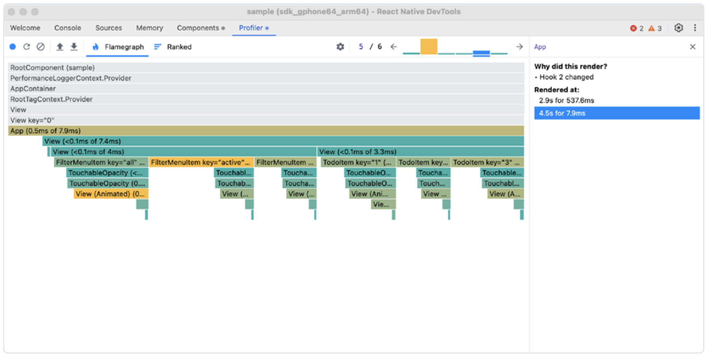
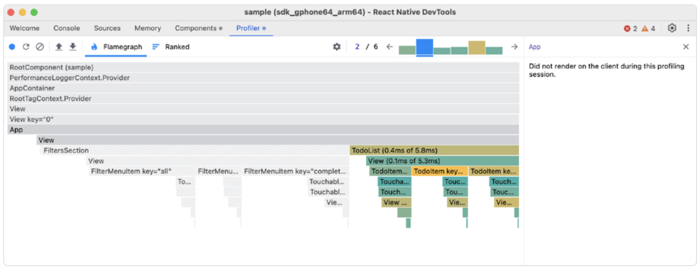

# 原子化状态管理

一个 React 应用每次都会根据其接收到的输入（如 state、props 或 context）从头开始重新创建自身。任何 React 组件都会根据这些输入，以及其父组件更新的情况重新渲染自身。这正是我们作为开发者如此喜爱 React 的承诺之一，因为它为我们提供了可预测性和确定性，确保我们的变更始终与整个应用保持同步。

然而，这种机制也经常导致性能问题，如果不加以优化，不必要的重新渲染会在组件树中不断传播。尤其在我们没有使用 React Compiler 的情况下，这种问题更容易出现。

组件树中重新渲染发生得越高层，变更传播到底层组件的可能性就越大，即使这些组件并未受到影响。这种情况在几乎所有 React 应用中都存在的全局应用状态中尤其常见。如果没有进行优化，全局 store 中的变更会导致不相关组件也发生重新渲染。

在那些严重依赖 React 的 Context 或 Redux 等外部库的代码库中，我们经常会观察到这种现象。

我们来看一段小代码片段，它演示了一个 `App` 组件，该组件持有 `filter` 和 `todos` 的状态，这些状态被 **FilterMenuItem** 和 **TodoItemList** 组件使用，而这两个组件并没有被 `memo` 处理。

```tsx
import React, { useState } from "react";
import { View, Text, TouchableOpacity } from "react-native";

const App = () => {
  const [filter, setFilter] = useState("all");
  const [todos, setTodos] = useState(initialState);

  const filteredTodos = todos.filter((todo) => {
    if (filter === "active") return !todo.completed;
    if (filter === "completed") return todo.completed;
    return true;
  });

  return (
    <View>
      {["all", "active", "completed"].map((filterType, index) => (
        <FilterMenuItem
          key={index}
          title={filterType}
          currentFilter={filter}
          onChange={setFilter}
        />
      ))}

      {/* Todo list section - re-renders entirely when filter changes */}
      {filteredTodos.map((todo, index) => (
        <TodoItem key={index} item={todo} onChange={setTodos} />
      ))}
    </View>
  );
};

export default App;
```

因此，无论是 `filter` 还是 `todos` 状态发生变化，所有组件：**App**、**FilterMenu** 和 **TodoItem** 都会重新渲染。更新一个 **TodoItem** 时会导致 **FilterMenu** 被重新渲染，即使它并不依赖于 `todos`。这并不是理想状态，但如果我们在 **React Native DevTools** 中检查组件，会发现它们要么是由于 `hook` 变更导致重新渲染，要么是由于其父组件重新渲染所致。



为了避免不必要的重新渲染，我们可以手动使用 `React.memo`、`useMemo` 和 `useCallback` 钩子进行优化，或者启用 **React Compiler** 让它自动为我们处理优化。还有第三种方式——我们可以跳出 React 的渲染模型，使用原子或信号（signal）为基础的状态管理库。

## 原子化状态管理

我们重点介绍 **atomic state**。它是一种自底向上的方法，将状态拆分为称为 atoms 的小型独立单元。相比维护一个庞大的集中式 store，每个 atom 表示一小部分状态，可以独立地在 React 渲染模型之外进行更新和订阅。这种方式能提供更细粒度的控制，并通过精确的重新渲染提升性能。

许多库都提供了这种原子、自底向上的状态管理方式，例如 [Zustand](https://github.com/pmndrs/zustand)、[Recoil](https://recoiljs.org/) 或 [Jotai](https://github.com/pmndrs/jotai)。接下来的示例中我们将使用 Jotai。

> “Jotai” 在日语中表示“状态”，而 “Zustand” 在德语中也表示“状态”。

在 Jotai 中，我们通过定义 atom 来表示一个状态片段。你只需要指定一个初始值，它可以是原始值，也可以是更复杂的数据结构：

```ts
const filterAtom = atom("all");
const todosAtom = atom(initialState);
```

然后我们可以使用 `useAtom` 钩子来获取 **filter atom** 的 `getter` 和 `setter`：

```tsx
const FilterMenuItem = ({ title, filterType }) => {
  const [filter, setFilter] = useAtom(filterAtom);

  return (
    <TouchableOpacity onPress={() => setFilter(filterType)}>
      <Text>{title}</Text>
    </TouchableOpacity>
  );
};
```

或者使用 `useSetAtom` 只访问 `todos` 的 `setter`：

```tsx
export const TodoItem = ({ item }) => {
  const setTodos = useSetAtom(todosAtom);
  return (
    <TouchableOpacity
      onPress={() => {
        setTodos((prev) =>
          prev.map((todo) =>
            todo.id === item.id ? { ...todo, completed: !todo.completed } : todo
          )
        );
      }}
    >
      {/* ... */}
    </TouchableOpacity>
  );
};
```

得益于原子式的状态管理方法，我们可以在不使用任何优化技巧（如 `memoization`）的情况下，避免无关组件因状态变更而重新渲染。

在我们的这个简单示例中，修改 `filter` 会导致所有读取 **filter atom** 的组件重新渲染：比如所有的 **FilterMenuItem**，因为它们都订阅了 `filter` 状态；还有根组件和其中的 **TodoItems**，因为它们依赖过滤后的结果。不过，当我们切换某个 `todo` 的完成状态时，只有订阅了 **todos atom** 的组件会被重新渲染——**FilterMenuItem** 不会受到影响，因为它们并不依赖 `todos` 的状态。



再次强调，跳出 React 的编程模型可以为我们的应用带来整体性能上的提升。多年来，这类原子状态库帮助我们减少了整体的重新渲染次数，同时它们在底层仍然使用了 React 的钩子机制以及 `useSyncExternalStore` API。现在我们有了 **React Compiler**，如果仅为了性能而迁移整个应用到新库，可能并不明智，因为 **React Compiler** 可以为我们完成这些繁重的优化工作。你可以在[《React Compiler》](./8.React_Compiler.md)章节中阅读更多内容。
