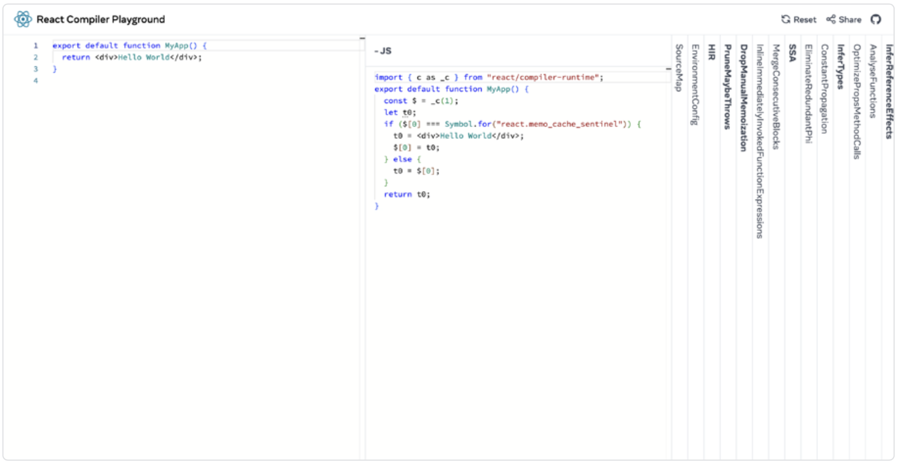
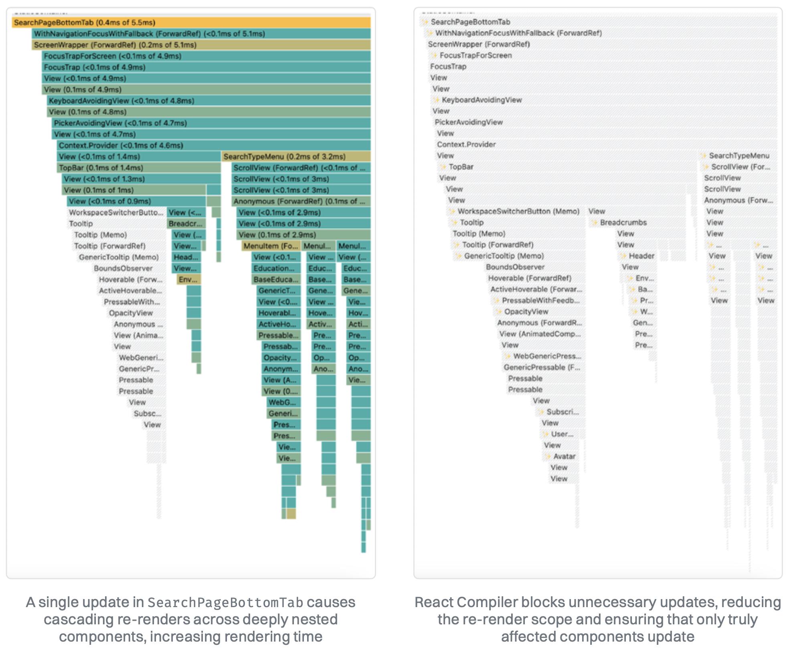
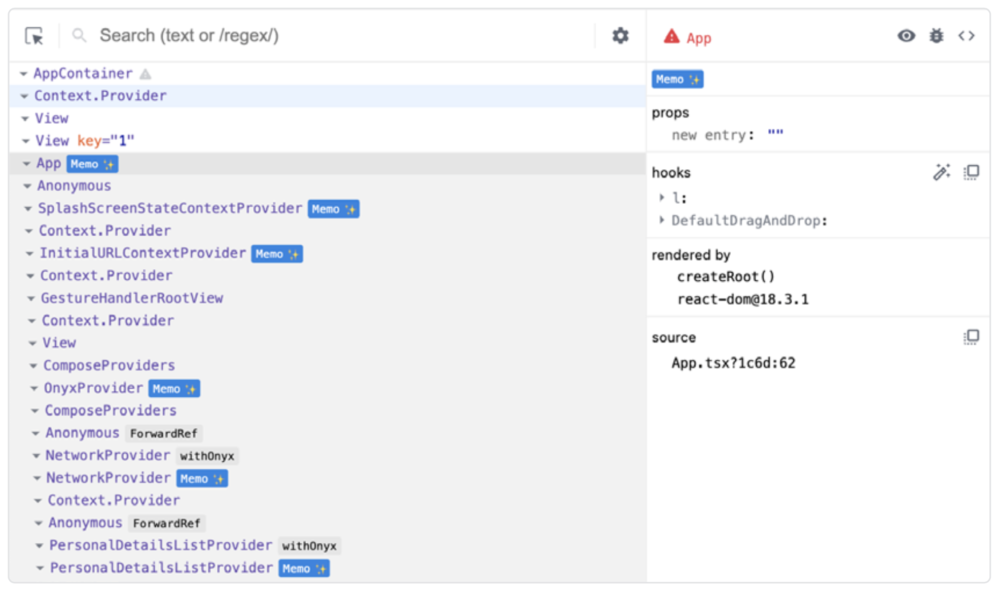

# React Compiler

正如你已经知道的那样，React Native 应用中的许多性能问题都来自 React 组件被过于频繁地重新渲染。为了解决这种过度渲染的问题，开发者可以使用各种记忆优化（memoization）技术，或者在某些使用场景中脱离 React 的渲染模型，例如全局状态管理。手写的记忆优化的问题在于，它会让代码变得更难阅读和理解。必须得有一种更好的方法，一种智能程序可以自动地为我们的函数和组件做记忆优化。确实有这样一个工具 —— 它就是 React Compiler。

React Compiler 是 React 核心团队推出的一款新工具，旨在在构建时自动优化 React 应用。它会分析组件结构并应用记忆优化技术，以减少不必要的重新渲染。与使用 `React.memo`、`useMemo` 或 `useCallback` 进行的手动优化不同，编译器会自动执行这些过程，使开发者无需额外工作也能获得理想的性能表现。

> 在撰写本指南（2025 年 1 月）时，React Compiler 仍处于测试阶段。像 Meta 这样的公司已经在生产环境中使用它，但你是否可以使用它取决于你的代码是否遵循 React 的规则。如果你迫不及待想要尝试，可以安装 npm 上标记为 beta 的测试版，或者尝试标记为 experimental 的每日构建版本。

## 为 React Compiler 做好代码准备

在将 React Compiler 添加到你的代码库之前，最好通过安装一个非侵入式的 ESLint 插件来提前为新工具做好准备。React Compiler 的 ESLint 插件是一个实用工具，它能够实时检测潜在问题，标记违反[React 规则](https://react.dev/reference/rules)的地方，并警告可能影响优化的阻碍因素。

即使你还没有使用编译器，启用这个插件也可以提升代码质量，并在你准备采纳它时确保过渡更加顺畅。

> React Compiler 与 React 17 及以上版本的应用和库兼容。不过，它的效果依赖于你是否遵循了 React 的最佳实践。它不会优化类组件、过时的模式或那些违反[React 规则](https://react.dev/reference/rules)的组件。

要安装这个插件，可以将 beta 标签的 **eslint-plugin-react-compiler** 添加到开发依赖中：

```bash
npm install eslint-plugin-react-compiler@beta --save-dev
```

然后在 ESLint 中配置它以启用编译器规则：

```js
import reactCompiler from "eslint-plugin-react-compiler";

export default [
  {
    plugins: {
      "react-compiler": reactCompiler,
    },
    rules: {
      "react-compiler/react-compiler": "error",
    },
  },
];
```

接下来你就可以开始修复代码中违反 React 规则的部分了。

## 运行编译器

现在我们已经准备好了 Linter，是时候面对问题的核心了：用于编译器的 Babel 插件：

```bash
npm install -D babel-plugin-react-compiler@beta
```

你可以像下面这样在 Babel 配置中设置它：

```js
const ReactCompilerConfig = {
  target: "19", // <- pick your 'react' version
};

module.exports = function () {
  return {
    plugins: [["babel-plugin-react-compiler", ReactCompilerConfig]],
  };
};
```

如果你要在 React Native 0.78 以下版本（该版本内置了 React 19）上使用 React Compiler，你还需要额外添加一个包：`react-compiler-runtime@beta`，并在 **ReactCompilerConfig** 中将目标版本设置为 `18`。这样你就基本准备好了，或者说差不多准备好了。

你可能会注意到，编译器在某些文件上会失败。针对这种情况，Babel 插件允许使用 `sources` 配置进行一定程度的定制，你可以跳过某些组件甚至整个目录：

```js
const ReactCompilerConfig = {
  sources: (filename) => {
    return filename.indexOf("src/path/to/dir") !== -1;
  },
};
```

通过这种方式，你可以逐步将 React Compiler 引入项目，从而降低使用测试版软件时引发回归问题的风险。我们来看看这个编译器如何影响源码，以下是一个带有 `onChangeText` 回调的 **TextInput** 简单示例：

```tsx
export default function MyApp() {
  const [value, setValue] = useState("");
  return (
    <TextInput
      onChangeText={() => {
        setValue(value);
      }}
    >
      Hello World
    </TextInput>
  );
}
```

```tsx
import { c as _c } from "react/compiler-runtime";
export default function MyApp() {
  const $ = _c(2);
  const [value, setValue] = useState("");
  let t0;
  if ($[0] !== value) {
    t0 = (
      <TextInput onChangeText={() => setValue(value)}>Hello World</TextInput>
    );
    $[0] = value;
    $[1] = t0;
  } else {
    t0 = $[1];
  }
  return t0;
}
```

请注意 React Compiler 如何转换了我们的代码。它从 **react/compiler-runtime** 中引入了一个 c 函数，并使用它根据状态决定渲染内容。**c(n)** 函数是 React 19 中 **useMemoCache(n)** 的一个兼容填充版本，允许在早期版本中实现相同行为。它创建了一个在多次渲染间持久存在的数组，类似于 `useRef`。如果我们使用 `useRef` 来实现这个功能，会像下面这样：

```js
function useMemoCache(n) {
  const ref = useRef(Array(n).fill(undefined));
  return ref.current;
}
```

在上述示例中，`const $ = _c(2)` 的作用等同于 `useMemoCache(2)`，返回一个包含两个槽位的数组。`$[0]` 存储上一次的值，而 `$[1]` 存储上一次渲染的 **TextInput**。当 `value` 变化时，会在 `$[1]` 中存入新的 **TextInput**。如果 `value` 没有变化，React 会复用缓存的组件而不是重新渲染。

> React Compiler 使用浅比较，和 ` React.memo``、useMemo ` 一样，所以在将对象或数组作为 `props` 传递时要小心。如果它们的引用发生了变化，就会被视为新值。

## React Compiler Playground

如果你想了解 React Compiler 是如何转换你的代码的，[React Compiler Playground](https://playground.react.dev/) 是一个好帮手。它允许你检查编译器如何优化组件，测试不同的结构，并调试编译器的输出。这个交互式环境可以帮助你查看编译器做了哪些更改，并识别组件中可能出现的意外行为。



## 是否可以移除手动记忆优化？

还不能。虽然 React Compiler 能自动进行记忆优化，但它并不能完全替代 `React.memo`、`useMemo` 或 `useCallback` 的所有使用场景。如果你的代码严重依赖这些优化措施，建议你在编译器达到稳定版本之前仍然保留它们，直到 React 团队正式推荐可以移除手动优化。我们预计 ESLint 插件会引导你识别哪些优化是不再必要的。

## 可以期待哪些性能提升？

React Compiler 旨在减少不必要的重新渲染，并降低对手动优化的依赖。它通过自动记忆组件计算来防止级联更新并提升性能，尤其是在组件层级较深的大型应用中表现更为显著。

在 [Expensify](https://github.com/Expensify/App) 应用上测试 React Compiler 后，性能上有了可衡量的提升。例如，其中一个最重要的指标“Chat Finder 页面可交互时间”（也就是实际的 TTI）提升了 4.3%。虽然 React Compiler 显著减少了不必要的渲染，但对于已经手动优化过的应用来说，提升可能相对较小。



### 如何验证优化效果？

打开 **React DevTools** 查看哪些组件已被 React Compiler 优化。被优化的组件会带有一个 **Memo**✨ 标签，表示该组件已经被编译器优化。



> React Compiler 是为通用 React 构建的，但主要在 Web 环境中进行测试。在 React Native 中启用它可能还需要额外步骤，以确保 **Memo** 标签能够正确显示。
>
> 由于 React Native 自带了它自己的 `react-devtools` 版本，你可能需要在 `package.json` 中覆盖该版本，并确保其升级至 6.0.1 或更高版本。否则 **Memo** 标签可能不会显示。
>
> 你可以在 DevTools 中点击设置图标来检查 React DevTools 后端的版本。

### 下一篇：[实现不掉帧的高性能动画](./9.High-Performance_Animations_Without_Dropping_Frames.md)
