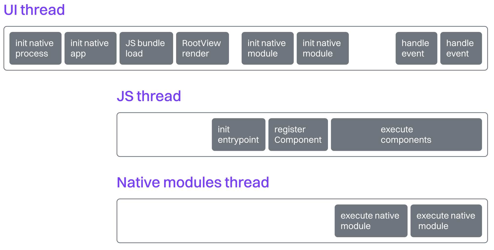

# Native

优化 React Native 在 iOS、Android 和 C++ 原生端的 FPS 的指南与技巧

## 引言

在第一部分中，我们探索了 React Native 应用在 Android 或 iOS 上简化的启动模型。我们还了解到，多达 80% 的性能问题源自 JavaScript 线程，这意味着至少还有 20% 的问题与原生端有关。这就为优化留下了相当大的空间。

因此，第二部分将聚焦于时间线中的原生部分。我们将从影响应用启动最关键的部分——JS 线程初始化之前运行的代码开始。随后，我们将介绍一些运行时优化策略，帮助我们在应用启动后实现更好的性能。

### 进程（预）初始化

让应用在屏幕上显示 UI 并不是一件简单的事。首先，操作系统（在此我们以 Android 为例）需要初始化将要引导应用的进程。事实上，操作系统可以通过不同机制，在用户打开应用之前就完全或部分地执行这种初始化。

> 这种技术在 Android 上被称为“预热（warm）”或“热启动（hot startup）”，你可以在 Android Developer 官方网站上了解更多相关内容。iOS 也支持类似的优化技术，称为 [预热](https://developer.apple.com/documentation/uikit/about-the-app-launch-sequence#Prepare-your-app-for-prewarming)。

在对应用启动进行可靠测量时，理解这些机制尤为重要。我们始终需要专注于“冷启动（cold startup）”。在初始化期间，操作系统还会为应用的内存数据创建安全沙箱，并通知其他系统服务。

### 应用启动与重启

一旦进程被初始化，操作系统将进入应用初始化阶段（调用 `Application.onCreate`），然后启动 Activity 并调用其 `Activity.onCreate()` 方法。在这里，原生开发者可以初始化他们的代码，React Native 的执行流程也将在此正式开始。接下来，操作系统会调用其他生命周期方法，例如 `Activity.onStart()`，并进入 UI 渲染阶段，在这个阶段，UI 线程会处理布局和绘制任务、测量视图并将它们显示在屏幕上。

### React Native 的线程模型

等等，什么是 UI 线程？如果你有 JavaScript 背景，你可能会对线程和线程模型这个话题感到困惑。毕竟，JavaScript 是一门单线程语言，它通过并发来避免多线程语言带来的各种陷阱（以及好处）。

线程是进程中最小的执行单元。它是一条独立的执行路径，可以在一个进程内并发运行多个任务，并共享该进程的资源（例如内存）。在移动应用开发中，线程用于同时执行多个任务，使应用保持响应性。

移动开发者通常在两种线程之间进行操作：一种是用于 UI 渲染的 UI 线程，另一种是用于执行较重任务和业务逻辑的后台线程，它们的作用是避免阻塞主线程。

Web 开发者通常是在一个线程上同时完成 UI 渲染和业务逻辑处理，并通过 CSS 硬件加速或并发机制（如 `async` 函数、`Promise`、setTimeout` 等）进行优化。这些 API 基于 JavaScript 环境提供的事件循环——无论是浏览器还是 Node.js 等服务端运行时。在 React Native 应用中，也存在这样的事件循环，它被封装在跨平台的 C++ 渲染器 Fabric 中，并由 Hermes JavaScript 引擎访问。

顺便一提，值得欣赏的是，React Native 将 JavaScript 与原生平台的优势整合到一个声明式模型中。UI 和后台线程通常被很好地抽象掉了，因此 React Native 工程师可以将编写 Web 应用的思维方式迁移到移动端，React 的原生渲染器会自动在最合适的线程上执行相应的代码。

到 React Native 主题。现在原生应用已经初始化，原生 Kotlin 代码（随 `com.facebook.react:react-android` 库一起加载）就可以开始执行它的魔法了。此代码将初始化 Hermes——这是一个为移动端 React Native 应用创建并优化的默认 JavaScript 引擎。初始化完成后，它会加载现有的 JS bundle，通常是 Hermes 字节码（HBC）格式。

这种字节码格式可以避免 Hermes 进行昂贵的解释操作。HBC 文件一旦加载到内存中，就可以直接在 JS 线程（`mqt_v_js`）上执行。

在执行任何 JavaScript 代码之前，JS 线程会先处理所有标记为“急切执行”的原生模块，例如 C++ TurboModules 或使用新架构的互操作层（Interop Layer）的 TurboModules。完成之后，JS 代码开始执行，并在专用线程（`mqt_v_native`）上惰性初始化其他 TurboModules，同时将渲染与事件处理任务调度给 UI 线程，由跨平台的 C++ 渲染器 Fabric 进行处理。

### 实战演示

要是我们能亲自检查这些应用启动阶段就好了，对吧？在下一章中，我们将使用 Android 和 iOS 的专用平台性能分析工具来完成这件事。有了这些知识，你将能够自行分析应用的初始化阶段，更好地理解其内部工作原理。小心哦，深入探索是会上瘾的！

### 下一篇：[理解不同平台的差异](./1.Understand_Platform_Differences.md)
