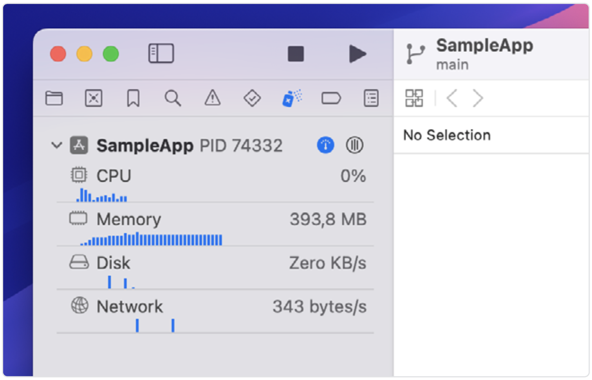
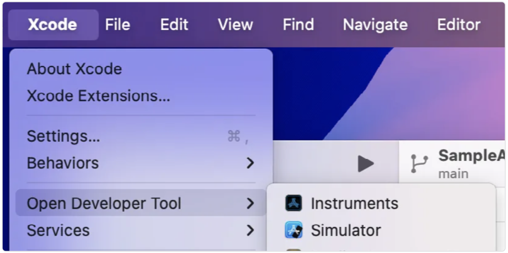
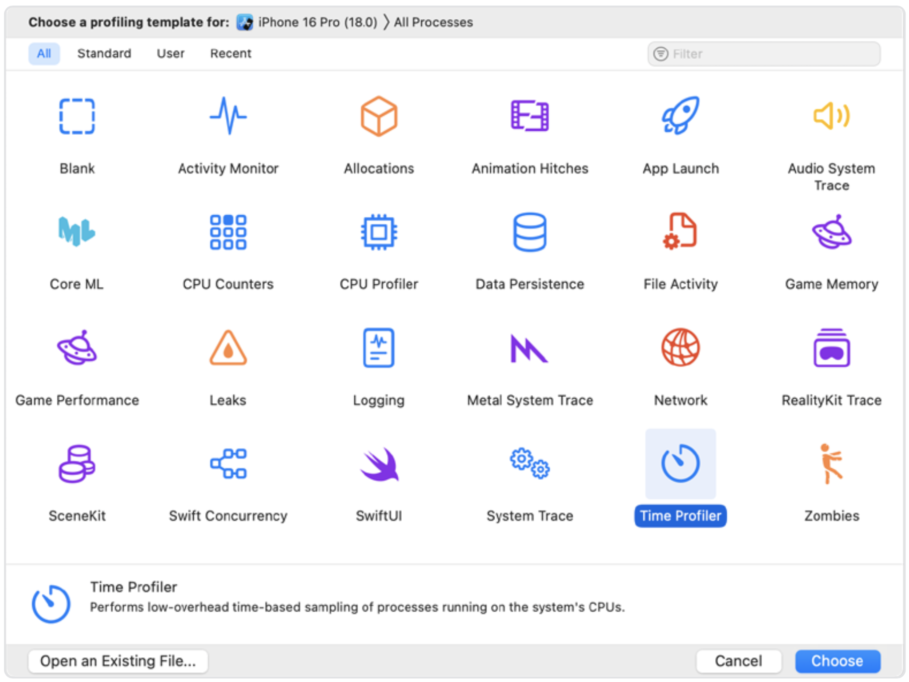
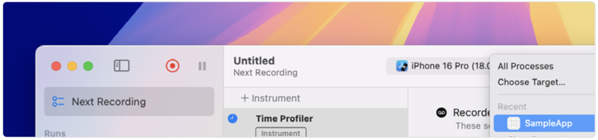
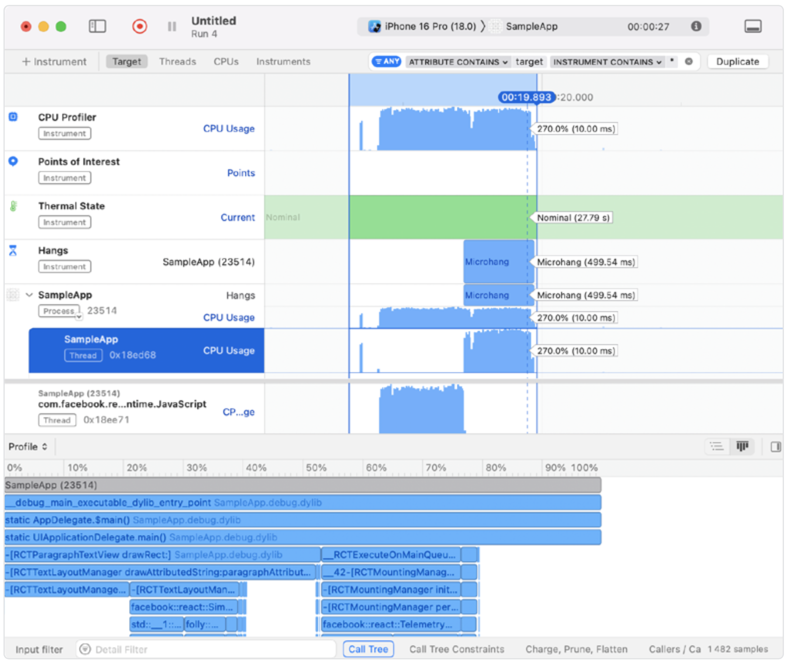
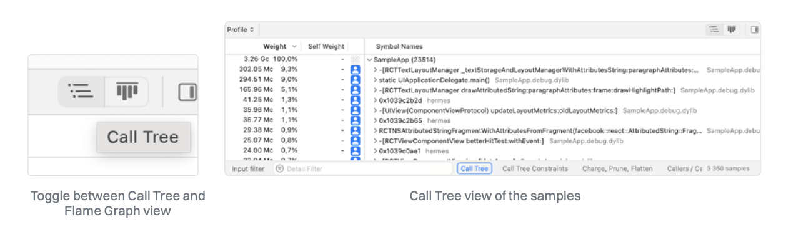
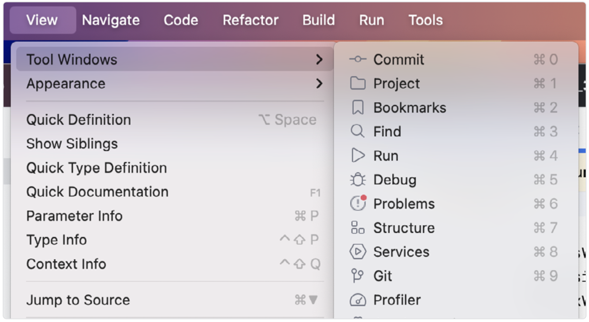
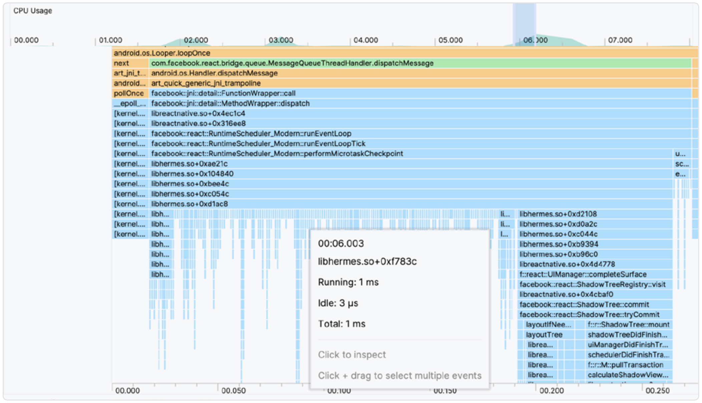
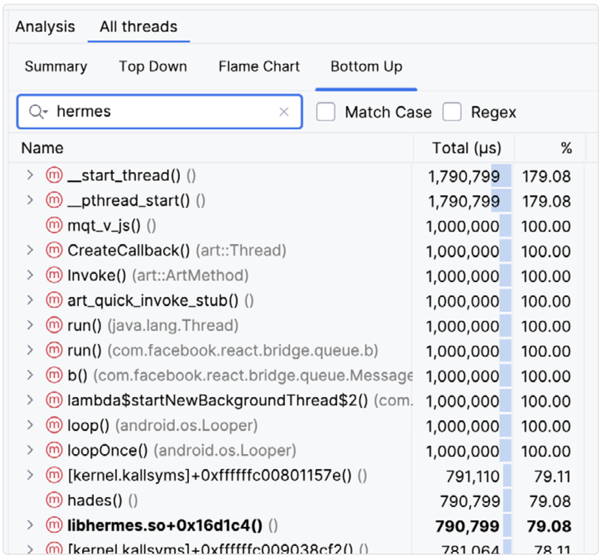

# 如何分析 React Native 中原生部分的性能

性能分析不仅对我们在[《如何分析 JavaScript 和 React 的性能》](../part1/1.How_to_Profile_JS_and_React_Code.md)章节中讲解过的 JavaScript 代码至关重要，对其他语言和平台（如 iOS 或 Android）同样重要。性能瓶颈可能出现在任一端，当 React Native 的 DevTools 不足以解决问题时，我们就需要借助平台自身的原生工具——Android Studio 或 Xcode。

除了 CPU、内存和网络性能分析外，电池使用情况对移动用户来说也同样重要。如果我们排除屏幕亮度的影响，它通常可以作为 CPU 开销的间接指标。

## iOS

Xcode 提供了 Debug Navigator 视图，可以一目了然地查看 CPU、内存、磁盘和网络负载。它位于 Xcode 侧边栏中的“Debug Navigator”图标下，前提是你的应用正在运行并附加到 Xcode 调试器上：

CPU 监视器测量一段时间内的工作量。该百分比值相对于单个核心而言，因此在 React Native 应用中可能超过 100%。内存监视器用于观察应用的内存使用情况。所有 iOS 设备都使用 SSD 作为永久存储——访问这些数据的速度比 RAM 慢。磁盘监视器用于了解应用的磁盘读写性能。网络监视器则用于分析你的 iOS 应用中的 TCP/IP 和 UDP/IP 连接。

你可以点击这些监视器查看更多信息。它还提供一个默认不显示但对检查 UI 非常有帮助的额外监视器——View Hierarchy（视图层级结构），我们会在[《使用 View Flattening 优化视图结构》](../part2/6.Use_View_Flattening.md)一章中详细讲解。

### Instruments

Xcode 内置了一个名为 Instruments 的调试和性能分析工具。它是一组检测工具套件，每个都有不同的用途。你可以根据目标选择不同的模板，比如提升性能、电池续航，或修复内存问题。对于 CPU 分析，我们将使用 Time Profiler。下面来深入了解。
打开 Xcode 后，依次点击菜单 `Xcode > Open Developer Tool > Instruments` 来启动 Instruments：

向下滚动找到 Time Profiler 工具，它包含了 CPU Profiler：

这会打开一个新窗口。要开始分析你的应用，点击目标设备下拉菜单（如 iPhone 16 Pro），选择你的应用（例如 SampleApp），然后点击录制按钮（红色圆圈）：

分析器将重新启动你的应用，并从启动开始采集 CPU 样本用于分析。现在你可以像用户一样使用应用，重现你想调查的性能问题。一旦数据足够多，就可以在 Instruments 窗口中停止录制。

在我们的案例中，我们渲染了一个包含 5000 个视图的 ScrollView，并且在每次点击按钮时状态更新会导致重新渲染。我们还会切换一张图片，推动列表重新布局。

这样的交互在 Instruments 的 CPU Profiler 中的分析图如下所示：

这里有很多内容需要解读。我们共采集了 27 秒的数据，但只关注其中很小的一段时间。使用 Cmd + 快捷键可以放大时间线，配合鼠标或触控板横向滚动查看感兴趣的部分。

在我们的案例中，我们聚焦在约 1.3 秒的时段——也就是点击按钮并等待应用更新的时间。你可以看到 UI 线程（标记为 SampleApp）上出现一个小峰值，随后是 JS 线程上的高强度 CPU 操作，以及大量 UI 线程的工作。底部的 flame graph（火焰图）显示了 React Native 内部的调用点（我们已过滤掉系统库）。

请注意，当 UI 线程的 CPU 负载较高时，会显示为 "Microhang"（微卡顿），而 JS 线程的高负载则不会。这说明 UI 线程正进行大量工作，无法立即响应用户交互。如果线程完全阻塞，则会显示为 "Hang"（卡顿），这应该是你优先调查的问题。"Hang" 工具是 Time Profiler 的补充，可以快速发现应用流程中的问题区域。

> 即使 JS 线程被完全阻塞，用户仍然可以与原生 UI 元素交互，比如点击按钮——只是不会立即反馈到 JS 线程。这是 React Native 的一个良好设计，值得我们珍惜。

CPU Profiler 工具提供了很多自定义选项，帮助你精确定位问题源。例如，可以过滤掉系统库的调用树，或将调用树倒置，以获得一种你在其他分析工具中熟悉的底向上视图，并按“样本数”进行排序（比如 Mc 表示百万级样本）。这样可以找到最耗时的函数，而不管它是由哪个上层函数调用的。你还可以按线程查看调用，以便进一步分析。

你可以在调用树和火焰图之间切换，这在 React Native DevTools 中你可能已经熟悉了。在我们最初的截图中，我们固定显示了 JavaScript 线程，以便观察它与 UI 线程及卡顿事件的关系。

通过 CPU 分析器，我们得出结论：将 5000 个元素存入 ScrollView 对性能非常不利，必须优化。

## Android

对于 Android 平台，我们可以使用 Android Studio 和其内置工具来分析应用的 CPU、内存、网络和电池使用情况。

### Android Profiler

Android Studio 是 JetBrains 开发的 IDE，由 Google 官方支持，是开发 Android 应用的标准工具。它功能强大，将多种功能集中在一体，其中包括 Android Profiler。

打开 Profiler 的方式是点击菜单栏中的 `View > Tool Windows > Profiler`：

或者点击工具栏中的 **"Profiler: Run 'app' as profileable"**。如果点击无效，你可能需要运行一个可调试版本，或按照[官方 Android 开发者指南](https://developer.android.com/studio/profile/build-run-manually)创建并运行 profileable 版本的应用。

现在，你应该能连接上运行中的 profileable 应用。我们选择 "Find CPU Hotspots" 任务并点击 “Start profiler task” 按钮开始采集样本。

> 值得注意的是，Android 设备生态远比 iOS 分散。手机、平板、电视等从低端到高端设备不一而足。建议选择性能最低的设备或模拟器来进行分析。如果可能，结合实时用户数据进行分析。

我们将执行与 iOS 相同的操作：多次点击按钮以触发大列表的重新渲染。停止分析后，界面会变成火焰图，展示 CPU 和各个线程所做的工作。

让我们放大在点击按钮之后的 JS 线程部分，可以看到 CPU 使用率上升的迹象：

我们可以观察到 Hermes JS 引擎执行了大量 1 毫秒的小型操作——遍历并准备绘制所有 5000 个视图。这些操作加起来超过了 240 毫秒，远超每帧 16.6 毫秒的预算，从而无法保持 60 FPS。注意，大约三分之一的时间花在了 React 协调算法的 "commit" 阶段，该阶段使用 Yoga 布局引擎排布视图，随后将其挂载并绘制到屏幕上。

如果我们在火焰图上往上滚动，查看主线程，可以看到一个用于按下按钮的事件处理程序，接着是释放手指的事件。

触摸释放的时机几乎与 JS 线程高负载开始的时间完美对齐，这是通过 React Native 内部的同步 JSI 调用实现的。在旧架构中，这些信息会通过桥接机制序列化并广播，从而引入额外开销。

和其他性能分析工具一样，我们可以访问自上而下或自下而上的调用树分析，并按库或感兴趣的调用过滤内容。

值得一提的是，像 Android Studio 和 Chrome JS Profiler 这样的工具都允许导出性能追踪记录，并用第三方工具加载。

### Perfetto

Perfetto 是一个很实用的工具，可以用于系统级性能分析、应用追踪及分析导出的 trace 文件。它还为 Android Studio 的 Trace Viewer 提供了增强功能。你可以通过 [ui.perfetto.dev](https://ui.perfetto.dev/) 上传 trace 并从另一个角度进一步检查它。

掌握如何使用性能分析工具，是你可以学到的最关键技能之一，它能帮助你在任何代码库中修复各种性能问题。即使是你没写过的代码，只要有合适的工具，你也能理解其性能特征，并在需要的地方做出优化。

### 下一篇：[如何测量 TTI](./3.How_to_Measure_TTI.md)
