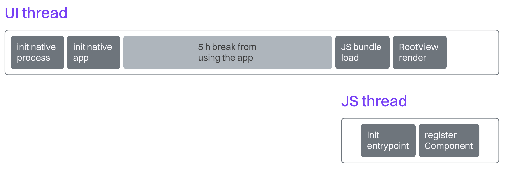
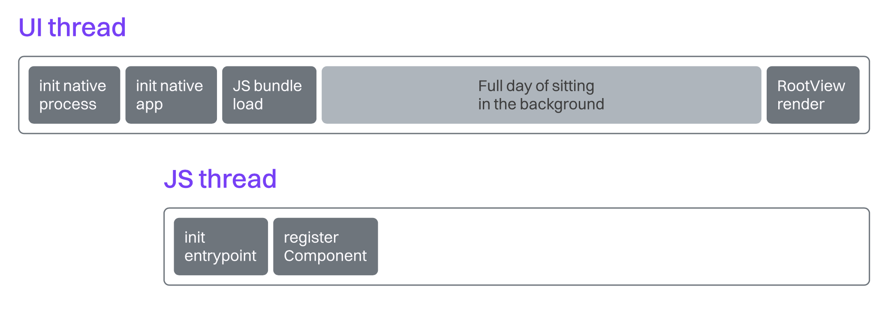

# 如何测量 TTI

应用程序的交互时间（Time to Interactive，简称 TTI）指标是每个应用都应跟踪的两个最重要指标之一。它告诉我们从点击应用图标到显示用户可通过触摸、语音或其他输入方式进行交互的有意义内容之间所经过的时间。用户期望这个过程尽可能快，最好是瞬间完成。

像 iOS 这样的操作系统甚至基于用户的过往使用经验，使用机器学习预测来“预热”某些应用，从而将启动速度提升多达 40%。这有助于营造整个 iOS 生态系统快速响应用户意图的印象，尽管某些应用实际上加载非常缓慢。

> 交互时间描述了用户打开并开始使用我们应用的速度。你必须跟踪并优化它，因为它会显著影响用户体验、满意度、留存率，进而影响你所开发应用的收入。

各种质量参差不齐的报告指出，用户通常期望应用在 2 到 4 秒内加载完成，否则他们会选择其他替代应用（如果有的话）。然而，我们的经验告诉我们，你应该相信自己的数据，并对外部报告持适度怀疑的态度。经验也告诉我们，TTI 应该尽可能低。

但如何划定“投入”与“产出”的合理界限呢？是否值得花费数月的工程团队时间，只是为了将某款 Android 参考设备上的 TTI 从 2.9 秒降至 2.3 秒？你的用户群体是独一无二的，只有观察他们的行为才能得出答案。本章将重点介绍帮助你尽可能降低 TTI 的技术手段。

## 可靠地测量 TTI

根据底层操作系统及其能力，我们的应用可能会执行冷启动、温启动、热启动，或被预热。这意味着你每天早上大约 8 点打开的那款新闻应用，在 iOS 上“冷启动”时通常需要 10 秒，但几天后可能在不到 6 秒内就开始启动。这是一个相当大的差异。



在另一个场景中，如果我们早上打开了应用，晚上再回来使用它，它可能仍驻留在后台。此时我们再次访问它，仅需渲染 React 部分，与冷启动相比整个过程明显加快。



如果我们天真地从每次启动应用开始测量直到其完全可交互的 TTI，那么我们将得到差异极大的测量数据，这将无法告诉我们这个指标是否退步或改善。

因此，只有在冷启动状态下测量应用才有意义，应该排除预热、温启动和热启动等其他启动状态的测量。幸运的是，iOS 和 Android 的开发者工具为开发人员提供了应对这一问题的方法。

## 设置性能标记

React Native 应用启动流程的每个阶段都可以通过性能标记进行检测——这是一段用于收集特定事件发生时间信息的代码。在 React Native 应用中，我们至少需要关注以下几个启动阶段：

- Native Process Init——通过 **nativeAppStart** 和 **nativeAppEnd** 标记描述。

- Native App Init——通过 **appCreationStart** 和 **appCreationEnd** 标记描述。

- JS Bundle Load——通过 **runJSBundleStart** 和 **runJSBundleEnd** 标记描述。

- React Native Root View Render——通过 **contentAppeared** 标记描述。

- React App Render——通过 **screenInteractive** 标记描述。

要在 iOS、Android 和 React 代码中记录这些标记，你需要一个原生模块或第三方库。我们最满意的是 [react-native-performance](https://github.com/oblador/react-native-performance/blob/master/packages/react-native-performance/README.md)。它向 iOS 和 Android 暴露了 **RNPerformance** 类，使你可以定义自定义标记：

```Swift
import ReactNativePerformance

RNPerformance.sharedInstance().mark("myCustomMark")
```

```Kotlin
import com.oblador.performance.RNPerformance;

RNPerformance.getInstance().mark("myCustomMark");
```

这些标记随后可通过与网页类似的 **performance** API 在 React 代码中使用：

```js
import performance from "react-native-performance";

performance.measure("myCustomMark");
performance.getEntriesByName("myCustomMark");
// returns: [{ name: "myCustomMark", entryType: "myCustomMark",startTime: 98, duration: 2137 }]
```

> 你可以使用 **react-native-performance** 提供的内置标记（例如 **nativeLaunchStart** 或 **runJsBundleEnd**），而不是自定义标记。值得注意的是，**nativeLaunchStart** 是在主线程之前（pre-main）进行测量的，即在预热阶段；其余标记则是在预热之后进行的。你可能需要将其过滤掉，或在 `main()` 中创建一个自定义标记。

### Native Process Init

首先确定是否为冷启动。在 iOS 上，你可以使用 **ProcessInfo** 获取此信息：

```Swift
let isColdStart = ProcessInfo.processInfo.environment["ActivePrewarm"] == "1"
```

在 Android 上，你需要使用 **onActivityCreated** 生命周期方法获取这一信息，因此稍显冗长：

```Kotlin
class MainApplication : Application(), ReactApplication {
  var isColdStart = false
  override fun onCreate() {
    super.onCreate()

    var firstPostEnqueued = true
    Handler().post {
      firstPostEnqueued = false
    }
    registerActivityLifecycleCallbacks(object :
    ActivityLifecycleCallbacks {
      override fun onActivityCreated(
        activity: Activity,
        savedInstanceState: Bundle?
      ) {
        unregisterActivityLifecycleCallbacks(this)
        if (firstPostEnqueued && savedInstanceState == null) {
          isColdStart = true
        }
      }
    })
  }
}
```

由于我们只想在应用位于前台时测量 TTI，因此还需要考虑这一点。在 iOS 的 **AppDelegate.swift** 文件中，我们可以在 **didFinishLaunchingWithOptions** 处理器中挂载：

```Swift
@main
class AppDelegate: RCTAppDelegate {
  var isForegroundProcess = false
  override func application(_ application: UIApplication, didFinishLaunchingWithOptions launchOptions: [UIApplication.
    LaunchOptionsKey : Any]? = nil) -> Bool {
      if application.applicationState == .active {
        isForegroundProcess = true
      }
      return true
    }
}
```

而在 Android 的 **MainApplication.kt** 文件中，我们可以通过 **processInfo.importance** API 来检查是否为前台进程，并封装成 **isForegroundProcess** 辅助函数：

```Kotlin
class MainApplication : Application(), ReactApplication {
  private fun isForegroundProcess(): Boolean {
    val processInfo = ActivityManager.RunningAppProcessInfo()
    ActivityManager.getMyMemoryState(processInfo)
    return processInfo.importance == IMPORTANCE_FOREGROUND
  }
}
```

你可以通过以下 API 在 iOS 和 Android 上访问应用初始化时间戳，用于获取 nativeLaunchStart 指标的数据：

```Swift
var tp = timespec()
clock_gettime(CLOCK_THREAD_CPUTIME_ID, &tp)
```

```Kotlin
Process.getElapsedCpuTime()
```

接着，nativeLaunchEnd 的最接近近似值是在 iOS 上初始化原生模块的时间，或在 Android 上创建内容提供者（Content Provider）的时间：

```Swift
+ (void) initialize
```

```Kotlin
class StartTimeProvider : ContentProvider() {
  override fun onCreate(): Boolean {}
}
```

初始化器和其他主线程之前的步骤（pre-main）可能会提前数小时运行，在 iOS 应用实际启动并进入 `main()` 之前就已执行。因此，务必考虑主线程之前的初始化器与进程启动时间之间的差值。

### Native App Init

要记录 iOS 应用创建时的 appCreationStart 标记，可以在 main 方法中挂载；在 Android 上，则可利用主应用的 onCreate 生命周期方法：

```Swift
int main(int argc, char *argv[])
```

```Kotlin
class MainApplication : Application(), ReactApplication {
  override fun onCreate() {}
}
```

由于 iOS 的预热机制会执行应用的启动流程，直至但不包括调用 **UIApplicationMain** 的时刻，因此在这之前的时间段我们无需担心预热对时序的影响。

然后，原生应用创建过程在 iOS 上以 **didFinishLaunchingWithOptions** 结束，在 Android 上则以 **onStart** 生命周期方法结束，此处可挂载 **appCreationEnd** 逻辑：

```Swift
func application(_ application: UIApplication, didFinishLaunchingWithOptions launchOptions: [UIApplication.LaunchOptionsKey: Any]?) -> Bool
```

```Kotlin
class MyApp : Application() {
  override fun onStart() {}
}
```

### JS Bundle Load

接下来我们终于可以访问与 React Native 相关的指标 **runJSBundleStart**。在 iOS 上，我们可以监听全局通知中心的 **RCTJavaScriptDidLoadNotification** 事件（由 React Native 核心触发）；在 Android 上，则可从核心中导入 **ReactMarker** 监听该事件：

```Swift
NotificationCenter.default.addObserver(self, selector: #selector(emit), name: NSNotification.Name("RCTJavaScriptDidLoadNotification"), object: nil)
```

```Kotlin
ReactMarker.addListener { name ->
  when (name) { RUN_JS_BUNDLE_START -> {} }
}
```

以类似方式，我们可以监听 JS bundle 加载完成事件，以记录 **runJSBundleEnd** 标记：

```Swift
NotificationCenter.default.addObserver(self, selector: #selector(emit), name: NSNotification.Name("RCTJavaScriptDidLoadNotification"), object: nil)
```

```Kotlin
ReactMarker.addListener { name ->
  when (name) { RUN_JS_BUNDLE_END -> {} }
}
```

### React Native Root View Render

我们可以复用同样的 React Marker 架构，检测 React Native 内容出现的时刻，并记录 **contentAppeared** 标记：

```Swift
NotificationCenter.default.addObserver(self, selector: #selector(emitIfReady), name: NSNotification.Name("RCTContentDidAppearNotification"), object: nil)

```

```Kotlin
ReactMarker.addListener { name ->
  when (name) { CONTENT_APPEARED -> {} }
}
```

### React App Render

我们最后一个标记 **screenInteractive** 将为我们提供整体 TTI 指标。这个标记没有统一的定义位置，它依赖于每个应用自身，你需要判断用户何时可以安全地与应用内容交互。作为初步方案，可以将其放在主屏幕的 **useEffect** 的初始挂载中。最终，你应当找到更合适的位置，例如：当应用顶层内容（用户通常从这里开始）已经显示出来时：

```tsx
export default HomeScreen() {
  useEffect(() => {}, [])
  return <TabNavigator {...} />
}
```

将所有这些整合起来，你就可以从全局视角了解应用的整个初始化流程——从原生初始化到屏幕变得可交互（最好是多个不同屏幕）。你可以将这些数据发送到数据库或实时用户指标平台，观察应用在各种设备上的性能表现，以及——更重要的是——这些性能随时间的变化情况。有了这些数据，你就能将 TTI 与应用的客户成功指标之间建立精确关联。这些数据可以并且应当影响你的工程团队的优先级安排，帮助你判断是时候进行优化，还是停止不再有效的优化并将重点转移到其他方面。
