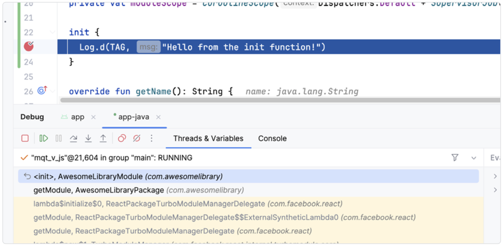
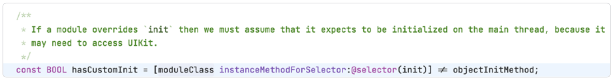
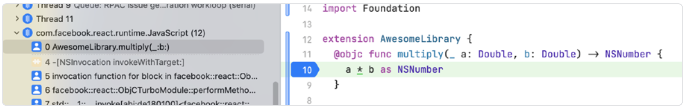
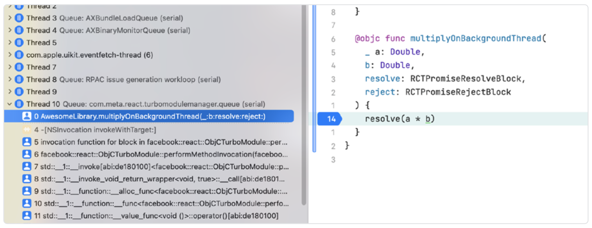
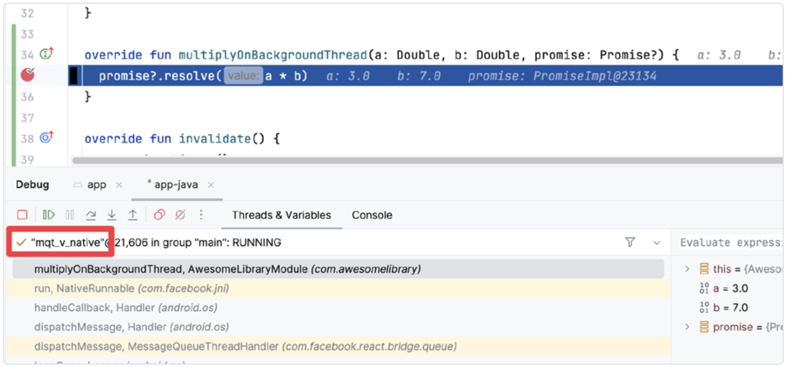
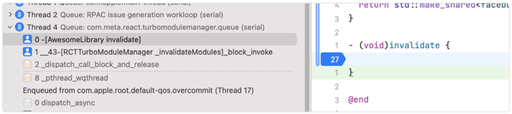
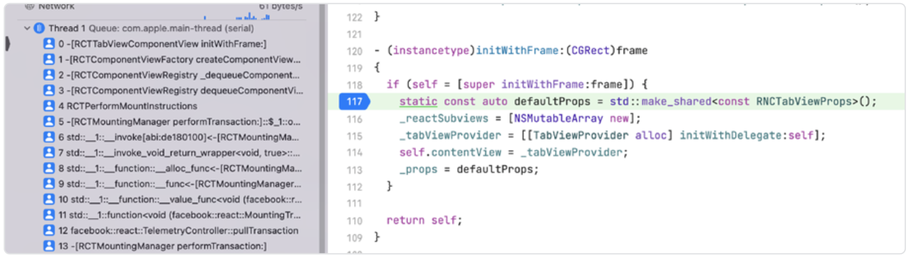
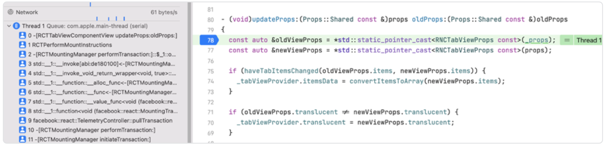
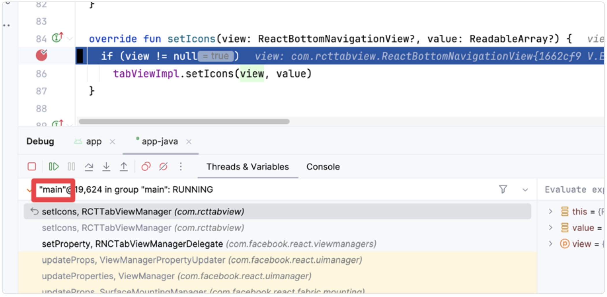

# 理解 Turbo Modules 和 Fabric 的线程模型

理解 React Native 如何执行你的代码对于构建高效的原生模块至关重要。本章将带你了解一个原生模块的整个生命周期——从初始化阶段到调用，再到反初始化。读完本章后，你将理解在什么情况下使用哪个线程。

## 线程模型

首先，让我们看看在移动端 React Native 应用中都有哪些线程可用：

- **主线程 / UI 线程**：无论是 React Native 应用还是普通原生应用，该线程负责 UI 操作并保持用户体验的响应性。
- **JavaScript 线程**：顾名思义，它用于执行 JavaScript 代码（尽管并不完全只用于此目的）。=
- **Native modules 线程**：React Native 专门为原生模块分配的共享线程池。

此外，React Native 的渲染器、你自己以及第三方模块都可以创建额外的线程来处理后台任务。你可以在[《让你的原生模块运行得更快》](./8.Make_Your_Native_Modules_Faster.md)一章中了解更多这方面的内容。

## Turbo Modules

为了更好地理解 Turbo 模块的线程模型，我们将通过检查其生命周期，了解方法是在什么线程上被调用的。

首先，让我们看看 `init` 函数在 iOS 和 Android 上分别是在哪个线程被调用的.

在 iOS 上：



在 Android 上：


两个平台之间存在明显差异。在 Android 上，`init` 方法是在 JavaScript 线程（称为 `mqt_v_js`）上被调用，而 iOS 则使用主线程。这个差异来源于 React Native 中一个关于覆盖 `init` 方法的假设：每当我们在 iOS 应用中重写 `init` 方法时，React Native 会假设我们可能会访问 UIKit，因此会在主队列（main queue）上调用此方法（因为 UIKit 不是线程安全的）。



> 如果移除这一假设，模块将会在 JavaScript 线程上初始化，这与 Android 的行为一致。修改 React Native 的内部实现需要从源码构建它。尽管这不推荐用于生产环境，但在开发过程中是一次有价值的学习机会。

接下来，我们看看是否禁用懒加载（**lazy initialization**）会影响模块使用的线程。这个功能目前仅在 Android 上可用。要启用主动加载（**eager loading**），打开你库的 package 文件，并将第四个参数 `needsEagerInit` 设置为 `true`：

```Kotlin
class AwesomeLibraryPackage : BaseReactPackage() {
  // Other code
  override fun getReactModuleInfoProvider(): ReactModuleInfoProvider {
    return ReactModuleInfoProvider {
      val moduleInfos: MutableMap<String, ReactModuleInfo> = HashMap()
      moduleInfos[AwesomeLibraryModule.NAME] = ReactModuleInfo(
        AwesomeLibraryModule.NAME,
          AwesomeLibraryModule.NAME,
          false,  // canOverrideExistingModule
          true,   // needsEagerInit <- Change this to true
          false,  // isCxxModule
          true    // isTurboModule
      )
      moduleInfos
    }
  }
}
```

接着我们看看更改该参数并重新构建应用后会发生什么：



正如预期的那样，我们现在处于不同的线程上——**mqt_v_native**，这是专门用于 Turbo 模块的独立线程。如果你打算在此线程中访问 JavaScript 实例，需要使用 JavaScript 的 **CallInvoker** 来在 JS 线程上调度函数调用。

### 同步函数调用

初始化完成后，我们来看看 React Native 是如何调用原生方法的。在这里，我们可以将其分为两类：同步调用 和 异步调用。我们先看看调用同步方法时会发生什么，比如 `multiply` 方法：


它会在 JavaScript 线程上被调用。仔细想想这是合理的，因为我们希望在该线程上暂停执行，直到这个原生函数返回结果。由此可见，对于同步函数你必须格外小心。如果你不小心让这个看似无害的函数一直在 JavaScript 线程上运行：

```Swift
@objc func multiply(_ a: Double, b: Double) -> NSNumber {
  Thread.sleep(forTimeInterval: 20) // Go to sleep
  return a * b as NSNumber
}
```

你将阻塞 JavaScript 线程上所有交互达 20 秒，实质上会冻结整个应用。

### 异步函数调用

现在我们来看看异步函数是如何被调用的。类似于 Web 环境中，当我们 `await` 一个函数（比如 fetch）时，这个调用会被委托给浏览器的 Web API（原生代码层）去处理。这个请求是在 JavaScript 执行主线程之外被处理的，在 React Native 中，这就是原生模块线程。

我们来看一个异步函数 `multiplyOnBackgroundThread` 的实际效果：





可以看到，React Native 自动将调用从 JavaScript 线程转移到了 Turbo 模块线程上。然而，由于该线程是所有原生模块共享的，因此它可能会比较繁忙。此时你可以选择创建一个新线程以缓解这一问题。

最后我们来看看模块是如何失效的。在 iOS 上，为了支持失效机制，我们的模块需要遵循 RCTInvalidating 协议。

> 当 React Native 实例被销毁时（例如重新加载 Metro 服务器时），就会发生失效。




我们在这里也看到平台之间的差异。在 iOS 上，该函数是在 Turbo 模块线程上被调用的；而在 Android 上，所用线程没有明确的名称，可能是自动生成的。查阅源码可以发现，它是由 **ReactHost** 类生成的线程。现在你已经全面了解了 Turbo 模块的线程机制，我们可以继续看看 Fabric 视图是如何工作的。

## 原生视图

理解原生视图层（内部称为 Fabric）的线程模型就容易多了。如前所述，操作系统（无论是 iOS 还是 Android）都期望在主线程上更新视图。你还了解到 iOS 的 UI 库 UIKit 不是线程安全的，因此几乎所有关于视图的创建和操作都发生在主线程上。

我们从初始化视图开始：





可以看到，在两个平台上，视图都是在主线程上初始化的。接着我们来看属性（prop）更新是在哪个线程上处理的。在 JavaScript 端，我们总是在 JavaScript 线程上修改 `props`，但让我们看看原生端会发生什么：




我们又回到了主线程！这是因为 React Native 假设更新 props 的函数会直接使用 Yoga 来操作原生平台的视图。

Yoga 是 React Native 渲染管线中的关键部分。它是一个跨平台布局引擎，用于计算布局属性，并基于绝对定位和 Flexbox 布局模型，在不同平台上提供一致的布局表现。React Native 的渲染器使用 Yoga 来计算 React Shadow Tree（React 组件树在 C++ 中的内部表示）的布局信息。

> Yoga 并不仅限于 React Native，它也经常被用于原生应用。某些基准测试表明，它甚至比 iOS 上的 Auto Layout 等原生命令布局系统更快。

与 Yoga 树相关的操作会在 JavaScript 线程上执行，如下所示：


现在你对线程模型有了更深入的理解——知道哪些调用在哪个线程上执行，以及原因所在——你就能够为你的 React Native 应用添加更高级、线程安全且性能良好的原生功能了。
