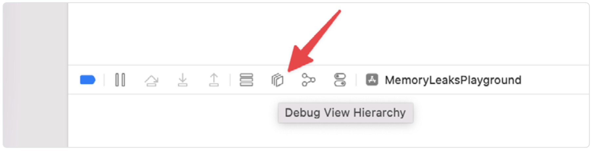
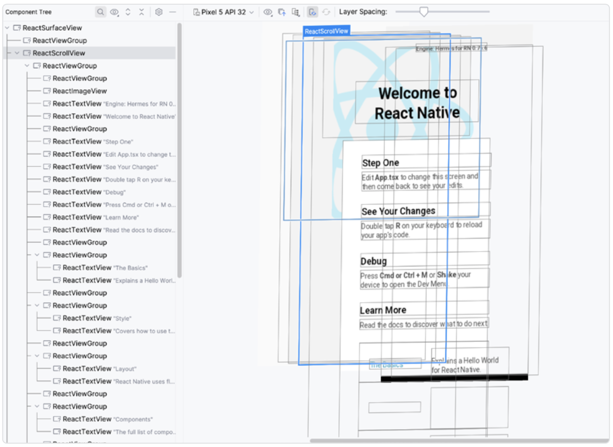
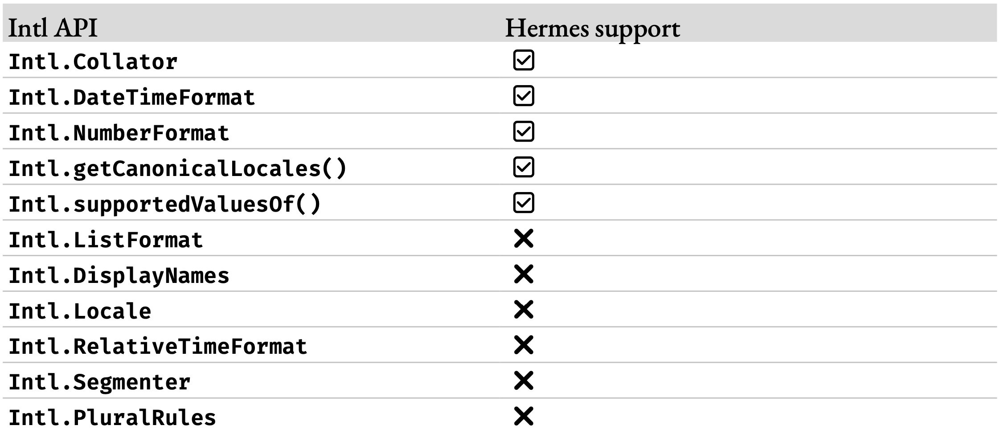

# 使用 View Flattening 优化视图结构

React 组件 API 的设计是声明式的，并通过组合实现可复用性。我们将多个组件组合在一起，就像拼乐高积木一样，以构建复杂的布局。这在 Web 上效果很好，因为创建 `<div/>` 的开销非常小。而 React Native 使用的是原生布局元素，其处理成本通常高于 Web 上的等效元素。为了解决这个问题，React Native 在其核心渲染器中引入了一种称为“视图扁平化”（view flattening）的优化。该优化在可能的情况下简化视图层级，从而减少内存压力和 CPU 处理负担。

> 这种优化最初是在 Android 的 React Native 渲染器中引入的。但随着 New Architecture（新架构）项目的推进，核心部分基本被重写为 C++，因此将这种平台特定的优化迁移到共享渲染器成为合乎逻辑的选择。得益于此，iOS 现在也支持视图扁平化了。

在不深入其工作细节的前提下，渲染器会识别出“仅布局”节点（layout-only nodes）——这些节点只影响视图的布局，不会在屏幕上实际渲染任何内容。这样的元素可以被扁平化，从而降低宿主元素树的深度。如需详细了解视图扁平化的工作原理，请查阅[官方文档](https://reactnative.dev/architecture/view-flattening)。

## 当心视图扁平化带来的问题

这种优化技术在大多数情况下表现良好，但有时我们希望某个视图保留在层级结构中。一个常见的例子是你正在开发一个接受子视图的原生 UI 组件。

```tsx
<MyNativeComponent>
  <Child1 />
  <Child2 />
  <Child3 />
</MyNativeComponent>
```

例如，在上述场景中，`MyNativeComponent` 期望在原生端接收到一个包含 3 个视图的数组。但如果视图扁平化机制认为 Child1 的容器视图是“仅布局”的，那么它的子视图就可能会被直接传递到原生端。也就是说，如果 Child1 内部还有 3 个子视图，你最终会收到 5 个子视图，而不是预期的 3 个。

```tsx
<MyNativeComponent>
  /* Child1 unexpectedly flattened to 3 Views */
  <View />
  <View />
  <View />
  <Child2 />
  <Child3 />
</MyNativeComponent>
```

如果你假设 JavaScript 中的子元素数量与原生端接收到的子视图数量是相同的，这种行为就是意料之外的。这意味着你需要在组件逻辑中进行验证。但有时你确实需要准确知道子元素数量。为了解决这个问题，可以使用 `collapsable` 属性来控制视图扁平化的行为。将该属性设置为 `false`，就可以防止该视图被合并到其他视图中。

```tsx
<MyNativeComponent>
  <Child1 collapsable={false} />
  <Child2 collapsable={false} />
  <Child3 collapsable={false} />
</MyNativeComponent>
```

设置该属性后，我们就可以确保在原生组件中总是接收到 3 个子视图。

## 调试视图层级结构

在处理视图扁平化问题时，调试视图层级结构可能会非常有帮助。幸运的是，在 iOS 和 Android 平台上都可以进行这项操作。

### Xcode

当你通过 Xcode 运行应用时，会看到调试工具栏，其中除了常规断点调试外，还有“层级结构检查器”（Hierarchy inspector）。点击 “Debug View Hierarchy” 按钮即可启动:



它会像遇到断点一样暂停你的应用，并允许你检查原生视图层级结构:



你可以看到原生视图的可视化表示，这对于解决布局相关的问题非常有帮助。在左侧栏中列出了与 JavaScript 组件对应的原生视图，例如 JavaScript 中的 `<View/>` 会对应原生视图 `RCTViewComponentView`，这也是纯原生应用中使用的相同构建块。

### Android Studio

与 Xcode 类似，我们也可以在 Android 上检查应用的视图层级结构，这个工具叫做 “Layout Inspector”（布局检查器）。要启动它，可以在 Android Studio 顶部菜单栏中依次点击 **View > Tool Windows > Layout Inspector**。


在这里，你会看到一个与 Xcode 中类似的用户界面。侧边栏中列出了当前屏幕上可见的所有元素。你会注意到，在这个平台上，JavaScript 中的 `<View/>` 对应的是 `ReactViewGroup`，其中包含了 `ReactTextView` 组件。

了解视图扁平化（View Flattening）是一个非常实用的技能。大多数情况下你无需关心它的存在，因为它的设计初衷就是完全透明。但有时候你可能会遇到这个优化被错误应用的问题，这时布局调试器可以帮助你了解发生了什么。如果有必要，你还可以选择跳过对某些有问题的视图进行扁平化处理。
