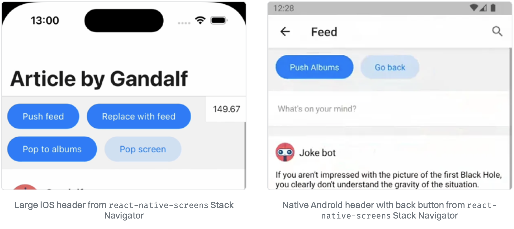
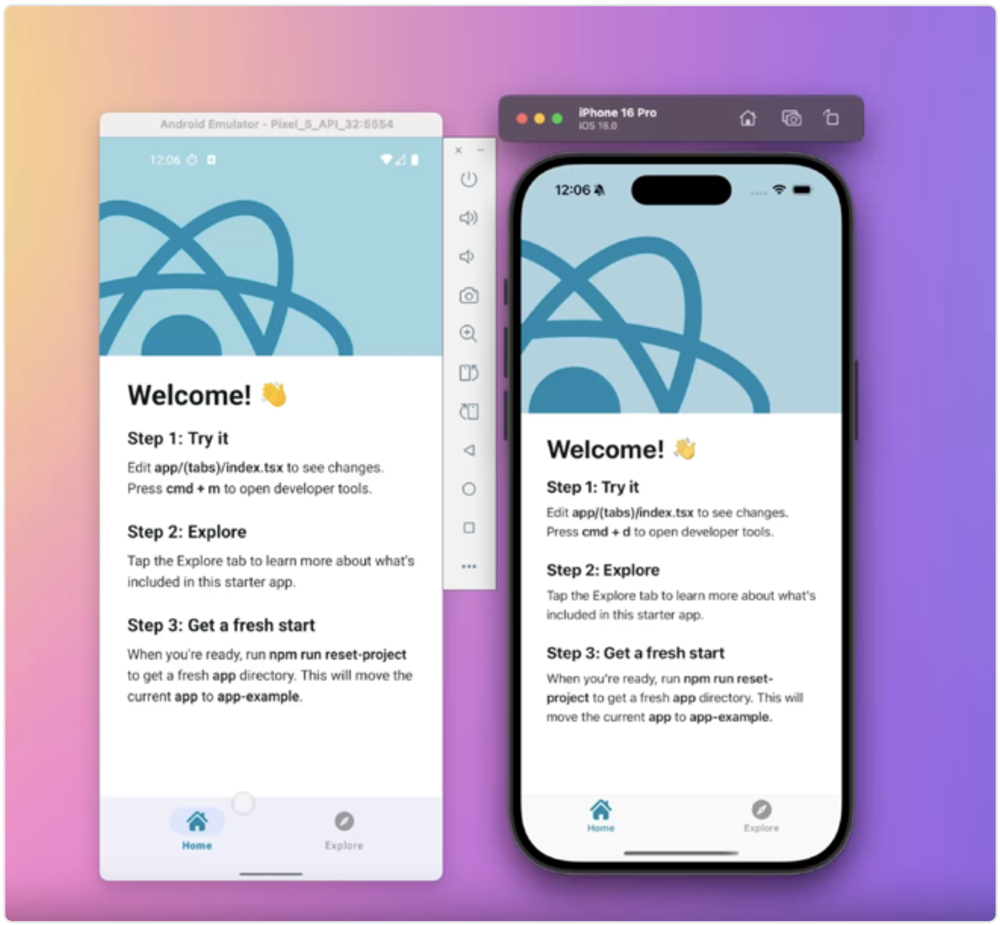

# 优先使用 React Native 专用的 SDK，而不是 Web

React Native 最棒的一点就是你可以在移动端、平板端和桌面应用中使用 JavaScript 生态中的所有优点。这意味着你可以复用部分 React 组件，并用你最喜欢的库来管理业务逻辑状态。

虽然 React Native 提供了类似 Web 的功能以便兼容 Web，但你需要明白，这并不是同一个运行环境。它有自己的一套最佳实践、快速优化手段和使用限制。

## 使用专门的、针对平台的库版本

虽然在 React Native 移动应用中运行与浏览器中相同的 JavaScript 通常（但并不总是）是可行的，但这并不意味着你每次都应该这么做。你必须保持警惕，审查你的依赖是否适用于当前平台，并持续检查它们是否仍然有必要使用，或者是否可以用更适合平台的替代方案替换掉。

### 国际化 polyfill

`Intl` 全局对象提供语言敏感的字符串比较、数字格式化，以及日期和时间格式化功能。它在所有现代浏览器中都可用，在 Hermes 引擎中则是部分支持。

下面是一个使用 `Intl` 将数字格式化为不同地区语言的例子：

```js
const number = 123456.789;
const germanFormat = new Intl.NumberFormat("de-DE");
console.log(germanFormat.format(number)); // 123.456,789
```

在 React Native 项目中，你经常会看到从 **Format.JS** 项目中导入大量 `Intl` polyfill，这些 polyfill 提供 ECMAScript 国际化 API 的纯 JS 实现：

```js
import "@formatjs/intl-getcanonicallocales/polyfill";
import "@formatjs/intl-locale/polyfill";
import "@formatjs/intl-numberformat/polyfill";
import "@formatjs/intl-numberformat/locale-data/en";
import "@formatjs/intl-datetimeformat/polyfill";
import "@formatjs/intl-datetimeformat/locale-data/en";
import "@formatjs/intl-pluralrules/polyfill";
import "@formatjs/intl-pluralrules/locale-data/en";
import "@formatjs/intl-relativetimeformat/polyfill";
import "@formatjs/intl-relativetimeformat/locale-data/en";
import "@formatjs/intl-displaynames/polyfill";
```

Hermes 对这套 API 的支持曾经很有限，但好消息是，Hermes 团队在去年宣布正在改进对这套 API 的支持。一年后，我们终于可以移除一些 polyfill 了！在撰写本指南的时间点（2025 年 1 月），以下 API 已可用：


在掌握了这些新信息后，我们可以减少项目中导入的 polyfill 数量：

```diff
-import '@formatjs/intl-getcanonicallocales/polyfill';
 import '@formatjs/intl-locale/polyfill';
-import '@formatjs/intl-numberformat/polyfill';
-import '@formatjs/intl-numberformat/locale-data/en';
-import '@formatjs/intl-datetimeformat/polyfill';
-import '@formatjs/intl-datetimeformat/locale-data/en';
 import '@formatjs/intl-pluralrules/polyfill';
 import '@formatjs/intl-pluralrules/locale-data/en';
 import '@formatjs/intl-relativetimeformat/polyfill';
 import '@formatjs/intl-relativetimeformat/locale-data/en';
 import '@formatjs/intl-displaynames/polyfill';
```

仅仅删除这些 `polyfill` 就能让 JS Bundle 体积减少 430KB 以上。而且这些代码是应用启动入口就会加载的，移除它们有可能提升 App 的首次交互时间（TTI）——这一切都是通过删除不必要的代码实现的。

### 加密库

另一个值得关注的优化是：将依赖于高计算负载的库替换为对应的原生实现。例如，Node.js 的加密库 `crypto-js` 是纯 JavaScript 实现的，可以被 Margelo 出品的 **react-native-quick-crypto** 替代。这种替换可以带来最高达 58 倍的性能提升，因为后者是通过 C++ 直接实现的。

这在那些依赖随机数并需要使用加密安全伪随机数生成器（CSPRNG）的项目中尤为重要，比如生成 Web3 钱包的种子。这种功能无法依赖 JavaScript 中的 `Math.random()` 实现，因为后者无法保证生成结果具有足够的熵来满足安全要求。

你可以通过这篇[通过原生加密库提升速度与安全性](https://www.callstack.com/blog/increase-speed-and-security-with-native-crypto-libraries?utm_source=guide_2025)的博客了解更多内容。

## 使用原生导航

几乎所有应用都需要导航解决方案，而其中最流行的之一就是 [React Navigation](https://reactnavigation.org/)。这是一个强大的库，它允许你根据设计需求和性能要求，混合使用 JS 和原生导航器。在搭建导航结构时，你可能会犹豫该选择哪种 Stack Navigator：是使用灵活性最强的 JS Stack，还是使用灵活性略低但性能更好、外观更符合平台风格的 Native Stack。如果你使用的是 Tab Navigator，也会面临类似的选择：是用 JS Tabs，还是 Native Tabs.

选择原生导航器有许多好处。最重要的是，它们会将负载从 JavaScript 线程中卸载出来，使你的 App 使用更少内存，并整体运行更加流畅。此外，还有一个很重要的优势：原生体验。Native Stack 和 Native Tabs 使用的是系统中原生的界面组件，其他原生 App 也在使用它们，这能让你的 App 更加精致、专业。

### Native Stack Navigator

要在 React Navigation 中使用 **react-native-screens** 提供的原生 Stack Navigator，你只需要安装并使用 **@react-navigation/native-stack** 包：

```js
import { createNativeStackNavigator } from "@react-navigation/native-stack";

const MyStack = createNativeStackNavigator({
  screens: {
    Home: HomeScreen,
    Profile: ProfileScreen,
  },
});
```

它的 API 与 JS 版的 Stack Navigator 非常相似，因此迁移过程通常并不复杂。



### Native Tabs Navigator

同样地，与其使用 React Navigation 中内置的 JavaScript Tab Navigator，你也可以使用 **react-native-bottom-tabs** 项目，它提供了一个基本兼容的 API。

和 Native Stack 一样，你可以直接替换原本基于 JavaScript 的导航实现，继续使用原有的 API：

```js
import { createNativeBottomTabNavigator } from "@bottom-tabs/react-navigation";

const MyTabs = createNativeBottomTabNavigator({
  screens: {
    Home: HomeScreen,
    Profile: ProfileScreen,
  },
});
```



## 优先使用提供原生组件的库

首选那些提供原生组件的库。React Native 社区非常活跃，许多开发者贡献了开源库，它们对外暴露原生组件接口。

以下是一些值得了解的库：

- [React Native Screens](https://github.com/software-mansion/react-native-screens) — React Navigation 的 Native Stack 的基础库。
- [Zeego](https://zeego.dev/) — 灵感来自 Radix UI 的 React Native + Web 原生菜单组件，外观漂亮。
- [React Native Slider](https://github.com/callstack/react-native-slider) — 使用原生平台组件实现的滑块。
- [React Native Date Picker](https://github.com/henninghall/react-native-date-picker) — 使用原生平台组件实现的日期选择器

当然，还有很多其他类似的库。

将无限灵活的 JavaScript 视图替换为平台原生组件，并非在所有场景下都可行，尤其是当你的 App 设计要求不允许时。但如果存在更优的原生实现，并且只需稍微调整设计就能换来更高性能和更好用户体验，你应当为用户着想。在实现伟大用户体验的过程中，设计师的创意和工程实现之间的平衡非常关键。不要害怕提出你的技术观点，毕竟，我们所做的一切，都是为了用户。
