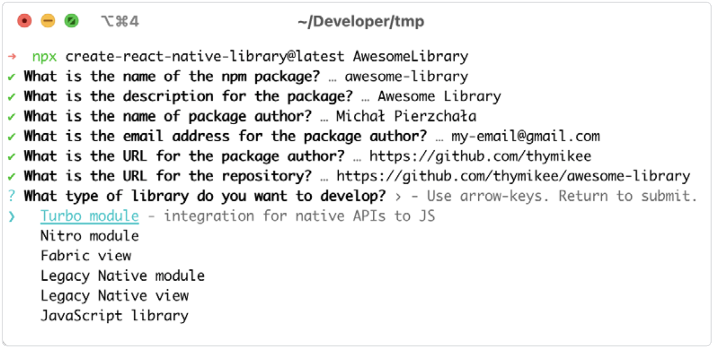
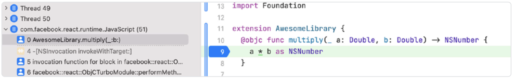
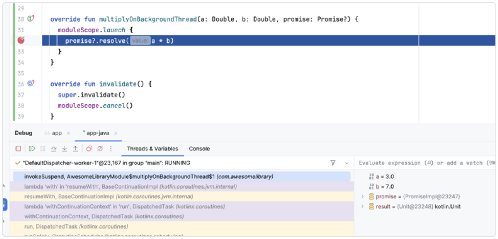
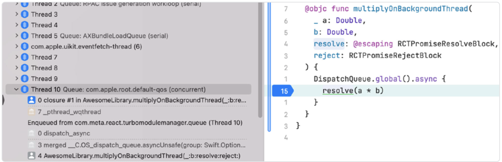

# 让你的原生模块运行得更快

原生模块在构建 React Native 应用时为你解锁了无限可能。当 JavaScript 的能力不足时，你可以切换到更底层的语言，比如 Swift 和 Kotlin，它们是各自平台的原生语言。如果你需要进一步接近底层以实现更好的性能或代码复用，也可以使用 C++。下面我们将回顾一些在构建下一个原生模块时可以采纳的最佳实践。

## 快速生成样板代码

创建一个新的 React Native 库需要设置初始的样板代码，以处理旧架构和新架构的实现、根据 TypeScript 或 Flow 类型定义进行代码生成，以及运行、测试和发布到 npm 的基础设施。幸运的是，有一个非常棒的工具可以帮助您快速生成配置完善的新库——[React Native Builder Bob](https://github.com/callstack/react-native-builder-bob)。

要使用它，请在终端中运行 **create-react-native-library** 命令：

```bash
npx create-react-native-library@latest library-name
```

它会提示您填写必要信息，例如包名称，是否构建 Turbo 模块、Fabric 视图或 JavaScript 库。您还可以选择喜欢使用的语言。



在回答完几个问题后，您就可以立即开始使用新的原生模块，并准备将其发布到 npm 作为第三方依赖供其他应用使用。但有时候，我们并不希望将代码发布到公共仓库。有时我们只是想为特定项目创建一个自定义模块。通过向 create 命令传递 --local 参数，Bob 可以实现本地模块功能。

接下来，我们来看看如何为原生模块使用现代编程语言。

## 使用现代语言：Swift 和 Kotlin

Android 和 iOS 一开始使用的编程语言与现在不同。Android 最初使用的是 Java，iOS 则是 Objective-C。

Java 的继任者是 Kotlin，由 JetBrains 创建，迅速风靡开发者社区，并在 2019 年被 Google 官方宣布为构建 Android 应用的首选语言。它与 Java 完全兼容。除了进行一些配置更改外，使用 Kotlin 不需要做任何特别的操作。事实上，React Native 的某些部分在过去几年已经被重写为 Kotlin，因此由 Builder Bob 生成的库默认就是使用 Kotlin 的。

在 iOS 方面，情况类似但略有不同。Swift 起源于 Apple，是一个新一代的专有语言，旨在最终取代 Objective-C。2014 年，Swift 工具链通过官方 Xcode 支持向 iOS 开发者发布，不久后也开源了，由 Apple 和 Swift 社区共同维护。Swift 可以很容易地与 Objective-C 代码互操作，反之亦然，允许渐进式迁移。从那以后，Swift 搭配 SwiftUI 成为了编写 iOS 应用的首选语言。棘手的是它与 C++ 的互操作性问题。这点很重要，因为在新架构中，React Native 完全采用 C++ 来提供其核心的跨平台功能。不过，这方面也有一些可行的解决办法。

React Native 在 iOS 上的内部支持仍然大量依赖于 Objective-C 及其名为 Objective-C++ 的 C++ 互操作方式。而 Swift 则是最近才支持 C++ 互操作，且仍处于实验阶段，方式也不同于 Objective-C++。我们可以在 React Native 库中创建一个小型包装器，将 Objective-C 的调用绑定到 Swift 上。这虽然繁琐，但可行。以下是实现方法：

创建模块后，首先通过修改 CocoaPods 提供的 Podspec 文件启用 Swift 支持：

```diff
- s.source_files = "ios/**/*.{h,m,mm,cpp}"
+ s.source_files = "ios/**/*.{h,m,mm,cpp,swift}"
```

接着，在 Xcode 中创建一个新的 Swift 文件，确保它位于模块的 iOS 文件夹中。当系统询问是否创建 Bridging Header 时，点击“是”。

然后，在库的头文件中添加以下更改：

```diff
#import <Foundation/Foundation.h>
+ #if __cplusplus
#import "ReactCodegen/RNAwesomeLibrarySpec/RNAwesomeLibrarySpec.h"
+ #endif
@interface AwesomeLibrary : NSObject
+ #if __cplusplus
  <NativeAwesomeLibrarySpec>
+ #endif
@end
```

由于 Swift 无法理解 C++ 类型，我们使用 **#if \_\_cplusplus** 宏，仅在定义了 **\_\_cplusplus** 时才导入 spec 文件（Swift 中不会定义此宏）。接下来，在 Bridging Header 中导入主库的头文件：

```diff
+ #import "AwesomeLibrary.h"
```

现在，我们可以为 **AwesomeLibrary** 类创建一个 **extension**，通过 @objc 属性使其在 Objective-C 中可用：

```Swift
import Foundation

extension AwesomeLibrary {
  @objc func multiply(_ a: Double, b: Double) -> NSNumber {
    a * b as NSNumber
  }
}
```

最后一步是调用我们刚刚实现的方法。为此，打开你的 .mm 文件（用于处理 Objective-C++ 语法），并使用 **RCT_EXTERN_METHOD()**：

```h
#import "AwesomeLibrary.h"

#if __has_include("awesome_library/awesome_library-Swift.h")
#import "awesome_library/awesome_library-Swift.h"
#else
#import "awesome_library-Swift.h"
#endif

@implementation AwesomeLibrary

RCT_EXPORT_MODULE()

RCT_EXTERN_METHOD(multiply:(double)a b:(double)b);

// rest of the module

@end
```

我们来分解下这段代码的工作原理。首先，我们导入模块。Xcode 会生成一个名为 **\<library-name>-Swift.h** 的头文件。在使用静态/动态框架模式时，它会以库名为前缀，因此我们要检查这个导入是否存在。如果不存在，则回退为普通导入。

接着，我们使用 **RCT_EXTERN_METHOD** 将 Objective-C 的函数映射到 Swift 的调用。这就是在模块中使用 Swift 所需的全部内容。目前正在推进默认支持 Swift 的工作，因此将来可能不再需要这些样板代码。

## 利用后台线程

在浏览器环境中，我们通常只处理一个线程。当然，我们可以将一些 JavaScript 工作交给 Web Worker，但情况有些不同。在 React Native 中，我们可以充分利用用户手中设备的性能。默认情况下，同步的 Turbo 模块方法会在 JavaScript 线程上调用，如下图所示（iOS）：



Android 上也同样如此：



> 关于 React Native 应用中的线程模型，在[《理解 Turbo Modules 和 Fabric 的线程模型》](./5.Understand_the_Threading_Model_of_Turbo_Modules_and_Fabric.md)一章中有详细讲解。

现在，我们希望利用多线程并安排一些工作在后台线程中执行。我们将引入一个新的异步方法 **multiplyOnBackgroundThread**。为了简洁，我们将跳过新增方法的细节，专注于如何将代码卸载到后台线程执行。

我们先从 iOS 开始。要在后台线程上运行代码，可以使用更高层级的队列概念 —— **DispatchQueue** API。该 API 管理任务的调度与执行，确保它们不在主线程运行。放入 **DispatchQueue.global()** 中的代码块会在全局并发队列可用时执行。在代码块内，我们可以调用 **resolve()** 方法将结果通知给 JavaScript。

```Swift
@objc func multiplyOnBackgroundThread(
  _ a: Double,
  b: Double,
  resolve: @escaping RCTPromiseResolveBlock,
  reject: RCTPromiseRejectBlock
) {
  DispatchQueue.global().async {
    resolve(a * b)
  }
}
```

我们看看 Android 如何实现类似操作。和 Swift 一样，我们不会直接访问后台线程，而是使用协程（coroutines）。协程是 Kotlin 并发框架的一部分，提供一种既可读又可维护的异步代码编写方式。值得注意的是，协程不依赖于物理线程 —— 成千上万个协程可以在少量线程上运行。

要创建一个协程，我们使用 CoroutineScope 类，并在 **moduleScope** 变量中初始化它：

```diff
@ReactModule(name = AwesomeLibraryModule.NAME)
class AwesomeLibraryModule(reactContext: ReactApplicationContext) : NativeAwesomeLibrarySpec(reactContext) {
  // Other methods..
+ private val moduleScope = CoroutineScope(Dispatchers.Default + SupervisorJob())
+ override fun invalidate() {
+   super.invalidate()
+   moduleScope.cancel()
+ }
}
```

请记得在模块失效时取消协程作用域，以确保不引入内存泄漏。现在有了 **moduleScope**，我们就可以使用其 **launch** 方法将任务卸载到后台线程：

```Swift
override fun multiplyOnBackgroundThread(a: Double, b: Double, promise: Promise?) {
  moduleScope.launch {
    promise?.resolve(a * b)
  }
}
```

调用该函数时，在调试器中打断点观察，你会发现 **multiplyOnBackgroundThread** 实际运行在工作线程而非主线程。


iOS 上的情况也是一样的：



> 关于线程还有更多细节，我们在[《理解 Turbo Modules 和 Fabric 的线程模型》](./5.Understand_the_Threading_Model_of_Turbo_Modules_and_Fabric.md)一章中进行了探讨。

## 使用 C++ 替换跨平台代码

如果你有可以用 C++ 替代的跨平台逻辑，它可以为你带来显著的性能提升。C++ 支持 iOS、Android、Windows 及几乎所有平台。不过，使用更底层的语言也意味着你必须更加小心地处理线程问题，避免内存泄漏。你可以在 [React Native 官网](https://reactnative.dev/docs/next/the-new-architecture/pure-cxx-modules)找到构建 C++ Turbo 模块的指南。

截至本指南撰写时（2025 年 1 月），C++ Turbo 模块在 iOS 上不支持自动链接。为了提升开发体验，并避免让开发者修改 AppDelegate 代码，可以使用 registerCxxModuleToGlobalModuleMap 方法将你的 C++ Turbo 模块注册到运行时的全局模块映射中。为此，创建一个 Objective-C 类，并利用 +load 方法，在类加载进 Objective-C 运行时时执行注册。

```C++
#include <ReactCommon/CxxTurboModuleUtils.h>

@implementation YourModule

+ (void)load {
  facebook::react::registerCxxModuleToGlobalModuleMap(
    std::string(facebook::react::YourModule::kModuleName),
    [&](std::shared_ptr<facebook::react::CallInvoker> jsInvoker) {
      return std::make_shared<facebook::react::YourModule>(jsInvoker);
    }
  );
}
@end
```

## 与 C++ 互操作的隐藏成本

跨语言边界通常会带来一些隐藏的开销。当你决定在应用中使用另一种原生语言时，应当了解这些代价。

### Objective-C++

在 iOS 中，应用和 React Native 本身仍普遍使用 Objective-C，由于其动态特性，在大多数情况下速度比 Swift 慢。每次 Objective-C 方法调用都需要在方法表中查找。但与 C++ 混用时的成本几乎为零，因为编译阶段已处理好。Objective-C++ 编译器会将其视作原生 C++ 代码。不幸的是，在构建 Objective-C 的 Turbo 模块时，方法调用仍需要查表执行。

### Swift 与 C++ 的互操作性

相比之下，Swift 每个类也使用虚方法表（vtable），类似于 C++。此外，Swift 与 C++ 的互操作几乎没有性能开销，这是使用 Nitro 模块（跳过 Objective-C、使用 C++）获得显著性能提升的原因之一。

### JNI

在 Android 生态中，Java Native Interface（JNI）使得 Java 虚拟机中的字节码可以与本地代码（如 C++）交互。但 JNI 的调用开销较大，每次调用都要在方法表中查找函数，带来额外开销。

直接使用 JNI（例如将每个 Kotlin 调用桥接到 C++）会导致调用较慢，但对于长时间运行的操作可能是值得的。在使用 C++ Turbo 模块时，JNI 主要用于模块初始化，因此可以在运行时跳过。由于 JavaScript 通过 JSI（React Native 的 JavaScript 接口）持有对 C++ 函数的引用，可以直接访问 C++ 代码，无需额外开销。
