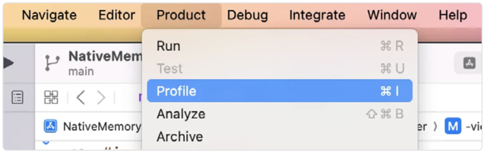
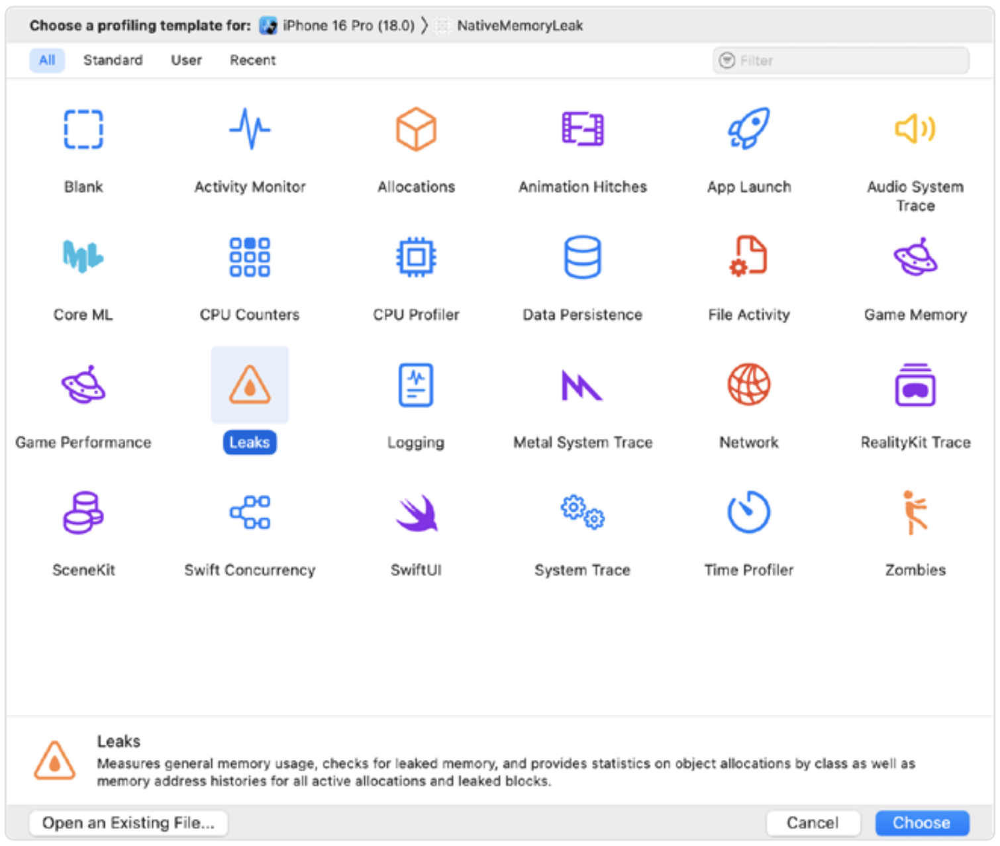
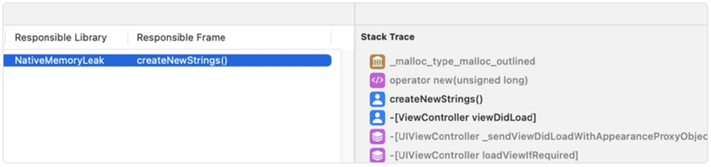
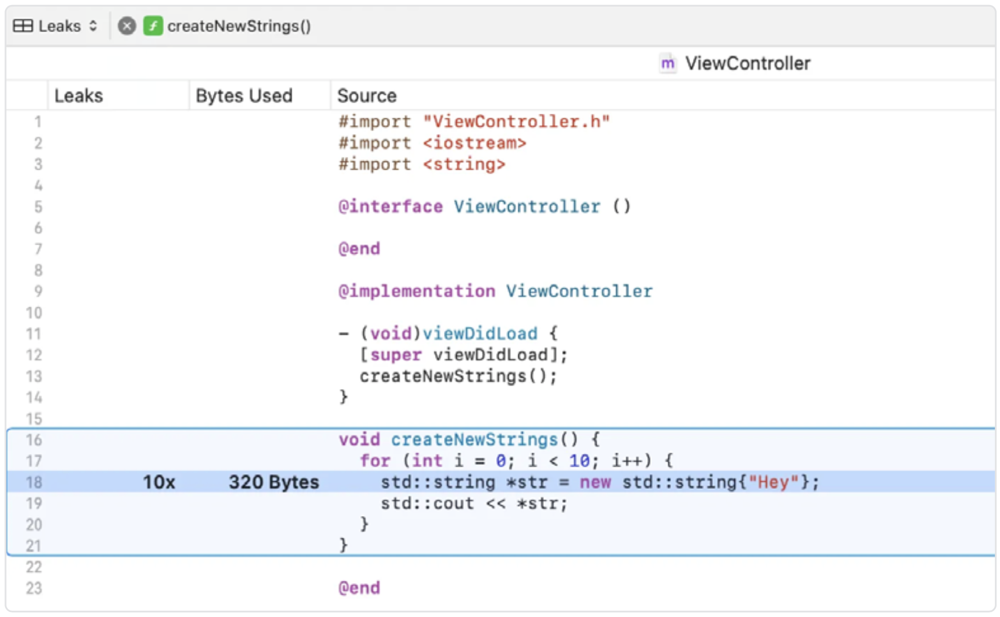
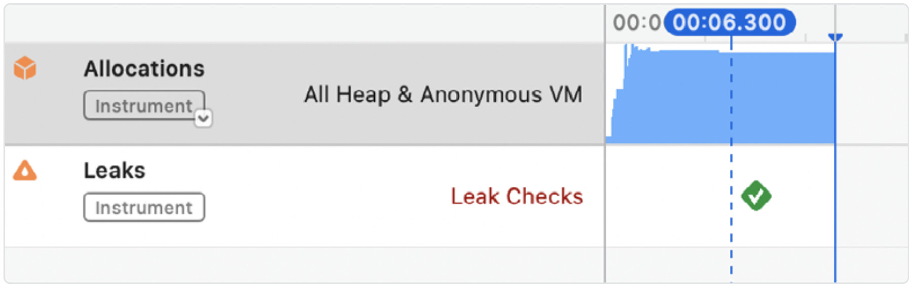
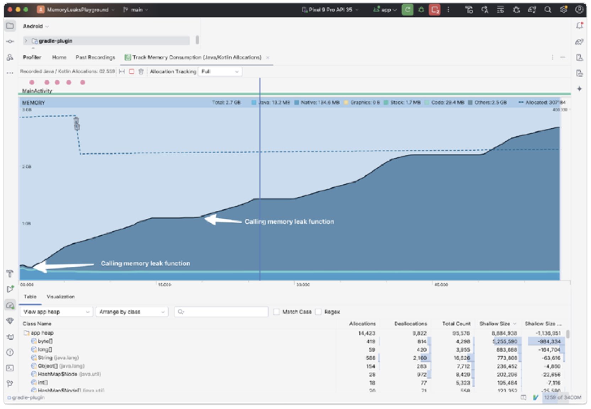
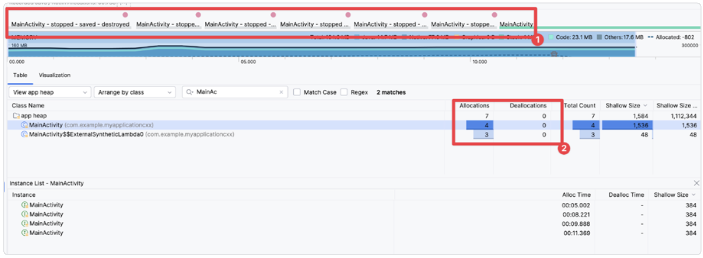

# 如何查找原生内存泄漏

要在没有专用工具的情况下检测内存泄漏是很困难的。幸运的是，iOS 和 Android 都提供了一些优秀的工具，帮助我们识别问题源，就像我们在[《如何追踪 JavaScript 的内存泄漏》](../part1/3.How_to_Hunt_JS_Memory_Leaks.md)章节中介绍的 JS 内存分析器那样。

## Xcode

Apple 的集成开发环境是一个寻找内存泄漏的绝佳工具。在这种方式下分析你的应用时，可以发现我们在[《理解原生内存管理》](./4.Understanding_Native_Memory_Management.md)章节中详细讨论的原生内存泄漏。要开始，请打开 Xcode 并构建你的应用。

检查内存泄漏的最快方式之一，是在运行应用时，通过侧边栏的 Debug Navigator 中查看“Memory Report（内存报告）”。



它可以显示你应用中所使用内存的图表。建议在发布版本（release build）中使用这种分析方式。内存图对于快速追踪内存泄漏问题非常有用——但要检查泄漏的源头，你需要使用 Xcode Instruments 中的 Leaks 分析模板。要开始新的分析会话，请导航到 **Product > Profile**。


一旦应用构建完成，从菜单中选择“Leaks”，然后点击“Choose”按钮：



此时会弹出一个新窗口。点击左上角的记录按钮，然后在你的设备上执行可能会触发内存泄漏的操作。可能是在导航到一个触发原生代码的新页面，或者按下某个按钮。

录制完成后，Leaks 工具会显示一个红色标记，表示检测到内存泄漏。



点击它后，你将看到一个泄漏对象的摘要、相关的库以及负责的调用栈。在右侧，有一个堆栈跟踪，能精确显示哪个函数导致了内存泄漏。



在我们的例子中，是 `createNewStrings()` 函数导致了泄漏。双击函数名称后，Xcode 会显示该函数的源代码：


啊，我们忘了删除分配在堆上的字符串！在显式删除这个字符串后，Xcode 告诉我们内存泄漏问题已解决。



现在，我们来看看如何在 Android 上排查内存泄漏。

## Android Studio

与 Xcode 类似，你也可以在 Android Studio 中以 release 模式构建你的应用，并检查内存使用图表。在 Android Studio 中，导航到左下角附近的 “Profiler” 标签页，然后选择 “Track memory consumption”。



现在，让我们通过 Android Studio 的分析器排查一个更复杂的内存泄漏。如果你熟悉 Android 的工作方式，可能知道其默认行为是在发生配置更改时重新创建其 **MainActivity** 类。这些配置更改包括：应用旋转、暗模式变化等等。

> React Native 通过在 **ApplicationManifest.xml** 中指定 **android:configChanges** 来避免这一行为。

但在原生应用中，处理这些配置更改是常见做法。将 **MainActivity** 的重新创建与实现监听器模式的全局单例类搭配使用，就可能引发内存泄漏。我们来看看一个看似简单的代码是如何让 **MainActivity** 无法被释放的。

下面是 **EventManager** 类，它通过接口注册监听器：

```Kotlin
object EventManager {
  private val listeners = mutableListOf<Callback>()

  fun addListener(callback: Callback) {
    listeners.add(callback)
  }

  fun removeListener(callback: Callback) {
    listeners.remove(callback)
  }
}

interface Callback {
  fun onEvent()
}
```

现在让 **MainActivity** 订阅 **EventManager** 的变更：

```Kotlin
class MainActivity : AppCompatActivity(), Callback {
  // ...

  override fun onCreate(savedInstanceState: Bundle?) {
    super.onCreate(savedInstanceState)
    // ...
    EventManager.addListener(this)
  }

  override fun onEvent() {
    Log.d("MAIN_ACTIVITY", "Hey")
  }
}
```

接下来，点击 Run > Profile，并选择 “Track Memory Consumption (Java/Kotlin allocations)”，以运行内存分析器。应用将会启动，你应当能看到内存图实时更新。在多次旋转设备后，我们可以看到 **MainActivity** 的生命周期（如下图中标注为 1）。红点表示触摸事件。下方则显示了每次点击后我们的活动被重新创建。



查看第二个高亮区域，你会发现 **MainActivity** 被分配了四次，而释放次数为 0！这意味着之前的 **MainActivity** 实例仍被我们的 **EventManager** 引用，从而阻止了它们被垃圾回收机制回收。这可能迅速升级为导致应用崩溃的问题。

在实践中，应用程序并不会经常发生内存泄漏。但一旦出现，追查泄漏源往往是大多数开发者最头痛的事。有了合适的工具，你将能更好地识别内存泄漏的原因，并优化应用程序的内存使用，从而防止它被操作系统过早终止。

### 下一篇：[Bundling](../part3/0.Bundling.md)
