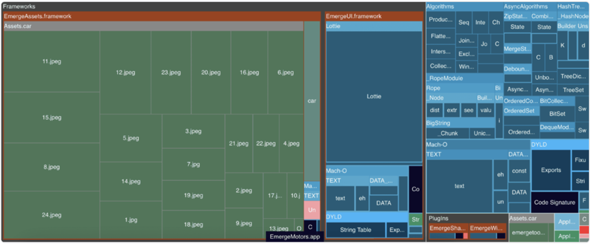

# BUNDLING

利用应用于 JavaScript 和原生代码的预编译与打包技术，来提升 TTI 的指南与技巧。

## 介绍

在本指南的第 1 部分和第 2 部分中，我们解释了如何分析 CPU 和内存、测量关键指标（例如 TTI 和 FPS），以及如何应用最佳实践来提升应用的运行时性能，这些实践大多影响 FPS 指标。但我们还可以在构建阶段进行哪些优化，以使我们的应用启动得更快呢？

这正是第 3 部分要探讨的内容。我们将专注于一些技术和工具，帮助你的 React Native 应用尽可能快地启动，这一指标通过“Time to Interactive”（TTI）来衡量。

正如我们在第 2 部分中了解到的，TTI 是应用中最重要的性能指标之一。应用启动得越快，用户越有可能再次使用。反之，如果启动较慢，用户可能会转而选择其他应用。接下来，我们将探讨影响启动时间的关键组件。

## JavaScript bundles and bundlers

与 Web 类似，React Native 开发者使用打包器生成 JS 引擎可读取的最终 JavaScript 工件。打包器是一种程序，它会将通过入口文件引入的各种源码文件（包括 TypeScript、HTML、CSS、JPG、MP4 等）转换为目标 JS 引擎可理解的格式。最终通常会生成一个 `.js` 文件，以及其他非 JS 资源如 `.html`。

默认情况下，React Native 项目使用 Metro，这是一个为 React Native 特别设计的打包器。它支持针对任何平台进行打包，包括 Web，尽管在 Web 方面它缺乏一些关键功能，比如代码分割和 tree-shaking。虽然 Metro 提供了开箱即用的体验和不错的性能，但像 Webpack 或 Rspack 这样的打包器——广泛应用于 Web 开发中——也可以通过 Re.Pack 集成到 React Native 项目中。

在开发阶段，应用包中不包含 JavaScript 代码，而是通过开发服务器进行获取。这使得能够实现模块热替换（Hot Module Replacement）或快速刷新（Fast Refresh），源文件变更后能以亚秒级的速度反映到屏幕上。

准备发布版本时，应用包将包含一个专门的 `.jsbundle` 文件，该文件包含的是 Hermes 字节码而非 JavaScript，并且不会连接到开发服务器。这个文件由 Xcode 和 Gradle 的原生脚本创建，它们在底层执行 `npx react-native bundle` 命令来生成 JS 工件，然后再通过 Hermes 编译器将其编译为最终的字节码文件。

现在，让我们来探讨与 iOS 和 Android 平台相关的各种打包策略与分发格式。

## Android app bundles

Android 应用有两种可用的打包格式：APK（Android Package Kit）和 AAB（Android App Bundle），它们封装了适用于不同设备架构的原生代码：

- **armeabi-v7a** —— 面向老旧或低端 ARM 设备。
- **arm64-v8a** —— 针对 64 位 ARM 处理器优化，性能更好。
- **x86** —— 面向基于 Intel 的设备。
- **x86_64** —— 面向 Intel 设备的 64 位版本，提供更佳性能和能力。

在 React Native 项目中，可以通过 **android/gradle.properties** 文件中的 `reactNativeArchitectures` 属性来配置这些架构。

> 为多个架构构建会增加构建时间。在使用 **React Native Community CLI** 开发时，可以在 `run-android` 命令中加入 `--activeArchOnly` 参数，以加快构建速度。

### APK

APK 是一种传统的 Android 应用分发与安装格式，通常用于开发和测试阶段，或当应用在 Play 商店以外分发时使用。每个 `.apk` 文件其实是一个 ZIP 文件。APK 不会根据设备架构或其他配置拆分资源，因此通常会将多个设备架构的内容打包在一起，以便在多种设备或模拟器上运行，从而导致总体体积变大。

### AAB

AAB 是 Google 推出的一种新格式，用于优化应用的商店分发。`.aab` 文件包含了生成 APK 所需的所有文件。这个格式现已成为 Google Play 商店分发的强制要求，Play 商店会根据用户设备生成优化的 APK，从而减少下载体积。

### 动态库

类似于 JavaScript，移动平台也有可重用库的概念。与 JavaScript 这样的解释型语言相比，Android 使用的静态编译语言（如 Kotlin 或 Java）需要在编译阶段链接库。以下是两种这类库的格式：

- **.a** —— C/C++ 静态库；静态链接。
- **.aar** —— Android Archive；包含类、资源（如 drawables），进行静态链接。
- **.so** —— 共享库（Shared Library）；动态链接。

静态链接库通常能简化依赖管理，并在设备之间提供一致的行为（避免运行时链接问题）。但与动态链接库相比，它们会增加 APK 的体积、重建和部署的工作量，并可能因为多个应用加载相同代码而增加内存使用。

> 静态链接库在编译时就被包含到应用代码中，生成一个可执行文件，其中包含了运行应用所需的所有代码。
>
> 动态链接库在运行时加载，允许多个程序共享同一个库，减少内存使用，并支持在无需重新编译应用的情况下更新库。

## iOS app bundles

iOS 应用也有两种打包格式：IPA（iOS App Store Package）和 APP（Application Bundle），它们封装了适用于不同设备架构的原生代码：

- **arm64** —— 用于大多数采用 ARM 架构的现代 Apple 设备。
- **x86_64** —— 用于 macOS 上的 iOS 模拟器，在非 ARM 硬件上支持开发与测试。

### IPA

该文件格式用于将 iOS 应用打包，以通过 Apple App Store、Ad Hoc 或企业渠道进行分发。`.ipa` 文件是一个归档文件，包含了在 Apple 设备上安装应用所需的所有信息。

> 有趣的小知识：你可以将 `.ipa` 改名为 `.zip` 来查看其中内容！`.apk` 文件也同样适用。

App Store 会使用 IPA 文件中的信息执行 App Thinning 优化安装过程，即根据具体设备裁剪内容。App Thinning 包括以下几项：

- `App Slicing` —— 仅交付设备所需的资源。
- `On-Demand Resources` —— 按需下载额外内容。
- `Bitcode` —— 允许 Apple 针对不同设备优化应用，无需开发者发布新版本。

### APP

这是开发过程中使用的格式，主要用于在模拟器上运行应用。.app 实际上是一个目录，包含了所有应用资源、二进制可执行文件和元数据，统一打包。它并不用于分发。

### Dynamic libraries

iOS 与 Android 一样，需要在构建时进行链接以包含外部库。可用的格式包括：

- `.a` —— C/C++ 静态库；静态链接。
- `.dylib` —— 动态库；独立文件，动态链接。
- `.framework` —— 框架包，包含单个平台的二进制、头文件和资源；动态链接。
- `.xcframework` —— 可包含多个平台和架构的 .framework 的框架包；动态链接。

由于 iOS 会在启动阶段加载动态库，Apple 建议在必要时尽量避免使用动态库，以提升启动时间。不过，在更广泛的场景中，对于特定库来说，动态链接并在多个 app target 之间共享可能是更好的方案。

### 何时从静态链接切换为动态链接？

如果你使用静态链接，并且在多个 app target 中共享一个框架，那么该框架会在每个 target 中重复包含。例如，你有三个 target（一个主应用，一个分享扩展和一个小组件扩展），那么这个框架就会被包含三次。**Emerge Tools** 的一篇[博客](https://www.emergetools.com/blog/posts/make-your-ios-app-smaller-with-dynamic-frameworks)对此进行了很好地可视化展示:

如图所示，EmergeUI 在每个 target 中被重复包含三次。改为动态链接后，可以移除这些冗余：

要实现这种链接架构，具体取决于框架的创建方式，因此超出了本指南的范围。我们强烈推荐你阅读上文提到的博客，以了解更多信息。

现在我们已经了解了 React Native 移动应用中各种不同类型的打包方式及其链接方式，接下来我们将分析这些包的内容，并探讨如何利用这些信息进一步优化应用的启动时间。

### 下一篇：[如何分析 JavaScript Bundle 的大小](./1.How_to_Analyze_JS_Bundle_Size.md)
