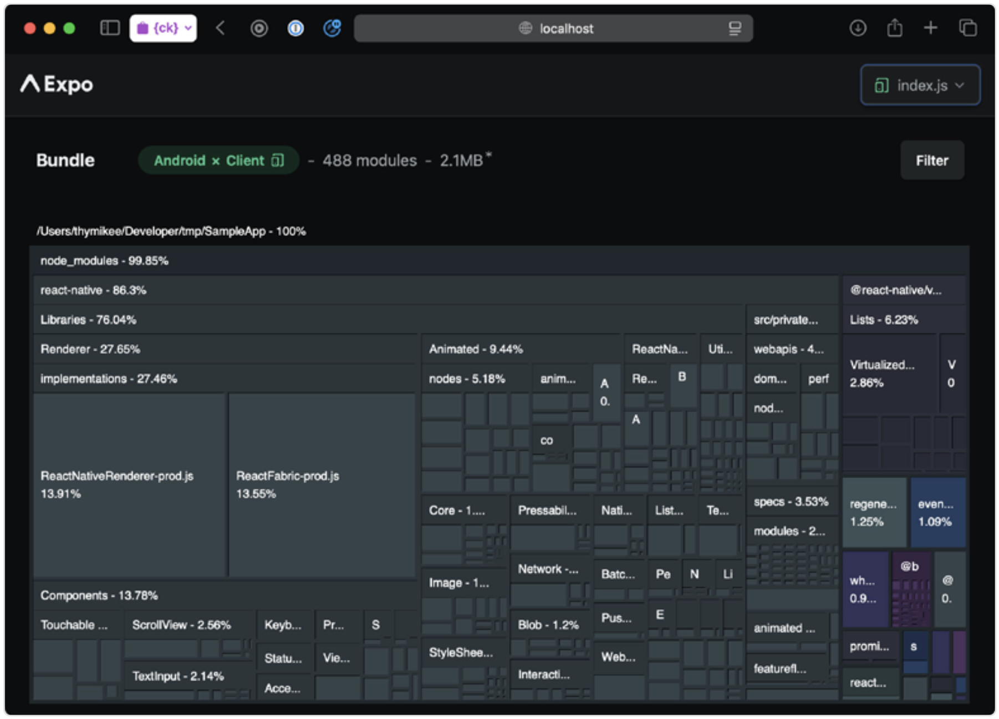

# 如何分析 JavaScript Bundle 的大小

在 React Native 应用中，与其他任何基于 JavaScript 的框架一样，了解我们实际打包并交付给用户的 JS bundle 是非常重要的。最终生成的 JavaScript 文件通常由我们自己的代码、第三方依赖的代码以及这些依赖自身的依赖（我们称之为“传递依赖”）组成。由于该文件的大小或多或少会影响应用的初始化过程，因此了解如何缩小 JavaScript 体积是值得的。有许多方法可以做到这一点，但它们都围绕着同一个核心思想：移除当前不必要的代码。而时机正是关键所在。

```js
// This code can be removed in production builds
if (__DEV__) {
  // ...
}

// This code can be removed in Android bundle
if (Platform.OS === "ios") {
  // ...
}
```

例如，Web 开发者会围绕浏览器初始下载的 JS 大小进行优化，因为浏览器引擎需要下载、加载到内存、解析并执行这些 JS。这是一系列繁琐的步骤，每一步都可以被优化。然而，在运行 Hermes 的现代 React Native 应用中情况有所不同，Hermes 是一个为移动应用设计的 JavaScript 引擎。

## Hermes 字节吗

如果你的应用自 2022 年以来已经更新，并且你使用的是 React Native 0.70 或更高版本，那么最终的应用包很可能并不包含类似 Web 应用那样的原始 JavaScript 代码。你会在其中发现一个由 Hermes JS 引擎生成的字节码文件，这是 React Native 默认集成的。

> Hermes 是 React Native 中唯一会生成可用字节码的 JS 引擎。其他引擎，例如 V8，在技术上也具备通过堆快照（heap snapshot）实现类似的预优化技术的能力。

Hermes 的核心理念是，它作为一个专为低端移动设备设计的引擎，实际上将“加载到内存”和“解析”这两个步骤提前到了构建阶段。

这意味着 Web 开发中的常见技巧，尤其是代码分割或对初始包大小的极致优化，并不能直接套用到 React Native 中。这是因为 React Native 已经跳过了下载阶段（JS 已打包进了应用中），而且借助 Hermes，还跳过了加载 JS 到内存和解析的步骤。

即便如此，仍然重要的是选择更小的库、移除旧代码，并在初始化路径中仅加载必要的库，以避免生成过大的字节码或执行过多不必要的 JS。字节码的大小会影响应用包的整体体积，进而使得下载和初始化变慢。初始化路径中运行的 JS 越多，TTI（可交互时间）指标的表现就越差。

更糟的是，当这些 JavaScript 加载原生模块时，会在原生层面造成更多工作，削弱 Turbo Modules 的懒加载优势。

> Turbo Modules 默认是懒加载的。与旧版 React Native 架构中的 Native Modules 不同，后者会在应用启动时立即初始化，而 Turbo Module 仅在从 JavaScript 层调用时才会初始化。这一机制在迁移至新架构的应用中明显提升了 TTI 表现。

想象一下你导入了一个包含数百个组件的组件库，但你实际上只使用了其中十几个。你通过 barrel 文件（从一个文件中导出所有组件，详见“避免 barrel 导出”章节）导入这些组件，而没有使用 tree shaking 或 Babel 插件进行优化。在初始化路径中，应用会加载所有这些组件，其中一些可能还会调用自己的 TurboModules，这将导致它们也在早期初始化，而不是在真正需要使用时或永远不会被初始化。

那么，我们如何检查 JavaScript 内容，以更好地了解导致体积变大的原因呢？

## source-map-explorer

我们可以使用如 `source-map-explorer` 这样的工具，配合相应的 source map 文件，以 Web UI 的形式分析任意 JavaScript bundle。这个工具可以让我们从宏观角度了解用户设备上实际接收到的内容，轻松识别那些意外打包进去的异常依赖，或是遗留特性留下的冗余内容。

这个工具的另一个优点是，它也能让你了解你自己代码的大小，从而帮助你在自有代码中发现优化空间，效果不亚于三方库的优化。

要使用它，你需要先生成 JavaScript bundle 并输出 source map：

```bash
npx react-native bundle \
--entry-file index.js \
--bundle-output output.js \
--platform ios \
--sourcemap-output output.js.map \
--dev false \
--minify true
```

生成 JS 后，你可以运行 **source-map-explorer**：

```bash
npx source-map-explorer output.js --no-border-checks
```

由于 Metro 生成的列/行映射不规范，我们需要添加 `--no-border-checks` 标志来禁用校验器。好消息是，这些无效映射并不会阻止该工具生成 UI，命令执行完成后，应该会自动打开浏览器，显示类似如下的输出页面：



坏消息是，由于映射不完整，可能会丢失多达 30% 的信息，从而隐藏了一些潜在的优化机会。想获得更多信息，可以使用 Expo Atlas，它与 Metro 打包流程深度集成。

## Expo Atlas

另一个可以用来可视化生产环境 bundle 并识别哪些库占据了较大体积的工具是 [Expo Atlas](https://github.com/expo/atlas#readme)。它适用于 Expo 项目，但也有一些 hack 方式可用于非 Expo 项目。使用方法是在运行 Expo CLI 时添加 **EXPO_UNSTABLE_ATLAS** 环境变量：

```bash
EXPO_UNSTABLE_ATLAS=true npx expo start --no-dev
# or export
EXPO_UNSTABLE_ATLAS=true npx expo export
```

然后运行：

```bash
npx expo-atlas
```

这会打开 Expo Atlas 的 UI，你可以在其中检查 bundle 内容。


> 有一种方式可以在没有 Expo CLI 的前提下运行 Expo Atlas，即使用 `expo-atlas-without-expo` 项目。

## Rspack bundle 分析

如果你使用 Re.Pack 将 Webpack 或 Rspack 替代 Metro 作为打包工具，你会发现有更多高质量的工具可用于分析 JS bundle。我们将重点介绍 Rspack，因为它具有更优的性能表现，并且大体兼容 Webpack 生态。

> 接下来讨论的所有工具使用方式与前文类似，为简洁起见，省略了截图。

### webpack-bundle-analyzer

Rspack 的 CLI 原生支持通过 `--analyze` 参数进行 bundle 分析。它在底层使用的是 `webpack-bundle-analyzer`：

```bash
rspack build --analyze
```

### bundle-stats 与 statoscope

你还可以使用 `--json stats.json` 参数通过 Re.Pack 的 bundle 命令生成 `stats.json` 文件，以便使用其他工具如 **bundle-stats** 或 **statoscope** 进行进一步分析：

```bash
npx react-native bundle \
--platform android \
--entry-file index.js \
--dev false \
--minify true \
--json stats.json
```

随后，在使用 Statoscope 时，可以将生成的 stats.json 文件传给 bundle-stats 命令：

```bash
npx bundle-stats --html --json stats.json
```

此时你就可以在浏览器中享受丰富的 HTML 报告啦！你也可以将不同的 stats 文件进行对比，从而洞察你的最终 bundle 是如何随时间增减变化的。

### Rsdoctor 的 bundle 分析

Rsdoctor 提供了 bundle size 模块，主要用于分析 Rspack 输出的信息，包括资源体积、重复包、模块引用关系等。要使用它，先安装 `@rsdoctor/rspack-plugin` 依赖并将其添加至 `rspack.config.js` 中的 plugins 列表：

```js
const { RsdoctorRspackPlugin } = require("@rsdoctor/rspack- plugin");

module.exports = {
  plugins: [
    process.env.RSDOCTOR &&
      new RsdoctorRspackPlugin({
        // plugin options
      }),
  ].filter(Boolean),
};
```

下次运行应用时，设置 **RSDOCTOR=true** 环境变量，它会打开 Rsdoctor 的 UI，效果类似于 `source-map-explorer`。
