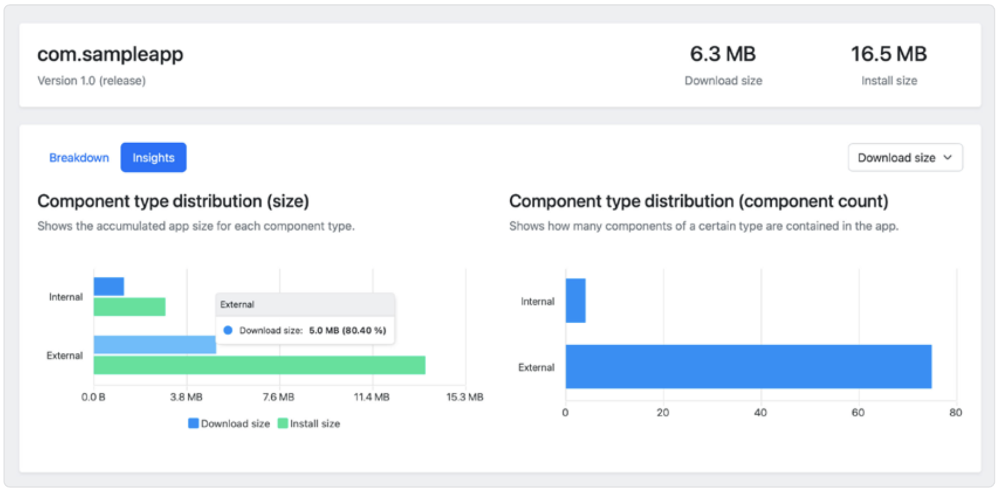
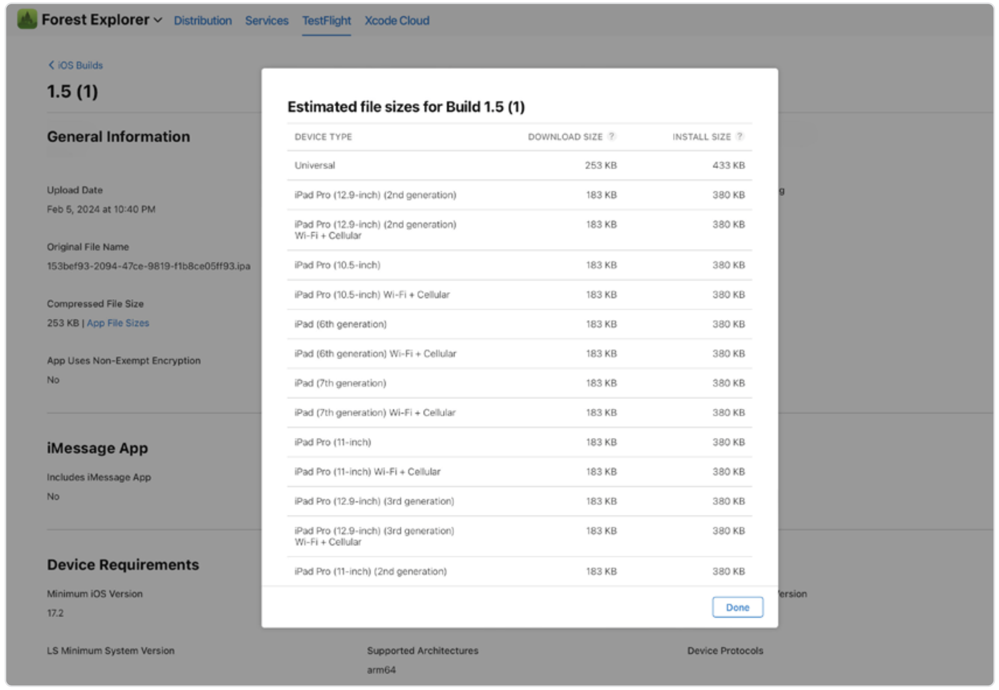
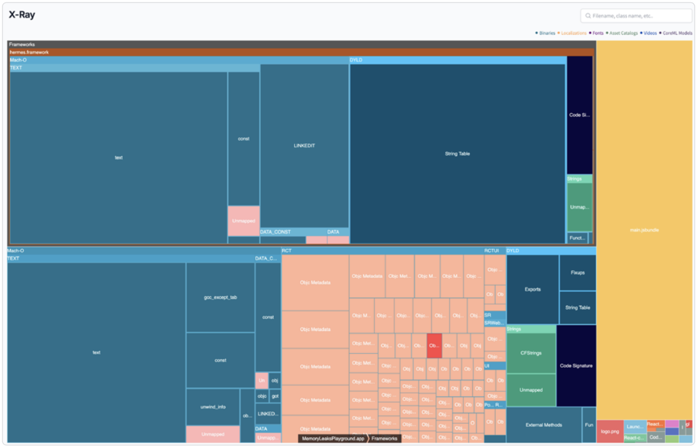
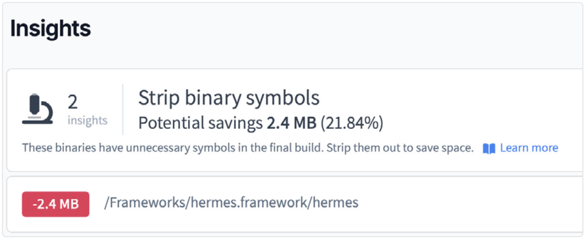
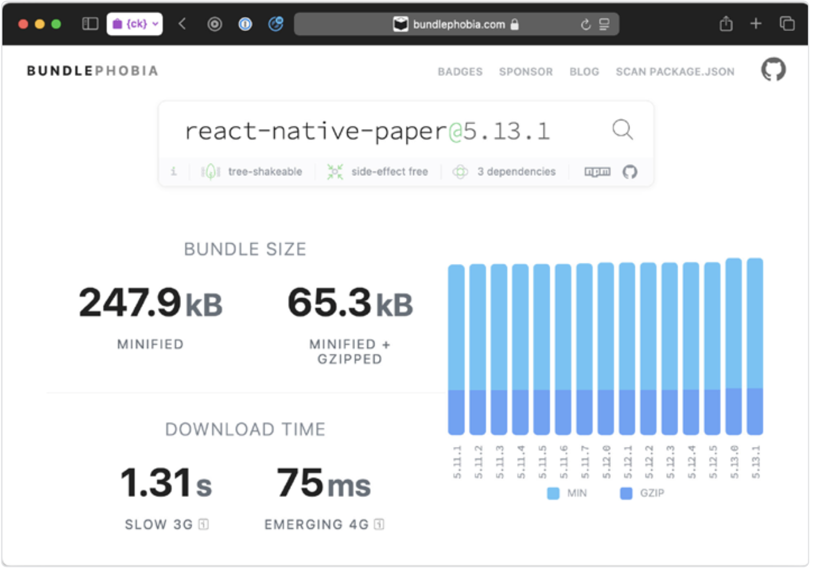

# 如何分析 App 安装包的大小

保持[《如何分析 JavaScript Bundle 的大小》](./1.How_to_Analyze_JS_Bundle_Size.md)和整个应用程序体积较小，对于某些平台上的应用推广来说非常重要。用户在安装应用时，可能仅仅因为安装包太大就选择放弃，特别是在依赖移动流量的情况下。[谷歌做过一个实验](https://medium.com/googleplaydev/shrinking-apks-growing-installs-5d3fcba23ce2)，研究 APK 文件大小和下载量之间的关系。他们发现，**APK 每增加 6 MB，安装转化率就会下降 1%**。

不同类型的应用大小对用户的影响也不一样，主要分为“网络相关”和“存储相关”两类。网络相关的指标包括“下载大小”和“更新大小”，它们表示通过互联网传输的压缩数据量；而存储相关的指标如“安装大小”和“存储大小”，则指的是应用本身和缓存解压后在设备上的实际占用空间。

## 测量 Android 应用的大小

Android 提供了几种方便的方式来检查应用体积。我们特别推荐一个好用的工具是 [Ruler](https://github.com/spotify/ruler)，这是 Spotify 推出的一个 Gradle 插件。它可以集成到现有的项目中，用来分析、调试和发布针对特定架构的应用包。

安装这个插件需要修改 Gradle 的构建设置。首先，在顶层的 **build.gradle** 文件中，把 Ruler 插件添加到 **buildscript** 的 **classpath** 里：

```gradle
buildscript {
  // ...
  dependencies {
    // ...
    classpath("com.spotify.ruler:ruler-gradle-plugin:2.0.0-beta-3")
  }
}
```

然后，在 **app/build.gradle** 文件的开头附近添加这个插件：

```grale
apply plugin: "com.spotify.ruler"
```

接着，在同一个文件中配置 Ruler，指定你想分析的架构（比如 ABI）、语言版本、SDK 版本等。具体怎么配置可以参考[官方文档](https://github.com/spotify/ruler)。

> ABI 是“应用二进制接口”的意思，对应设备的架构，比如 arm64-v8a 或 x86。在本指南的介绍部分我们提到过这些架构。

下面是一个示例配置：

```gradle
ruler {
  abi.set("arm64-v8a")
  locale.set("en")
  screenDensity.set(480)
  sdkVersion.set(34)
}
```

完成后，你会解锁两个新的 Gradle 命令：**analyzeDebugBundle** 和 **analyzeReleaseBundle**。你可以进入 **android** 文件夹，在终端中使用 Gradle Wrapper（**./gradlew**）执行这些命令：

```bash
cd android
./gradlew analyzeReleaseBundle
```

执行成功后，它会生成一个 **report.html** 的文件路径，你可以在浏览器中打开查看报告。

```bash
Wrote HTML report to file:///<PATH_TO_PROJECT>/android/app/build/reports/ruler/release/report.html
```

打开报告后，你就可以看到两个最关键的指标：下载大小和安装大小。



> 这个示例应用经过 R8 优化后，下载大小是 6.3 MB；如果不使用这些构建时优化，大小将达到 9.5 MB。如果你想了解更多相关内容，可以参考《用 R8 精简代码》这一章节。

此外，Ruler 还可以展示应用内部和外部组件的占用情况，从大到小排列：


理想情况下，你可以把“体积检查”加到 CI 流程中，自动监控体积变化，比如在某个 PR 下方自动添加 GitHub 评论。通过 Ruler，你甚至不需要其他工具就可以设置体积阈值，如果体积超标就自动让构建失败：

```gradle
ruler {
  // ...
  verification {
    downloadSizeThreshold = 20 * 1024 * 1024 // 20 MB in bytes
    installSizeThreshold = 50 * 1024 * 1024 // 2 MB in bytes
  }
}
```

## 测量 iOS 应用的大小

如果你的应用已经发布到 App Store 或通过 TestFlight 分发，App Store Connect 提供了最准确的体积信息。它会显示每个变种版本的大小，并在超出移动网络下载限制时发出警告。



TestFlight 构建包里包含了额外的测试数据，所以会比 App Store 上的版本稍大。不过在上传 App Store 后，系统还会对应用进行 DRM 加密和重新压缩，这个过程可能会让最终体积稍微变大，这是正常现象，是为了安全和分发优化。

除了 App Store Connect，你也可以在开发阶段使用 Xcode 来生成一个包含应用大小估算的报告。具体操作是先在 Xcode 中生成一个已签名的 IPA 文件。

然后在 Organizer 中点击 “Distribute App”，选择 “Custom” → 选择你要的分发方式，并在 App Thinning 选项中勾选 “All compatible device variants”。



如果你想通过命令行使用 xcodebuild 来实现同样的功能，可以在 ExportOptions.plist 文件中设置相应的选项：

```plist
<key>thinning</key>
<string>&lt;thin-for-all-variants&gt;</string>
```

这个流程会生成一个包含应用构建产物的文件夹：

- 一个“通用 IPA 文件”，用于老旧设备。这个文件包含了所有变种的资源和二进制。
- 每个变种单独的“瘦身 IPA 文件”，只包含对应变种的资源和二进制。

这个导出文件夹中还包含一个体积报告文件，名为 **App Thinning Size Report.txt**。它列出了每个 IPA 文件的压缩和解压大小。解压大小相当于安装后在设备上的体积，压缩大小则是用户需要下载的体积。

下面是这个报告中某个示例应用的起始部分：

```bash
> App Thinning Size Report for All Variants of SampleApp

Variant: SampleApp-FB829A90-8597-43CA-B6ED-6AB3AEAA1C75.ipa
Supported variant descriptors: ...
App + On Demand Resources size: 3,5 MB compressed, 10,6 MB
uncompressed
App size: 3,5 MB compressed, 10,6 MB uncompressed
On Demand Resources size: Zero KB compressed, Zero KB uncompressed
```

## Emerge Tools

本指南的作者与 Emerge Tools 没有任何经济关系。Emerge Tools 是一个付费服务，提供 14 天免费试用。我们之所以提到这个工具，是因为我们使用下来觉得它在分析应用体积方面确实有用，而且它同时支持 iOS 和 Android。

你只需上传 IPA、APK 或 AAB 文件，就可以使用它的 X-Ray 或 Breakdown 工具，它们提供的界面大致如下：



就像 source-map-explorer 会用矩形方式展示 JS 模块和库，并按文件夹或模块边界分组一样，X-Ray 也会用类似的方式展示 Android 和 iOS 包的二进制信息。

这个工具还会提供一些建议，但我们不能说它完全可靠。比如它可能建议你移除整个 Hermes JS 引擎，这样做会导致你的应用直接出问题。



### 下一篇：[确定第三方库的实际大小](./3.Determine_True_Size_of_Third-Party_Libraries.md)
