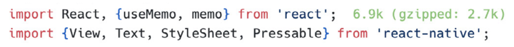

# 确定第三方库的实际大小

在 JavaScript 生态系统中，我们非常推崇“不要重复造轮子”。再加上开放网络平台的开源文化，也就不奇怪我们最终得到了 npm（Node 包管理器和一个在线包注册中心），它包含了数百万个可复用的 JavaScript 库，帮助我们更快速地构建应用，同时也常常在我们的 node_modules 文件夹中占据了数 GB 的空间。多亏了 JavaScript 打包工具，这些内容中只有一小部分最终会进入我们的 React Native 应用。在本章中，我们将分享我们日常使用的一些工具，用来判断项目中第三方依赖的实际体积。

## [bundlephobia.com](https://bundlephobia.com/)

这是我们最喜欢的网站之一。只需输入一个 npm 上的包，它就会显示该包的压缩前体积、压缩后体积，甚至包括下载时间——这对网页应用来说尤其有用。

**Bundlephobia** 的一个额外实用功能是包和依赖项的结构拆解，类似于我们将在本章稍后介绍的 **react-native-bundle-visualizer**。

## pkg-size.dev

有时候，Bundlephobia 无法处理某些包，或者出现服务中断。这种情况下，我们会使用备用方案：[pkg-size.dev](https://pkg-size.dev/)。它是一个类似的服务，会在一个 Web 容器中安装你的包，并显示其压缩前和压缩后的体积。

## VS Code 插件：Import Cost

上述所有工具的使用体验都属于偶尔使用、一次性检查的类型。然而，有时你可能希望获得更实时的反馈。在这种场景下，很少有方法能比直接集成到你最喜欢的 IDE 中更好。

以 VS Code 或其衍生版本（如 Cursor）为例，你可以使用 [Import Cost](https://marketplace.visualstudio.com/items?itemName=wix.vscode-import-cost) 扩展来实现这一目标。

Import Cost 会通过 Webpack 来处理你的 import。可惜的是，Webpack 并不原生支持 React Native，因此该扩展在处理包含原生代码的包时往往会失败。但对于其他包来说，它仍然非常有用。

> 你可以通过 [Re.Pack](https://re-pack.dev/) 使用 Webpack 或 Rspack 作为 React Native 项目的打包工具。

### 下一篇：[避免使用 Barrel Exports](./4.Avoid_Barrel_Exports.md)
