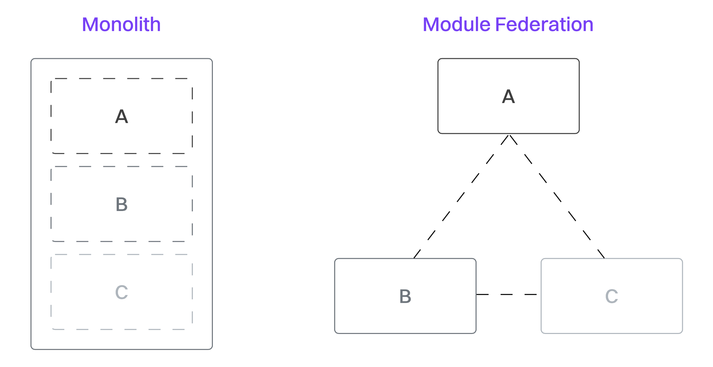

# 避免使用 Barrel Exports

JavaScript 中的 barrel 文件是一种将多个模块集中在一个文件中进行导出的方法。它通过提供一个统一的访问入口，让导入这些模块变得更加简单。这类导入通常来自所谓的 index 文件，它们会把多个目录下的文件组织在一起：

```js
// components/index.ts -- an index file
export { Button } from "./Button";
export { Card } from "./Card";
export { Modal } from "./Modal";
```

之后，可以从这个统一的入口点轻松导入这些模块：

```js
import { Button, Card, Modal, Sidebar } from "./components";
```

## barrel 导出与导入的问题

虽然 barrel 导入看起来很方便，但它们会带来几个严重的问题：

### 构建体积开销

Metro 打包工具会将 barrel 文件中导出的所有模块都包含在最终的打包文件中，即使你只使用了其中一个。例如，如果你通过 barrel 文件导入了一个 **Button** 组件，Metro 仍然会把 **Card**、**Modal** 以及所有其他组件的代码一起打包进去。

> 一些第三方库（比如 React Native Paper）提供了专门的 Babel 插件，可以去除未使用的导入，因此你不必担心未使用的组件。

### 运行时开销

使用 barrel 导入时，JavaScript 在返回你需要的模块之前，必须先处理 barrel 文件中所有的模块。这意味着即使你只需要一个组件，JavaScript 也会解析所有其他模块，造成不必要的运行时开销，从而影响 TTI（首次交互时间）指标。

### 循环依赖

barrel 文件提供的抽象层更容易无意中引入模块之间的循环依赖。这类循环依赖在开发流程中尤其麻烦，通常会导致热更新（HMR）失效，每当依赖链中的某个模块发生变化时都需要完整刷新。



## 完全避免使用 barrel 导入

应对上述问题的通用方案是彻底避免使用 barrel 导入。不要这样写：

```js
// importing from a barrel file – avoid!
import { Button, Card, Modal, Sidebar } from "./components";
```

应该这样写：

```js
// importing from individual files – better!
import Button from "./components/Button";
import Card from "./components/Card";
import Modal from "./components/Modal";
```

如果你想在项目中坚持这样的导入规范，最好添加一个 eslint 插件来强制遵循这种风格。你可以使用 [eslint-plugin-no-barrel-imports](https://www.npmjs.com/package/eslint-plugin-no-barrel-files) 来做到这一点。

但现实是——这种方案并不太优雅。其实也有一些自动处理 barrel 导入的办法。在 React Native 中，你可以使用以下工具之一实现同样的优化效果：

- **Expo SDK 52** 引入了对 tree shaking 的实验性支持，可以自动优化 barrel 导入——只打包实际使用的模块。点击[这里](https://docs.expo.dev/guides/tree-shaking/#barrel-files)了解更多信息。
- **rnx-kit** 的 metro-serializer-esbuild 允许通过 ESBuild 来接管打包过程，从而为 Metro 启用 tree shaking 功能。点击[这里](https://microsoft.github.io/rnx-kit/docs/tools/metro-serializer-esbuild)了解更多信息。
- **Webpack 和 Rspack** 本身就具备高级的 tree shaking 能力，能够从 barrel 文件中移除未使用的导出。点击[这里](https://rspack.dev/guide/optimization/tree-shaking#side-effects-analysis)了解更多信息。

## 实际库示例：date-fns

**date-fns** 是一个流行的 JavaScript 日期工具库，提供了丰富的日期操作功能。虽然可以从主入口导入整个库，但它特别设计了子模块导入功能，以更好地控制实际打包的内容。

所以，与其像这样导入整个库：

```js
// This imports the entire date-fns library
import { format, addDays, isToday } from "date-fns";
```

我们可以将导入拆分，仅引入我们需要的代码：

```js
// These imports only include the code you need
import format from "date-fns/format";
import addDays from "date-fns/addDays";
import isToday from "date-fns/isToday";
```

通过使用子模块导入，你可以确保最终打包中只包含实际使用的函数。务必使用[《如何分析 JavaScript Bundle 的大小》](./1.How_to_Analyze_JS_Bundle_Size.md)一章中介绍的工具来评估这些操作对最终 JS 包体积的影响。

### 下一篇：[尝试使用 Tree Shaking 精简代码](./5.Experiment_With_Tree_Shaking.md)
