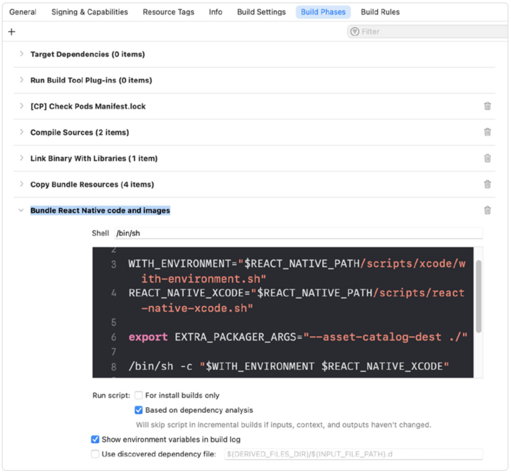
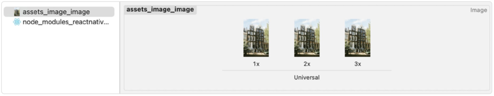
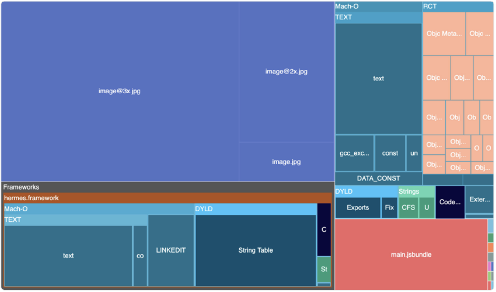
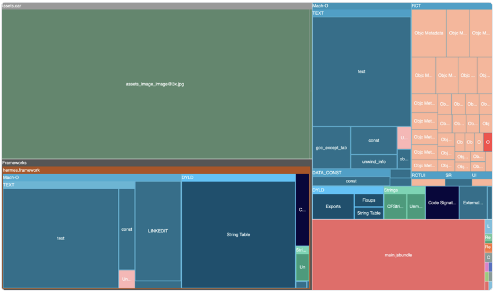

# 使用 Native Assets 文件夹

应用体积中相当大的一部分通常来自资源文件，例如图像、音频或视频等，它们被打包进应用中。iOS 和 Android 都提供了根据设备的屏幕尺寸或像素密度来优化这些资源交付的方式。例如，在移动设备上加载更大尺寸的图像是一种好习惯，因为这样可以保证图像清晰。移动设备通常具有高分辨率的小屏幕，也就是高像素密度。屏幕像素越多，能显示的细节越多，因此建议使用更大的图像。当你正确使用这些平台优化机制时，用户从应用商店下载应用时，系统只会加载所需分辨率的图像资源。

> 同时，记得使用专门的工具对你的资源进行优化，以减小它们的体积。

## 使用尺寸后缀（Size Suffixes）

在 React Native 应用中处理资源时，建议为同一张图片创建多个尺寸的变体：基础尺寸（1x）、两倍尺寸（2x）和三倍尺寸（3x）。通常的命名约定是在文件名中使用 **@2x** 或 **@3x** 后缀。



当你通过标准的 require 导入图片时，React Native 会根据当前设备的屏幕密度自动选择最佳的图片版本。

## 原生资源目录（Native Assets Folders）

只要你的图片带有尺寸后缀，Android 就会自动应用优化。我们可以借此机会深入了解其背后的运行机制。

首先，使用以下命令生成一个 AAB 文件：

```bash
./gradlew bundleRelease
```

此命令将生成一个 Android App Bundle（AAB 文件），Play 商店会利用它按需生成针对不同设备架构优化过的 APK。如果你想了解更多格式相关的内容，可以回到本书前面的[介绍](./0.Bundling.md#介绍)部分。

生成后，进入目录 **android/app/build/outputs/bundle/release/app-release**。我们将其扩展名从 .aab 改为 .zip 并解压（因为 AAB 本质上是一个 ZIP 压缩包），以便查看其内容。


在资源目录中，你将看到多个文件夹，它们的名称对应 Android 的屏幕密度级别，例如 **drawable-xhdpi-v4**、**drawable-xxhdpi-v4** 等。你会注意到文件名中的后缀（如 **@2x**）消失了。实际上，图片被按密度分类并分别存放在对应文件夹中。

当用户从 Google Play 下载应用时，Play 会生成一份仅包含其设备所需图像资源的 APK，而不会包含所有图像变体。

> 关于 “按需编译（on-demand compilation）” 的详细机制超出了本章范围，但如果你感兴趣，可以查阅更多[相关资源](https://developer.android.com/guide/app-bundle)。

## Xcode 的资源目录

在 iOS 上也能实现类似的效果。但与 Android 不同的是，React Native 和 Metro 在打包时不会自动处理这部分优化。如果你想在 iOS 上也实现相同的资源优化效果，必须手动创建一个 **_Xcode 的资源目录_**（**.xcassets**），并将其配置到编译流程中。

首先，让我们创建一个名为 **RNAssets.xcassets** 的文件，并将其放置在 ios 文件夹中。

> 该文件夹必须命名为 **RNAssets.xcassets**，这是由于 React Native bundle 脚本中存在硬编码路径所致。希望未来这个限制能够被移除。

创建该文件夹后，导航到项目设置中的 **Build Phases**，然后修改“Bundle React Native code and images”构建阶段，在第 8 行之上添加 `EXTRA_PACKAGER_ARGS` 变量：

```
export EXTRA_PACKAGER_ARGS="--asset-catalog-dest ./"
```


这样，当该构建阶段被执行时，Metro 将会把资源放入 **RNAssets.xcassets** 目录中。首次构建完成后，你的资源文件夹应该会如下所示：



你也可以手动触发 bundle 命令，以便在遇到问题时测试是否一切正常（注意，此时 **--asset-catalog-dest** 现在指向 ios，因为我们是从 React Native 项目的根目录运行该脚本）：

```bash
npx react-native bundle \
--entry-file index.js \
--bundle-output output.js \
--platform ios \
--dev false \
--minify true \
--asset-catalog-dest ios \
--assets-dest <your-assets-folder>
```

现在，在你将应用上传至 App Store 之后，“App Thinning（应用瘦身）”机制将开始生效，并根据用户设备选择合适的图像尺寸！

> 在 iOS 上，“App Thinning” 通过创建特定设备版本来优化应用交付，仅包含所需的资源。而 Android 则通过“Android App Bundles”（AAB）实现类似效果，AAB 会根据每种设备配置生成优化过的 APK，将应用拆分成可按需下载的模块组件。

## 测试效果

让我们检查一下在应用这种优化前后，iOS 上的实际差异。如果不进行优化，你的 bundle 会包含三种图像资源，这是种浪费，因为你的设备只会使用其中一种尺寸。



在应用了上述技术并使用资源目录之后，你会看到 bundle 中只包含相关图像（**assets_image_image@3x.jpg**）。



这是一个优秀的优化技术，它确保你的应用仅包含针对目标平台所需的图像。总体上，它对应用体积指标具有积极影响。

> 在撰写本章时（2025 年 1 月），Assets Catalog 并未默认启用；不过，目前已有相关工作正在推进，旨在将其设为默认选项。

### 下一篇：[关闭 JavaScript Bundle 压缩](./9.Disable_JS_Bundle_Compression.md)
